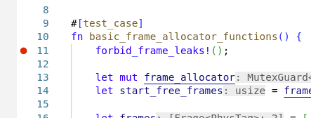
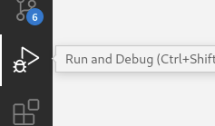
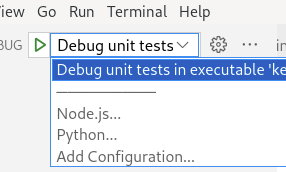
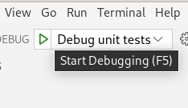

## Настройка VSCode

Для работы в VSCode нужно установить два плагина.

 1. [rust-analyzer](https://marketplace.visualstudio.com/items?itemName=rust-lang.rust-analyzer)
 2. [CodeLLDB](https://marketplace.visualstudio.com/items?itemName=vadimcn.vscode-lldb)

После этого нужно открыть репозиторий `File -> Open Folder`.

VSCode поддерживает отладку ядра. Чтобы запустить отладку, нужно поставить breakpoint в интерфейсе редактора кода, перейти в `Run and Debug` (иконка с жуком слева), выбрать конфигурацию запуска и нажать на иконку `Start Debugging`.

