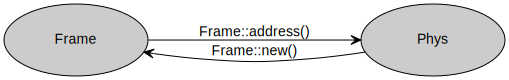
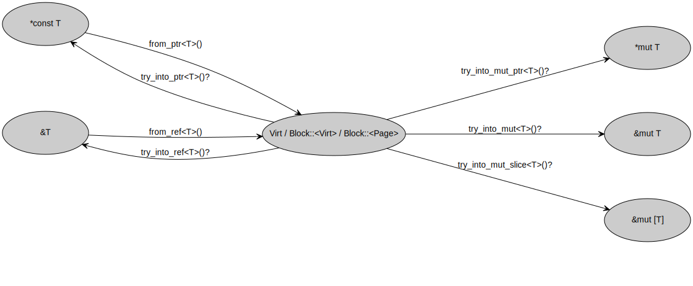
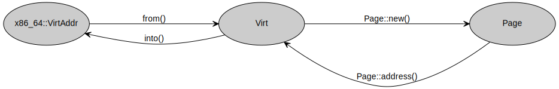
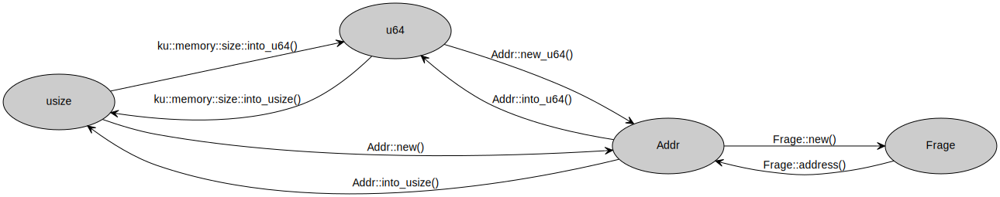
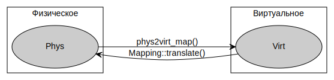

## Преобразования внутри физического пространства

## Преобразования внутри виртуального пространства

## Преобразования между Addr/Phys/Virt и Frage/Frame/Page

## Преобразования между пространствами

