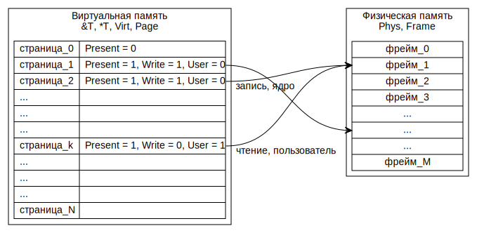
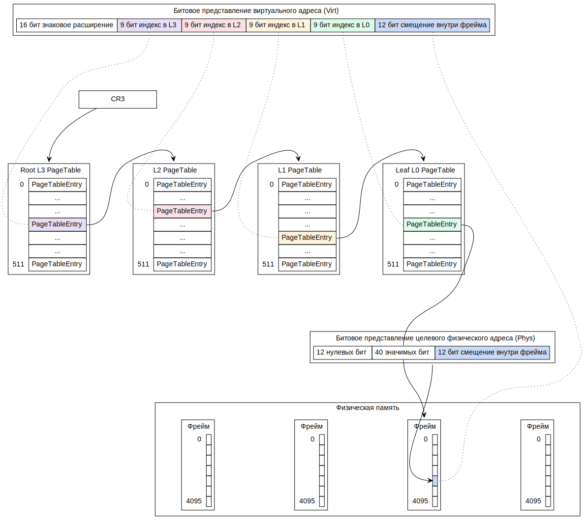

## Отображение виртуальных страниц в физические фреймы

За это отображение отвечает структура
[`kernel::memory::mapping::Mapping`](../../doc/kernel/memory/mapping/struct.Mapping.html).
Фактически она реализует дерево большой арности --- 512, если закрыть глаза на возможность сослаться в узле на любой узел.
Такая возможность используется только в специфических случаях, например для реализации [рекурсивного отображения](https://wiki.osdev.org/Page_Tables#Recursive_mapping).

[`Mapping`](../../doc/kernel/memory/mapping/struct.Mapping.html) содержит уже немного знакомые нам поля:

- [`Mapping::page_directory`](../../doc/kernel/memory/mapping/struct.Mapping.html#structfield.page_directory) типа [`PageTable`](../../doc/ku/memory/mmu/type.PageTable.html) --- таблица страниц самого верхнего уровня, корневая в дереве.
- [`Mapping::phys2virt`](../../doc/kernel/memory/mapping/struct.Mapping.html#structfield.phys2virt) типа [`Page`](../../doc/ku/memory/frage/type.Page.html) --- начало "окна", в которое отображена вся физическая память.

[`Mapping::phys2virt`](../../doc/kernel/memory/mapping/struct.Mapping.html#structfield.phys2virt)
нужен, чтобы с помощью функции
```rust
fn phys2virt_map(phys2virt: Page, address: Phys) -> Virt
```
по заданному физическому адресу, найти куда он отображён в "окне".
Это потребуется когда нам нужно будет записать в какую-нибудь
[`PageTable`](../../doc/ku/memory/mmu/type.PageTable.html).
Так как в
[`PageTableEntry`](../../doc/ku/memory/mmu/struct.PageTableEntry.html) таблица
[`PageTable`](../../doc/ku/memory/mmu/type.PageTable.html) следующего вниз уровня
задаётся именно физическим адресом.

> Подумайте, а можно ли было бы в
> [`PageTableEntry`](../../doc/ku/memory/mmu/struct.PageTableEntry.html)
> хранить виртуальный адрес
> [`PageTable`](../../doc/ku/memory/mmu/type.PageTable.html),
> на которую ссылается данная
> [`PageTableEntry`](../../doc/ku/memory/mmu/struct.PageTableEntry.html)?

Отображение виртуальных страниц на физические фреймы:



Про отображение страниц можно почитать на сайте [osdev](https://wiki.osdev.org/), нас интересует 64-битный вариант для x86-64:

- [Memory management](https://wiki.osdev.org/Memory_management).
- [Paging](https://wiki.osdev.org/Paging).

Ещё более подробный и обстоятельный разбор есть в блоге [Writing an OS in Rust](https://os.phil-opp.com/):

- [Introduction to Paging](https://os.phil-opp.com/paging-introduction/), [перевод](https://habr.com/ru/post/436606/).
- [Paging Implementation](https://os.phil-opp.com/paging-implementation/), [перевод](https://habr.com/ru/post/445618/).


### Задача 5 --- [`Mapping`](../../doc/kernel/memory/mapping/struct.Mapping.html)


#### Отображение виртуальных страниц на физические фреймы

Страничное преобразование устроено как показано на схеме.
Стрелки ведут из физических адресов, хранящихся в регистре
[`CR3`](https://wiki.osdev.org/CPU_Registers_x86#CR3)
и в элементах
[`ku::memory::mmu::PageTableEntry`](../../doc/ku/memory/mmu/struct.PageTableEntry.html)
таблиц
[`ku::memory::mmu::PageTable`](../../doc/ku/memory/mmu/type.PageTable.html),
в целевые фреймы и целевой байт.
А пунктиром показано какая часть битового представления виртуального адреса
([`Virt`](../../doc/ku/memory/addr/type.Virt.html))
используется как индекс в одной из таблиц
[`PageTable`](../../doc/ku/memory/mmu/type.PageTable.html),
либо как смещение внутри целевого фрейма.
Каждая [`PageTable`](../../doc/ku/memory/mmu/type.PageTable.html) занимает ровно один фрейм физической памяти.



Вооружившись этими знаниями, реализуйте [метод](../../doc/kernel/memory/mapping/struct.Mapping.html#method.translate)
```rust
unsafe fn Mapping::translate(
    &mut self,
    virt: Virt,
    mut frame_allocator: Option<&mut FrameAllocator>,
    flags: PageTableFlags,
) -> Result<&mut PageTableEntry>
```

в файле [`kernel/src/memory/mapping.rs`](https://gitlab.com/sergey-v-galtsev/nikka-public/-/blob/master/kernel/src/memory/mapping.rs).
Он принимает на вход

- Виртуальный адрес `virt`, который нужно транслировать.
- Опциональный аллокатор фреймов `frame_allocator`.
- Флаги `flags` для промежуточных записей таблиц страниц, если их придётся создавать.

И возвращает ссылку на запись
[`PageTableEntry`](../../doc/ku/memory/mmu/struct.PageTableEntry.html)
в
[`PageTable`](../../doc/ku/memory/mmu/type.PageTable.html)
листьевого уровня (L0 на схеме),
соответствующую входному виртуальному адресу `virt`.
Возвращается ссылка на изменяемую
[`PageTableEntry`](../../doc/ku/memory/mmu/struct.PageTableEntry.html),
а не например
[`Phys`](../../doc/ku/memory/addr/type.Phys.html).
Чтобы вызывающая функция могла потом как-либо модифицировать отображение `virt` --- удалить это отображение, изменить его флаги, поменять физический адрес.
Получить же целевой
[`Phys`](../../doc/ku/memory/addr/type.Phys.html)
из возвращённой
[`PageTableEntry`](../../doc/ku/memory/mmu/struct.PageTableEntry.html)
можно в одно действие ---
[`PageTableEntry::phys()`](../../doc/ku/memory/mmu/struct.PageTableEntry.html#method.phys).

[`Mapping::translate()`](../../doc/kernel/memory/mapping/struct.Mapping.html#method.translate)
должен пройти от корневой L3 до листьевой L0 по физическим фреймам, которые возвращает метод
[`fn PageTableEntry::frame() -> Result<Frame>`](../../doc/ku/memory/mmu/struct.PageTableEntry.html#method.frame)
для промежуточных
[`PageTableEntry`](../../doc/ku/memory/mmu/struct.PageTableEntry.html).
Если какая-то из этих промежуточных
[`PageTableEntry`](../../doc/ku/memory/mmu/struct.PageTableEntry.html)
не отображена на физическую память, то есть два варианта:

- Входной `frame_allocator` равен [`None`](https://doc.rust-lang.org/nightly/core/option/enum.Option.html#variant.None), тогда [`Mapping::translate()`](../../doc/kernel/memory/mapping/struct.Mapping.html#method.translate) сразу выходит, возвращая ошибку [`Error::NoPage`](../../doc/kernel/error/enum.Error.html#variant.NoPage).
- Входной `frame_allocator` равен [`Some`](https://doc.rust-lang.org/nightly/core/option/enum.Option.html#variant.Some)
, тогда [`Mapping::translate()`](../../doc/kernel/memory/mapping/struct.Mapping.html#method.translate) аллоцирует с его помощью фрейм для недостающей промежуточной [`PageTable`](../../doc/ku/memory/mmu/type.PageTable.html). И очищает её --- все записи в ней должны быть равны значению, которое возвращает метод [`PageTableEntry::default()`](../../doc/ku/memory/mmu/struct.PageTableEntry.html#method.default).

Вам может пригодиться конструкция `frame_allocator.as_mut().ok_or(NoPage)?`. В ней
[`Option::as_mut()`](https://doc.rust-lang.org/nightly/core/option/enum.Option.html#method.as_mut)
преобразует `&mut Option<FrameAllocator>` в `Option<&mut FrameAllocator>`.
Далее, уже встречавшаяся нам `Option::ok_or(NoPage)` преобразует
[`Option::None`](https://doc.rust-lang.org/nightly/core/option/enum.Option.html#variant.None)
в
[`Result::Err(NoPage)`](https://doc.rust-lang.org/nightly/core/result/enum.Result.html#variant.Err)
а
[`Option::Some(frame_allocator)`](https://doc.rust-lang.org/nightly/core/option/enum.Option.html#variant.Some)
в
[`Result::Ok(frame_allocator)`](https://doc.rust-lang.org/nightly/core/result/enum.Result.html#variant.Ok).
Последним штрихом `?` разворачивает
[`Result::Ok(frame_allocator)`](https://doc.rust-lang.org/nightly/core/result/enum.Result.html#variant.Ok)
в содержащийся внутри `&mut FrameAllocator`, а
[`Result::Err`](https://doc.rust-lang.org/nightly/core/result/enum.Result.html#variant.Err)
прокидывает в вызывающую функцию.
Именно изменяемый `&mut FrameAllocator` нужен нам чтобы аллоцировать из него фреймы для промежуточных таблиц
[`PageTable`](../../doc/ku/memory/mmu/type.PageTable.html),
если это понадобится.
Если во
[`FrameAllocator`](../../doc/kernel/memory/enum.FrameAllocator.html)
не окажется свободных фреймов, он вернёт ошибку
[`Error::NoFrame`](../../doc/kernel/error/enum.Error.html#variant.NoFrame),
как мы реализовали в
[задаче 2](../../lab/book/2-mm-5-boot-frame-allocator.html#%D0%97%D0%B0%D0%B4%D0%B0%D1%87%D0%B0-2--%D0%B0%D0%BB%D0%BB%D0%BE%D0%BA%D0%B0%D1%86%D0%B8%D1%8F-%D1%84%D1%80%D0%B5%D0%B9%D0%BC%D0%BE%D0%B2).
Заметьте, что:

- Если в [`Mapping::translate()`](../../doc/kernel/memory/mapping/struct.Mapping.html#method.translate)
не передали [`FrameAllocator`](../../doc/kernel/memory/enum.FrameAllocator.html), она возвращает [`Error::NoPage`](../../doc/kernel/error/enum.Error.html#variant.NoPage). Это означает "виртуальная страница для данного `virt` не отображена в физическую память".
- А если передали, но он не смог выделить свободный физический фрейм, то [`Mapping::translate()`](../../doc/kernel/memory/mapping/struct.Mapping.html#method.translate) вернёт ошибку [`kernel::error::Error::NoFrame`](../../doc/kernel/error/enum.Error.html#variant.NoFrame). Это означает "во время исполнения операции понадобилось выделить дополнительный физический фрейм, но свободных фреймов не осталось".

У этих двух ситуаций разный смысл, поэтому
[`Mapping::translate()`](../../doc/kernel/memory/mapping/struct.Mapping.html#method.translate)
возвращает для них разные значения ошибок.

Если в промежуточной таблице встретилась запись, в которой
[`PageTableEntry::flags()`](../../doc/ku/memory/mmu/struct.PageTableEntry.html#method.flags)
содержит флаг
[`PageTableFlags::HUGE_PAGE`](../../doc/ku/memory/mmu/struct.PageTableFlags.html#associatedconstant.HUGE_PAGE),
верните
[`Error::Unimplemented`](../../doc/kernel/error/enum.Error.html#variant.Unimplemented).
Такая запись не является промежуточной, а задаёт большую страницу, ---
[x86-64 поддерживает](https://en.wikipedia.org/wiki/X86-64#Virtual_address_space_details) страницы
[размеров `4 KiB`, `2 MiB` и `1 GiB`](https://en.wikipedia.org/wiki/Page_(computer_memory)#Multiple_page_sizes).
Мы не будем их поддерживать.
Но они нам будут попадаться, потому что с их помощью
[bootloader](../../doc/bootloader/index.html)
отображает всю физическую память в "окно" в виртуальной.
Делается это для экономии физических фреймов на само отображение.

Кроме того, есть ещё такой момент.
Если вызывающая функция захочет отобразить `virt`, например, с возможностью записи, и установит
соответствующий флаг
[`PageTableFlags::WRITABLE`](../../doc/ku/memory/mmu/struct.PageTableFlags.html#associatedconstant.WRITABLE)
только в том элементе
[`PageTableEntry`](../../doc/ku/memory/mmu/struct.PageTableEntry.html)
таблицы L0, которую вернёт
[`Mapping::translate()`](../../doc/kernel/memory/mapping/struct.Mapping.html#method.translate),
этого может оказаться недостаточно.
Дело в том, что процессор пересечёт флаги [`PageTableFlags::WRITABLE`](../../doc/ku/memory/mmu/struct.PageTableFlags.html#associatedconstant.WRITABLE)
из всех промежуточных
[`PageTableEntry`](../../doc/ku/memory/mmu/struct.PageTableEntry.html)
по схеме `И`.
И если в какой-то из промежуточных
[`PageTableEntry`](../../doc/ku/memory/mmu/struct.PageTableEntry.html)
флаг
[`PageTableFlags::WRITABLE`](../../doc/ku/memory/mmu/struct.PageTableFlags.html#associatedconstant.WRITABLE)
будет сброшен, то запись по виртуальному адресу `virt` будет запрещена,
несмотря на то что в
[`PageTableEntry`](../../doc/ku/memory/mmu/struct.PageTableEntry.html)
таблицы L0, она разрешена.
Поэтому в промежуточных
[`PageTableEntry`](../../doc/ku/memory/mmu/struct.PageTableEntry.html)
функция
[`Mapping::translate()`](../../doc/kernel/memory/mapping/struct.Mapping.html#method.translate)
должна будет включить флаги, заданные ей в аргументе `flags`.
И никакие флаги промежуточных
[`PageTableEntry`](../../doc/ku/memory/mmu/struct.PageTableEntry.html)
она не должна случайно сбросить при этой операции.
Альтернативой было бы либо сразу включать все доступы в промежуточных
[`PageTableEntry`](../../doc/ku/memory/mmu/struct.PageTableEntry.html),
либо возвращать из
[`Mapping::translate()`](../../doc/kernel/memory/mapping/struct.Mapping.html#method.translate)
весь набор промежуточных
[`PageTableEntry`](../../doc/ku/memory/mmu/struct.PageTableEntry.html).
Также заметьте, что включать нужно только флаги доступа, они задаются константой
[`ku::memory::mmu::FULL_ACCESS`](../../doc/ku/memory/mmu/constant.FULL_ACCESS.html).
То есть, включать нужно флаги которые есть в пересечении --- `flags & FULL_ACCESS`.

Выделение физического фрейма под отсутствующую промежуточную таблицу
[`PageTable`](../../doc/ku/memory/mmu/type.PageTable.html)
рекомендуется вынести во вспомогательную [функцию](../../doc/kernel/memory/mapping/struct.Mapping.html#method.map_intermediate)

```rust
fn Mapping::map_intermediate(
    pte: &mut PageTableEntry,
    flags: PageTableFlags,
    phys2virt: Page,
    frame_allocator: &mut FrameAllocator,
) -> Result<()>
```

в файле [`kernel/src/memory/mapping.rs`](https://gitlab.com/sergey-v-galtsev/nikka-public/-/blob/master/kernel/src/memory/mapping.rs).

Запись `()` в её результате означает пустой [кортеж](https://doc.rust-lang.ru/book/ch03-02-data-types.html#%D0%9A%D0%BE%D1%80%D1%82%D0%B5%D0%B6%D0%B8), --- это аналог `void` языка C++.
То есть, функция либо возвращает `Ok(())`, если она отработала успешно, либо ошибку.
Функция [`Mapping::map_intermediate()`](../../doc/kernel/memory/mapping/struct.Mapping.html#method.map_intermediate) статическая, она не принимает `self`.
Чтобы её вызвать нужно явно указать `Self::` или `Mapping::`.

При реализации `Mapping::translate()` и `Mapping::map_intermediate()` вам также могут пригодиться:

- Поле [`Mapping::page_directory`](../../doc/kernel/memory/mapping/struct.Mapping.html#structfield.page_directory), оно содержит адрес фрейма корневой таблицы L3, то есть фактически копию регистра [`CR3`](https://wiki.osdev.org/CPU_Registers_x86#CR3).
- Константа [`ku::memory::mmu::PAGE_TABLE_ROOT_LEVEL`](../../doc/ku/memory/mmu/constant.PAGE_TABLE_ROOT_LEVEL.html) --- та самая 3 из обозначения L3 для корневой таблицы страниц --- третий уровень считая с нуля.
- Константа [`ku::memory::mmu::PAGE_TABLE_LEAF_LEVEL`](../../doc/ku/memory/mmu/constant.PAGE_TABLE_LEAF_LEVEL.html) --- та самая 0 из обозначения L0 для листьевой таблицы страниц.
- Конструкция `unsafe { virt_addr.try_into_mut::<PageTable>()? }`, которая превращает [`Virt`](../../doc/ku/memory/addr/type.Virt.html) в `&mut PageTable`.
- Метод [`fill()`](https://doc.rust-lang.org/nightly/core/primitive.slice.html#method.fill) срезов.
- Цикл, чтобы обойти уровни таблицы. Для уменьшения потенциальных возможностей совершить ошибку, можно было бы сделать таблицы страниц разных уровней не совместимыми в системе типов, [как здесь](https://os.phil-opp.com/page-tables/#some-clever-solution). Тогда компилятор не дал бы их перепутать в коде. Но такой подход, к сожалению, не даст написать обычный цикл по уровням, только рекурсию на обобщённых функциях или копипасту. Поэтому в Nikka выбор сделан в пользу одного и того же типа для узлов всех уровней.
- Итерирование в обратном порядке: `for i in (5..10).rev()`, или же `for i in (5..=10).rev()` если `10` должно быть включительно.
- Сохранение в самом начале функции [`Mapping::translate()`](../../doc/kernel/memory/mapping/struct.Mapping.html#method.translate) значения `self.phys2virt` в отдельную переменную и использование уже новой переменной, если столкнётесь с излишней консервативностью borrow checker'а, подобного вида:
```console
error[E0503]: cannot use `self.phys2virt` because it was mutably borrowed
  --> src/memory/mapping.rs:58:65
   |
55 |             let ... = self...;
   |                       ---- borrow of `*self` occurs here
...
58 |                 Self::map_intermediate(..., self.phys2virt, frame_allocator.as_mut().ok_or(NoPage)?)?;
   |                                             ^^^^^^^^^^^^^^ use of borrowed `*self`
...
61 |             if ... {
   |                --- borrow later used here
```

Теперь должен проходить тест

```console
$ (cd kernel; cargo test --test 2-mm-3-translate)
...
2_mm_3_mapping::translate-----------------------------------
18:27:12 0 D pte = PageTableEntry(2613347)
18:27:12 0 D read_ptr = 0xfffff0000027e420; write_ptr = 0x10000201420
18:27:12 0 D write_value = 0; read_value = 0; variable = 0
18:27:12 0 D write_value = 1; read_value = 1; variable = 1
18:27:12 0 D write_value = 2; read_value = 2; variable = 2
18:27:12 0 D write_value = 3; read_value = 3; variable = 3
18:27:12 0 D write_value = 4; read_value = 4; variable = 4
2_mm_3_mapping::translate-------------------------- [passed]

2_mm_3_mapping::map_intermediate----------------------------
18:27:12 0 D page = Page(34359738366 @ 0v7FFFFFFFE000)
18:27:12 0 D pte = PageTableEntry(0)
2_mm_3_mapping::map_intermediate------------------- [passed]
18:27:12 0 I exit qemu; exit_code = SUCCESS
```

А вот для проверки копирования и удаления виртуальных отображений
нам понадобится основной аллокатор физических фреймов.
Поэтому тесты для них придётся отложить.


#### Создание полной копии виртуального отображения

В будущем, при создании нового процесса, нам понадобится скопировать существующий
[`Mapping`](../../doc/kernel/memory/mapping/struct.Mapping.html)
в новый.
Это делает метод
[`Mapping::duplicate()`](../../doc/kernel/memory/mapping/struct.Mapping.html#method.duplicate):
```rust
fn duplicate(&self) -> Result<Self> {
    let mut result = Self::new(Frame::zero(), self.phys2virt);
    result.page_directory = Self::duplicate_page_table(&mut result, self, self.page_directory, PAGE_TABLE_ROOT_LEVEL)?;
    Ok(result)
}
```
Основную работу он перекладывает на рекурсивный метод
[`Mapping::duplicate_page_table()`](../../doc/kernel/memory/mapping/struct.Mapping.html#method.duplicate_page_table),
запуская корневой вызов рекурсии.

Реализуйте [метод](../../doc/kernel/memory/mapping/struct.Mapping.html#method.duplicate_page_table)
```rust
fn Mapping::duplicate_page_table(
    &self,
    dst: &mut Mapping,
    src_frame: Frame,
    level: u32,
) -> Result<Frame>
```

в файле [`kernel/src/memory/mapping.rs`](https://gitlab.com/sergey-v-galtsev/nikka-public/-/blob/master/kernel/src/memory/mapping.rs)
сейчас, пока помните как устроено страничное отображение.
Он принимает на вход:

- Новое отображение `dst`, которое мы создаём как копию исходного.
- Исходное отображение `self`.
- Исходный узел `PageTable` таблицы страниц в виде содержащего его фрейма `src_frame`.
- Уровень этого узла `level` от [`PAGE_TABLE_ROOT_LEVEL = 3`](../../doc/ku/memory/mmu/constant.PAGE_TABLE_ROOT_LEVEL.html)
до [`PAGE_TABLE_LEAF_LEVEL = 0`](../../doc/ku/memory/mmu/constant.PAGE_TABLE_LEAF_LEVEL.html).

И должен создать копию заданного `src_frame` узла.
Возвращает он либо эту копию, либо возникшую в процессе работы ошибку.
Этот метод копирует только страничное отображение, то есть все `PageTable` уровней L3--L0,
но не пользовательские фреймы, на которые указывает это отображение.
То есть, должно получиться отображение,
которое переводит те же виртуальные адреса в те же физические адреса.
Разделяя таким образом пользовательскую часть физической память,
но дублируя физическую память под само страничное отображение (`PageTable` уровней L3--L0).
Если бы `PageTable` разделяли ту же физическую память, то уже после того как копирование отработало,
модификации исходного `self` приводили бы к модификации `dst` и наоборот.
А это не то что нам нужно.
Это означает, что

- `PageTable` уровней L3--L1 включительно нужно пересоздать, заполняя их `PageTableEntry` результатами рекурсивных вызовов `Mapping::duplicate_page_table()`.
- А вот `PageTable` уровня L0 нужно просто скопировать как есть, их записи `PageTableEntry` должны вести в те же физические фреймы, что и в исходном отображении `self`. Но только если соответствующая запись ведёт на страницу, принадлежащую ядру. Ссылки уровня L0 на страницы, принадлежащие пользователю --- `PageTableFlags::USER_ACCESSIBLE`, --- копировать не нужно.
- На этот раз `PageTableFlags::HUGE_PAGE` нужно корректно обработать. Это означает, что рекурсивно спускаться в записи `PageTableEntry` для которых этот флаг включён не нужно. С этими записями нужно поступить как с записями на уровне L0, --- скопировать в точности из `self`.

Для физических фреймов, на которые указывают скопированные записи листьевого уровня L0, нужно вызвать
[`FrameAllocator::reference()`](../../doc/kernel/memory/enum.FrameAllocator.html#method.reference).
Этот метод увеличивает число ссылок на физический фрейм.
И позволяет понять, что физический фрейм нельзя считать свободным пока оба отображения `self` и `dst` существуют.
А ведь именно указанные фреймы мы разделяем, используя сразу в обоих отображениях.

Для выделения новых физических фреймов используйте
[`FrameAllocator::allocate()`](../../doc/kernel/memory/enum.FrameAllocator.html#method.allocate).
В обоих случаях обращайтесь к глобальному
[`FRAME_ALLOCATOR`](../../doc/kernel/memory/struct.FRAME_ALLOCATOR.html).

Также вам могут пригодиться методы

- [`unsafe fn Mapping::page_table_ref(&self, frame: Frame) -> &PageTable`](../../doc/kernel/memory/mapping/struct.Mapping.html#method.page_table_ref) и
- [`unsafe fn Mapping::page_table_mut(&mut self, frame: Frame) -> &mut PageTable`](../../doc/kernel/memory/mapping/struct.Mapping.html#method.page_table_mut).

Они позволяют интерпретировать заданный физический фрейм `frame` как узел `PageTable` таблицы страниц.
И различаются только возможностью менять эту таблицу.

Учтите, что в рекурсивный вызов передаётся изменяемая ссылка `dst: &mut Mapping`.
А значит, в момент рекурсивного вызова не должно быть живых локальных переменных ссылающихся на `dst` прямо или косвенно.
Rust не даст скомпилировать такой код из-за нарушения [владения](https://doc.rust-lang.ru/book/ch04-00-understanding-ownership.html) `dst`, ---
только одна из функций, вызывающая или вызываемая, может эксклюзивно заимствовать `dst` в каждый момент времени.
А [изменяемая ссылка и означает эксклюзивность заимствования](https://doc.rust-lang.ru/book/ch04-02-references-and-borrowing.html#%D0%98%D0%B7%D0%BC%D0%B5%D0%BD%D1%8F%D0%B5%D0%BC%D1%8B%D0%B5-%D1%81%D1%81%D1%8B%D0%BB%D0%BE%D1%87%D0%BD%D1%8B%D0%B5-%D0%BF%D0%B5%D1%80%D0%B5%D0%BC%D0%B5%D0%BD%D0%BD%D1%8B%D0%B5).


#### Удаление виртуального отображения

Раз есть способ создать новое отображение, которое расходует физические фреймы, значит должен быть и способ удалить его, вернув эти фреймы в систему.
Это делает реализация типажа [`core::ops::Drop`](https://doc.rust-lang.org/nightly/core/ops/trait.Drop.html):
```rust
impl Drop for Mapping {
    fn drop(&mut self) {
        assert!(Self::current_page_directory() != self.page_directory);

        if self.is_valid() {
            self.drop_page_table(self.page_directory, PAGE_TABLE_ROOT_LEVEL);
        }
    }
}
```
В строчке `assert!(Self::current_page_directory() != self.page_directory)` проверяется, что мы не пытаемся удалить отображение, которое в данный момент загружено в регистр
[`CR3`](https://wiki.osdev.org/CPU_Registers_x86#CR3)
и является активным виртуальным пространством.
Далее вся работа перекладывается на рекурсивный метод
[`Mapping::drop_page_table()`](../../doc/kernel/memory/mapping/struct.Mapping.html#method.drop_page_table).

Реализуйте [метод](../../doc/kernel/memory/mapping/struct.Mapping.html#method.drop_page_table)
```rust
fn Mapping::drop_page_table(
    &mut self,
    src_frame: Frame,
    level: u32,
)
```
в файле [`kernel/src/memory/mapping.rs`](https://gitlab.com/sergey-v-galtsev/nikka-public/-/blob/master/kernel/src/memory/mapping.rs).

Для освобождения фреймов используйте
[`FrameAllocator::deallocate()`](../../doc/kernel/memory/enum.FrameAllocator.html#method.deallocate),
он уменьшит количество ссылок на фрейм и освободит его, когда ссылок не останется.
Перед освобождением фрейма, занятого под одну из `PageTable`, то есть из записей `PageTableEntry` уровней L3--L1,
нужно спуститься в этот фрейм, рекурсивно вызвав `Mapping::drop_page_table()`.
Пользовательские фреймы нужно освобождать так же как и фреймы, занятые под `PageTable`.
А вот с записями у которых включён флаг `PageTableFlags::HUGE_PAGE` делать ничего не нужно --- ни освобождать, ни спускаться в них рекурсивно.


### Ориентировочный объём работ этой части лабораторки

```console
 kernel/src/memory/mapping.rs |   88 +++++++++++++++++++++++++++++++++++++++++--
 1 file changed, 84 insertions(+), 4 deletions(-)
```
