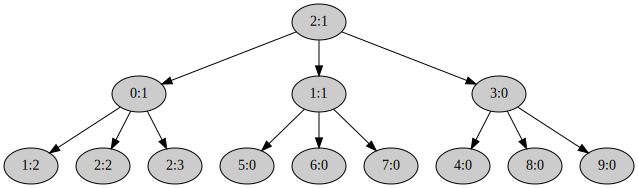

## Eager `fork()`

Системный вызов
[`fork()`](https://pubs.opengroup.org/onlinepubs/9699919799/functions/fork.html)
долгое время считался удачной абстракцией.
Но время показало, что у него есть и большое количество недостатков,
см. статью
[A `fork()` in the road](https://www.microsoft.com/en-us/research/uploads/prod/2019/04/fork-hotos19.pdf).
Хотя не стоит воспринимать
[`fork()`](https://pubs.opengroup.org/onlinepubs/9699919799/functions/fork.html)
как удачный интерфейс порождения процессов,
его реализация является хорошим упражнением.

Nikka воплощает некоторые идеи [экзоядра](https://en.wikipedia.org/wiki/Exokernel),
поэтому реализовывать
[`fork()`](https://pubs.opengroup.org/onlinepubs/9699919799/functions/fork.html)
будем в пространстве пользователя.
Естественно, от ядра потребуется небольшая помощь.
Тем более то, что реализует ядро, пригодится и для других целей.
Например, можно будет реализовать аналог современного системного вызова для порождения процессов ---
[`posix_spawn()`](https://pubs.opengroup.org/onlinepubs/9699919799/functions/posix_spawn.html).
Естественно, также в пространстве пользователя.

Подробнее про концепцию экзоядра можно почитать в оригинальной статье ---
[Exokernel: an operating system architecture for application-level resource management](https://pdos.csail.mit.edu/6.828/2008/readings/engler95exokernel.pdf).


### Системный вызов [`kernel::process::syscall::exofork()`](../../doc/kernel/process/syscall/fn.exofork.html)

Реализуйте [системный вызов](../../doc/kernel/process/syscall/fn.exofork.html)

```rust
fn exofork(
    process: MutexGuard<Process>,
    context: MiniContext,
) -> Result<SyscallResult>
```

в файле [`kernel/src/process/syscall.rs`](https://gitlab.com/sergey-v-galtsev/nikka-public/-/blob/master/kernel/src/process/syscall.rs).

Он создаёт копию вызывающего процесса `process` и возвращает его
[`Pid`](../../doc/ku/process/pid/enum.Pid.html).
При этом новый процесс создаётся практически без адресного пространства и не готовый к работе.
Поэтому он, в частности, не ставится в очередь планировщика.

Этот системный вызов использует создание копии системной части адресного пространства процесса `process`,
которое
[вы реализовали ранее](../../lab/book/2-mm-6-address-space-2-translate.html#%D0%97%D0%B0%D0%B4%D0%B0%D1%87%D0%B0-6--%D1%81%D0%BE%D0%B7%D0%B4%D0%B0%D0%BD%D0%B8%D0%B5-%D0%BF%D0%BE%D0%BB%D0%BD%D0%BE%D0%B9-%D0%BA%D0%BE%D0%BF%D0%B8%D0%B8-%D0%B2%D0%B8%D1%80%D1%82%D1%83%D0%B0%D0%BB%D1%8C%D0%BD%D0%BE%D0%B3%D0%BE-%D0%BE%D1%82%D0%BE%D0%B1%D1%80%D0%B0%D0%B6%D0%B5%D0%BD%D0%B8%D1%8F).
А вот пользовательскую часть адресного пространства он не копирует.
Этим займётся код на стороне пользователя.

Системный вызов `exofork()` возвращает
[`Pid::Id`](../../doc/ku/process/pid/enum.Pid.html#variant.Id)
с идентификатором потомка в процессе родителя и константу
[`Pid::Current`](../../doc/ku/process/pid/enum.Pid.html#variant.Current)
в процессе потомка.

Текущий контекст родителя --- `context` --- нужно записать в потомка.
Вы уже делали аналогично для
[`sched_yield()`](../../doc/kernel/process/syscall/fn.sched_yield.html).
В родителя
[`exofork()`](../../doc/kernel/process/syscall/fn.exofork.html)
вернётся через функцию
[`kernel::process::syscall::sysret()`](../../doc/kernel/process/syscall/fn.sysret.html),
которая получает `context` на вход и восстанавливает его.
А вот потомок будет позже запущен планировщиком через цепочку
[`kernel::process::process::Process::enter_user_mode()`](../../doc/kernel/process/process/struct.Process.html#method.enter_user_mode) ->
[`kernel::process::registers::Registers::switch_to()`](../../doc/kernel/process/registers/struct.Registers.html#method.switch_to) ->
[`iretq`](https://www.felixcloutier.com/x86/iret:iretd:iretq).
И для
[`iretq`](https://www.felixcloutier.com/x86/iret:iretd:iretq)
нужно предоставить правильный контекст пользователя, в который нужно будет переключиться.

Обратите внимание на код библиотечной обёртки
[`lib::syscall::exofork()`](../../doc/lib/syscall/fn.exofork.html)
для этого системного вызова
в файле [`user/lib/src/syscall.rs`](https://gitlab.com/sergey-v-galtsev/nikka-public/-/blob/master/user/lib/src/syscall.rs).
Она предполагает, что ваша реализация функции
[`lib::syscall::syscall()`](../../doc/lib/syscall/fn.syscall.html)
возвращает два поля в кортеже --- `child_pid` и `process_info`:
```rust
let (child_pid, process_info) = syscall(Syscall::EXOFORK.bits(), 0, 0, 0, 0, 0)?;
```
В поле `child_pid` должен быть
[`Pid::Id`](../../doc/ku/process/pid/enum.Pid.html#variant.Id)
с идентификатором потомка в процессе родителя или
[`Pid::Current`](../../doc/ku/process/pid/enum.Pid.html#variant.Current)
в процессе потомка.
А в `process_info` --- ссылка на системную информацию о текущем процессе
[`ku::info::ProcessInfo`](../../doc/ku/info/struct.ProcessInfo.html).
Это поле имеет смысл только для потомка.
Соглашение такое: ядро при запуске нового процесса и через метод
[`kernel::process::Process::new()`](../../doc/kernel/process/struct.Process.html#method.new)
и через метод
[`kernel::process::Process::duplicate()`](../../doc/kernel/process/struct.Process.html#method.duplicate)
передаёт в одном из регистров ссылку на
[`ku::info::ProcessInfo`](../../doc/ku/info/struct.ProcessInfo.html).
Метод
[`kernel::process::Process::new()`](../../doc/kernel/process/struct.Process.html#method.new)
использует регистр `rdi`.
А метод
[`kernel::process::Process::duplicate()`](../../doc/kernel/process/struct.Process.html#method.duplicate) ---
`rsi`, предполагая что ошибка из системного вызова передаётся через `rax`, а `pid` --- через `rdi`.
Вы можете поменять эти соглашения.
Но в любом случае проверьте, что в
[`lib::syscall::exofork()`](../../doc/lib/syscall/fn.exofork.html)
приходит правильные и `pid` и ссылка на
[`ku::info::ProcessInfo`](../../doc/ku/info/struct.ProcessInfo.html).


### Системный вызов [`kernel::process::syscall::set_state()`](../../doc/kernel/process/syscall/fn.set_state.html)

Реализуйте [системный вызов](../../doc/kernel/process/syscall/fn.set_state.html)

```rust
fn set_state(
    process: MutexGuard<Process>,
    dst_pid: usize,
    state: usize,
) -> Result<SyscallResult>
```

в файле [`kernel/src/process/syscall.rs`](https://gitlab.com/sergey-v-galtsev/nikka-public/-/blob/master/kernel/src/process/syscall.rs).

Он переводит целевой процесс, заданный идентификатором `dst_pid`, в заданное состояние `state`.
И ставит его в очередь планировщика в случае
[`State::RUNNABLE`](../../doc/ku/process/struct.State.html#associatedconstant.RUNNABLE).
Не забудьте
[проверить права доступа](../../lab/book/5-um-2-memory.html#check_process_permissions)
процесса `process` к процессу `dst_pid`.


### Рекурсивное отображение памяти

Для того чтобы в пространстве пользователя процесс мог прочитать собственное
отображение страниц адресного пространства,
удобно использовать старый джедайский трюк ---
[рекурсивное отображение памяти](https://os.phil-opp.com/page-tables/#recursive-mapping).

Реализуйте [метод](../../doc/kernel/memory/mapping/struct.Mapping.html#method.make_recursive_mapping)

```rust
fn Mapping::make_recursive_mapping(&mut self) -> Result<usize>
```

в файле [`kernel/src/memory/mapping.rs`](https://gitlab.com/sergey-v-galtsev/nikka-public/-/blob/master/kernel/src/memory/mapping.rs).
Выберете в таблице страниц корневого уровня свободную запись, например ближе к концу.
И используйте её как рекурсивную.
Сохраните её номер в поле
[`Mapping::recursive_mapping`](../../doc/kernel/memory/mapping/struct.Mapping.html#structfield.recursive_mapping)
и верните наружу.
Поправьте методы
[`Mapping::duplicate_page_table()`](../../doc/kernel/memory/mapping/struct.Mapping.html#method.duplicate_page_table) и
[`Mapping::drop_page_table()`](../../doc/kernel/memory/mapping/struct.Mapping.html#method.drop_page_table),
чтобы они игнорировали эту запись корневой таблицы страниц.


### Библиотечные функции

В файле
[`user/lib/src/memory/mod.rs`](https://gitlab.com/sergey-v-galtsev/nikka-public/-/blob/master/user/lib/src/memory/mod.rs)
реализуйте вспомогательные функции кода пользователя.


#### [`lib::memory::temp_page()`](../../doc/lib/memory/fn.temp_page.html)

```rust
fn temp_page() -> Result<Page>
```

Заводит в адресном пространстве процесса страницу памяти для временных нужд.
Использует системный вызов
[`lib::syscall::map()`](../../doc/lib/syscall/fn.map.html),
определённый в файле
[`user/lib/src/syscall.rs`](https://gitlab.com/sergey-v-galtsev/nikka-public/-/blob/master/user/lib/src/syscall.rs),
реализацию которого в ядре [вы уже написали](../../lab/book/5-um-2-memory.html#map).


#### [`lib::memory::copy_page()`](../../doc/lib/memory/fn.copy_page.html)

```rust
unsafe fn copy_page(src: Page, dst: Page)
```

Копирует содержимое страницы `src` в страницу `dst` с помощью
[core::ptr::copy_nonoverlapping()](https://doc.rust-lang.org/nightly/core/ptr/fn.copy_nonoverlapping.html).


#### [`lib::memory::page_table()`](../../doc/lib/memory/fn.page_table.html)

```rust
fn page_table(address: Virt, level: u32) -> &'static PageTable
```

Пользуясь рекурсивной записью таблицы страниц,
выдаёт ссылку на таблицу страниц заданного уровня `level` для заданного виртуального адреса `address`.
Узнать номер рекурсивной записи в пространстве пользователя можно методом
[`ProcessInfo::recursive_mapping()`](../../doc/ku/info/struct.ProcessInfo.html#method.recursive_mapping),
а получить саму структуру
[`ku::info::ProcessInfo`](../../doc/ku/info/struct.ProcessInfo.html)
можно функцией
[`ku::info::process_info()`](../../doc/ku/info/fn.process_info.html).


### Основной код пользовательского процесса `eager_fork`

В файле [`user/eager_fork/src/main.rs`](https://gitlab.com/sergey-v-galtsev/nikka-public/-/blob/master/user/eager_fork/src/main.rs) пользовательского процесса `eager_fork` реализуйте следующие функции.


#### `copy_page_table()`

```rust
fn copy_page_table(
    child: Pid,
    level: u32,
    virt_addr: Virt,
) -> Result<()>
```

Копирует таблицу страниц уровня `level` для виртуального адреса `virt_addr`
из своего адресного пространства в пространство дочернего процесса `child`.
Работает рекурсивно.
Корень рекурсии запускает функция

```rust
fn copy_address_space(child: Pid) -> Result<()> {
    copy_page_table(child, PAGE_DIRECTORY_LEVEL, Virt::default())
}
```

Проходится по таблице страниц, получая ссылку на неё с помощью
[реализованной вами ранее](../../lab/book/5-um-3-eager-fork.html#page_table)
[`lib::memory::page_table()`](../../doc/lib/memory/fn.page_table.html).
На записях
[`PageTableEntry`](../../doc/ku/memory/mmu/struct.PageTableEntry.html),
которые доступны для пользовательского кода,
либо рекурсивно спускается на следующий уровень таблицы страниц,
либо на листьевом уровне копирует содержимое отображённой страницы.
Адрес отображаемой страницы вычисляет поэтапно на рекурсивных вызовах с помощью аргумента `virt_addr`,
номера обрабатываемой записи
[`PageTableEntry`](../../doc/ku/memory/mmu/struct.PageTableEntry.html),
и уровня таблицы страниц.

Для копирования страницы в целевой процесс, сначала выделяет временную страницу
в собственном адресном пространстве с помощью функции
[`lib::memory::temp_page()`](../../doc/lib/memory/fn.temp_page.html).
Копирует текущую отображаемую страницу туда с помощью
[реализованной вами ранее](../../lab/book/5-um-3-eager-fork.html#copy_page)
функции
[`lib::memory::copy_page()`](../../doc/lib/memory/fn.copy_page.html).
Затем, с помощью системных вызовов
[`lib::syscall::copy_mapping()`](../../doc/lib/syscall/fn.copy_mapping.html)
и
[`lib::syscall::unmap()`](../../doc/lib/syscall/fn.unmap.html)
передаёт скопированную временную страницу потомку `child`, отображая её в его адресном пространстве
по адресу исходной страницы в своём адресном пространстве.

Запись номер `ku::process_info().recursive_mapping()` корневой таблицы страниц, а также страницы,
предоставляющие пользовательскому процессу информацию о нём, системе и
[`RingBuffer`](../../doc/ku/ring_buffer/struct.RingBuffer.html)
для логирования,
нужно проигнорировать.
То есть, страницы для которых `ku::process_info().contains_address()` возвращает `true`.
Их отобразит в память потомка ядро, выбирая новые, а не разделяемые, физические фреймы.


#### `eager_fork()`

```rust
fn eager_fork() -> Result<bool>
```

Создаёт процесс потомка с помощью
[реализованного вами ранее](../../lab/book/5-um-3-eager-fork.html#%D0%A1%D0%B8%D1%81%D1%82%D0%B5%D0%BC%D0%BD%D1%8B%D0%B9-%D0%B2%D1%8B%D0%B7%D0%BE%D0%B2-exofork)
системного вызова
[`lib::syscall::exofork()`](../../doc/lib/syscall/fn.exofork.html).
Далее копирует своё адресное пространство в пространство потомка с помощью функции `fn copy_address_space()`.
И запускает потомка системным вызовом
[`lib::syscall::set_state()`](../../doc/lib/syscall/fn.set_state.html),
устанавливая его состояние в
[`State::RUNNABLE`](../../doc/ku/process/struct.State.html#associatedconstant.RUNNABLE).
В потомке ничего не делает.
Возвращает `true` в процессе потомка и `false` в процессе родителя.


### Проверьте себя

Теперь должны заработать тесты `exofork_syscall()` и `eager_fork()` в файле
[`kernel/tests/5-um-3-eager-fork.rs`](https://gitlab.com/sergey-v-galtsev/nikka-public/-/blob/master/kernel/tests/5-um-3-eager-fork.rs):

```console
$ (cd kernel; cargo test --test 5-um-3-eager-fork)
...
5_um_3_eager_fork::exofork_syscall--------------------------
15:26:59 0 I page allocator init; free_page_count = 33822867456; block = [0v18000000000, 0v7F8000000000), size 126.000 TiB
15:26:59 0 I duplicate; address_space = "process" @ 0p7E0A000
15:26:59 0 I switch to; address_space = "process" @ 0p7E0A000
15:26:59 0 D extend mapping; block = [0v10000000, 0v10007644), size 29.566 KiB; page_block = [0v10000000, 0v10008000), size 32.000 KiB; flags =   R; page_flags = PRESENT | WRITABLE | USER_ACCESSIBLE
15:26:59 0 D elf loadable program header; file_block = [0v2016D9, 0v208D1D), size 29.566 KiB; memory_block = [0v10000000, 0v10007644), size 29.566 KiB; flags =   R
15:26:59 0 D extend mapping; block = [0v10008000, 0v100547CD), size 305.950 KiB; page_block = [0v10008000, 0v10055000), size 308.000 KiB; flags = X R; page_flags = PRESENT | WRITABLE | USER_ACCESSIBLE
15:26:59 0 D elf loadable program header; file_block = [0v208D29, 0v255EA6), size 308.372 KiB; memory_block = [0v10007650, 0v100547CD), size 308.372 KiB; flags = X R
15:26:59 0 D elf loadable program header; file_block = [0v255EA9, 0v255F99), size 240 B; memory_block = [0v100547D0, 0v100548C0), size 240 B; flags =  WR
15:26:59 0 D extend mapping; block = [0v10055000, 0v1005AAE0), size 22.719 KiB; page_block = [0v10055000, 0v1005B000), size 24.000 KiB; flags =  WR; page_flags = PRESENT | WRITABLE | USER_ACCESSIBLE
15:26:59 0 D elf loadable program header; file_block = [0v255F99, 0v25C191), size 24.492 KiB; memory_block = [0v100548C0, 0v1005AAE0), size 24.531 KiB; flags =  WR
15:26:59 0 I switch to; address_space = "base" @ 0p1000
15:26:59 0 I loaded ELF file; context = { rip: 0v10007BC0, rsp: 0v7F7FFFFFF000 }; file_size = 5.474 MiB; process = { pid: <current>, address_space: "process" @ 0p7E0A000, { rip: 0v10007BC0, rsp: 0v7F7FFFFFF000 } }
15:26:59 0 I allocate; slot = Process { pid: 0:0, address_space: "0:0" @ 0p7E0A000, { rip: 0v10007BC0, rsp: 0v7F7FFFFFF000 } }; process_count = 1
15:26:59 0 I user process page table entry; entry_point = 0v10007BC0; frame = Frame(32234 @ 0p7DEA000); flags = PRESENT | WRITABLE | USER_ACCESSIBLE | ACCESSED | DIRTY
15:26:59 0 D process_frames = 152
15:26:59 0 I page allocator init; free_page_count = 33822867456; block = [0v18000000000, 0v7F8000000000), size 126.000 TiB
15:26:59 0 I duplicate; address_space = "process" @ 0p7D72000
15:26:59 0 I switch to; address_space = "process" @ 0p7D72000
15:26:59 0 D extend mapping; block = [0v10000000, 0v10007644), size 29.566 KiB; page_block = [0v10000000, 0v10008000), size 32.000 KiB; flags =   R; page_flags = PRESENT | WRITABLE | USER_ACCESSIBLE
15:26:59 0 D elf loadable program header; file_block = [0v2016D9, 0v208D1D), size 29.566 KiB; memory_block = [0v10000000, 0v10007644), size 29.566 KiB; flags =   R
15:26:59 0 D extend mapping; block = [0v10008000, 0v100547CD), size 305.950 KiB; page_block = [0v10008000, 0v10055000), size 308.000 KiB; flags = X R; page_flags = PRESENT | WRITABLE | USER_ACCESSIBLE
15:26:59 0 D elf loadable program header; file_block = [0v208D29, 0v255EA6), size 308.372 KiB; memory_block = [0v10007650, 0v100547CD), size 308.372 KiB; flags = X R
15:26:59 0 D elf loadable program header; file_block = [0v255EA9, 0v255F99), size 240 B; memory_block = [0v100547D0, 0v100548C0), size 240 B; flags =  WR
15:26:59 0 D extend mapping; block = [0v10055000, 0v1005AAE0), size 22.719 KiB; page_block = [0v10055000, 0v1005B000), size 24.000 KiB; flags =  WR; page_flags = PRESENT | WRITABLE | USER_ACCESSIBLE
15:26:59 0 D elf loadable program header; file_block = [0v255F99, 0v25C191), size 24.492 KiB; memory_block = [0v100548C0, 0v1005AAE0), size 24.531 KiB; flags =  WR
15:27:00.013 0 I switch to; address_space = "base" @ 0p1000
15:27:00.017 0 I loaded ELF file; context = { rip: 0v10007BC0, rsp: 0v7F7FFFFFF000 }; file_size = 5.474 MiB; process = { pid: <current>, address_space: "process" @ 0p7D72000, { rip: 0v10007BC0, rsp: 0v7F7FFFFFF000 } }
15:27:00.031 0 I allocate; slot = Process { pid: 1:0, address_space: "1:0" @ 0p7D72000, { rip: 0v10007BC0, rsp: 0v7F7FFFFFF000 } }; process_count = 2
15:27:00.041 0 I user process page table entry; entry_point = 0v10007BC0; frame = Frame(32082 @ 0p7D52000); flags = PRESENT | WRITABLE | USER_ACCESSIBLE | ACCESSED | DIRTY
15:27:00.055 0 D process_frames = 152
15:27:00.059 0 I switch to; address_space = "0:0" @ 0p7E0A000
15:27:00.153 0 I page allocator init; free_page_count = 33688649728; block = [0v18000000000, 0v7F0000000000), size 125.500 TiB
15:27:00.161 0 I duplicate; address_space = "process" @ 0p7CDA000
15:27:00.167 0 I switch to; address_space = "process" @ 0p7CDA000
15:27:00.173 0 I switch to; address_space = "0:0" @ 0p7E0A000
15:27:00.179 0 I allocate; slot = Process { pid: 2:0, address_space: "2:0" @ 0p7CDA000, { rip: 0v0, rsp: 0v0 } }; process_count = 3
15:27:00.189 0 I syscall = "exofork"; process = 0:0; child = 2:0
15:27:00.195 0 D child_pid = 2:0
15:27:00.199 0 D child = { pid: 2:0, address_space: "2:0" @ 0p7CDA000, { rip: 0v0, rsp: 0v0 } }
15:27:00.211 0 I free; slot = Process { pid: 0:0, address_space: "0:0" @ 0p7E0A000, { rip: 0v10007BC0, rsp: 0v7F7FFFFFF000 } }; process_count = 2
15:27:00.219 0 I switch to; address_space = "base" @ 0p1000
15:27:00.225 0 I drop the current address space; address_space = "0:0" @ 0p7E0A000; switch_to = "base" @ 0p1000
15:27:00.293 0 I free; slot = Process { pid: 1:0, address_space: "1:0" @ 0p7D72000, { rip: 0v10007BC0, rsp: 0v7F7FFFFFF000 } }; process_count = 1
15:27:00.303 0 I drop; address_space = "1:0" @ 0p7D72000
15:27:00.367 0 I dequeue; pid = Some(2:0)
15:27:00.373 0 I switch to; address_space = "2:0" @ 0p7CDA000
15:27:00.379 0 D entering the user mode; pid = 2:0; registers = { rax: 0x0, rdi: 0xFFFFFFFFFFFFFFFE, rsi: 0x7EFFFFFFB000, { mode: user, cs:rip: 0x0023:0v0, ss:rsp: 0x001B:0v0, rflags: IF } }
15:27:00.395 0 D trap = "Page Fault"; context = { mode: user, cs:rip: 0x0023:0v0, ss:rsp: 0x001B:0v0, rflags: IF }; info = { address: 0v0, code: 0b10100 = non-present page | execute | user }
15:27:00.425 0 I user mode trap; trap = "Page Fault"; number = 14; info = { address: 0v0, code: 0b10100 = non-present page | execute | user }; context = { mode: user, cs:rip: 0x0023:0v0, ss:rsp: 0x001B:0v0, rflags: IF }; pid = 2:0
15:27:00.441 0 I free; slot = Process { pid: 2:0, address_space: "2:0" @ 0p7CDA000, { rip: 0v0, rsp: 0v0 } }; process_count = 0
15:27:00.451 0 I switch to; address_space = "base" @ 0p1000
15:27:00.457 0 I drop the current address space; address_space = "2:0" @ 0p7CDA000; switch_to = "base" @ 0p1000
15:27:00.529 0 D leaving the user mode; pid = 2:0
15:27:00.535 0 I dequeue; pid = None
5_um_3_eager_fork::exofork_syscall----------------- [passed]

5_um_3_eager_fork::eager_fork-------------------------------
15:27:00.635 0 I page allocator init; free_page_count = 33822867456; block = [0v18000000000, 0v7F8000000000), size 126.000 TiB
15:27:00.645 0 I duplicate; address_space = "process" @ 0p7CC4000
15:27:00.649 0 I switch to; address_space = "process" @ 0p7CC4000
15:27:00.657 0 D extend mapping; block = [0v10000000, 0v10007A34), size 30.551 KiB; page_block = [0v10000000, 0v10008000), size 32.000 KiB; flags =   R; page_flags = PRESENT | WRITABLE | USER_ACCESSIBLE
15:27:00.671 0 D elf loadable program header; file_block = [0v77B368, 0v782D9C), size 30.551 KiB; memory_block = [0v10000000, 0v10007A34), size 30.551 KiB; flags =   R
15:27:00.707 0 D extend mapping; block = [0v10008000, 0v1005D3F2), size 340.986 KiB; page_block = [0v10008000, 0v1005E000), size 344.000 KiB; flags = X R; page_flags = PRESENT | WRITABLE | USER_ACCESSIBLE
15:27:00.721 0 D elf loadable program header; file_block = [0v782DA8, 0v7D875A), size 342.424 KiB; memory_block = [0v10007A40, 0v1005D3F2), size 342.424 KiB; flags = X R
15:27:00.747 0 D elf loadable program header; file_block = [0v7D8760, 0v7D8860), size 256 B; memory_block = [0v1005D3F8, 0v1005D4F8), size 256 B; flags =  WR
15:27:00.759 0 D extend mapping; block = [0v1005E000, 0v100640A0), size 24.156 KiB; page_block = [0v1005E000, 0v10065000), size 28.000 KiB; flags =  WR; page_flags = PRESENT | WRITABLE | USER_ACCESSIBLE
15:27:00.771 0 D elf loadable program header; file_block = [0v7D8860, 0v7DF3E0), size 26.875 KiB; memory_block = [0v1005D4F8, 0v100640A0), size 26.914 KiB; flags =  WR
15:27:00.799 0 I switch to; address_space = "base" @ 0p1000
15:27:00.803 0 I loaded ELF file; context = { rip: 0v1000F750, rsp: 0v7F7FFFFFF000 }; file_size = 5.763 MiB; process = { pid: <current>, address_space: "process" @ 0p7CC4000, { rip: 0v1000F750, rsp: 0v7F7FFFFFF000 } }
15:27:00.817 0 I allocate; slot = Process { pid: 2:1, address_space: "2:1" @ 0p7CC4000, { rip: 0v1000F750, rsp: 0v7F7FFFFFF000 } }; process_count = 1
15:27:00.827 0 I user process page table entry; entry_point = 0v1000F750; frame = Frame(32098 @ 0p7D62000); flags = PRESENT | WRITABLE | USER_ACCESSIBLE | ACCESSED | DIRTY
15:27:00.841 0 D process_frames = 162
15:27:00.845 0 I dequeue; pid = Some(2:1)
15:27:00.849 0 I switch to; address_space = "2:1" @ 0p7CC4000
15:27:00.853 0 D entering the user mode; pid = 2:1; registers = { rax: 0x0, rdi: 0x7F7FFFFDB000, rsi: 0x0, { mode: user, cs:rip: 0x0023:0v1000F750, ss:rsp: 0x001B:0v7F7FFFFFF000, rflags: IF } }
15:27:00.873 0 I name = "eager_fork *"; pedigree = [2:1]; len = 1; capacity = 3; pid = 2:1
15:27:01.021 0 I page allocator init; free_page_count = 33688649728; block = [0v18000000000, 0v7F0000000000), size 125.500 TiB
15:27:01.029 0 I duplicate; address_space = "process" @ 0p7D4C000
15:27:01.035 0 I switch to; address_space = "process" @ 0p7D4C000
15:27:01.041 0 I switch to; address_space = "2:1" @ 0p7CC4000
15:27:01.047 0 I allocate; slot = Process { pid: 1:1, address_space: "1:1" @ 0p7D4C000, { rip: 0v1000B487, rsp: 0v7F7FFFFFDB08 } }; process_count = 2
15:27:01.057 0 I syscall = "exofork"; process = 2:1; child = 1:1
15:27:01.063 0 D leaving the user mode; pid = 2:1
15:27:01.069 0 I the process was preempted; pid = 2:1; user_context = { mode: user, cs:rip: 0x0023:0v1002759D, ss:rsp: 0x001B:0v7F7FFFFFD968, rflags: IF ZF PF }
15:27:01.079 0 I returned
15:27:01.083 0 I dequeue; pid = Some(2:1)
15:27:01.087 0 I switch to; address_space = "2:1" @ 0p7CC4000
15:27:01.093 0 D entering the user mode; pid = 2:1; registers = { rax: 0xFE, rdi: 0x10060B38, rsi: 0x0, { mode: user, cs:rip: 0x0023:0v1002759D, ss:rsp: 0x001B:0v7F7FFFFFD968, rflags: IF ZF PF } }
15:27:01.107 0 I syscall::exofork() done; child = Ok(1:1); pid = 2:1
15:27:01.289 0 I syscall::set_state(); child = 1:1; result = Ok(()); pid = 2:1
15:27:01.387 0 I page allocator init; free_page_count = 33688649728; block = [0v18000000000, 0v7F0000000000), size 125.500 TiB
15:27:01.397 0 I duplicate; address_space = "process" @ 0p7DF2000
15:27:01.401 0 I switch to; address_space = "process" @ 0p7DF2000
15:27:01.407 0 I switch to; address_space = "2:1" @ 0p7CC4000
15:27:01.413 0 I allocate; slot = Process { pid: 0:1, address_space: "0:1" @ 0p7DF2000, { rip: 0v1000B487, rsp: 0v7F7FFFFFDB08 } }; process_count = 3
15:27:01.423 0 I syscall = "exofork"; process = 2:1; child = 0:1
15:27:01.427 0 I syscall::exofork() done; child = Ok(0:1); pid = 2:1
15:27:01.599 0 I syscall::set_state(); child = 0:1; result = Ok(()); pid = 2:1
15:27:01.711 0 I page allocator init; free_page_count = 33688649728; block = [0v18000000000, 0v7F0000000000), size 125.500 TiB
15:27:01.721 0 I duplicate; address_space = "process" @ 0p7C1C000
15:27:01.725 0 I switch to; address_space = "process" @ 0p7C1C000
15:27:01.733 0 I switch to; address_space = "2:1" @ 0p7CC4000
15:27:01.739 0 I allocate; slot = Process { pid: 3:0, address_space: "3:0" @ 0p7C1C000, { rip: 0v1000B487, rsp: 0v7F7FFFFFDB08 } }; process_count = 4
15:27:01.749 0 I syscall = "exofork"; process = 2:1; child = 3:0
15:27:01.753 0 I syscall::exofork() done; child = Ok(3:0); pid = 2:1
15:27:01.925 0 I syscall::set_state(); child = 3:0; result = Ok(()); pid = 2:1
15:27:01.931 0 I free; slot = Process { pid: 2:1, address_space: "2:1" @ 0p7CC4000, { rip: 0v1002759D, rsp: 0v7F7FFFFFD968 } }; process_count = 3
15:27:01.941 0 I switch to; address_space = "base" @ 0p1000
15:27:01.945 0 I drop the current address space; address_space = "2:1" @ 0p7CC4000; switch_to = "base" @ 0p1000
15:27:02.017 0 I syscall = "exit"; pid = 2:1; code = 0; reason = Some(OK)
15:27:02.023 0 D leaving the user mode; pid = 2:1
15:27:02.027 0 I dequeue; pid = Some(1:1)
15:27:02.031 0 I switch to; address_space = "1:1" @ 0p7D4C000
15:27:02.037 0 D entering the user mode; pid = 1:1; registers = { rax: 0x0, rdi: 0xFFFFFFFFFFFFFFFE, rsi: 0x7EFFFFFFB000, { mode: user, cs:rip: 0x0023:0v1000B487, ss:rsp: 0x001B:0v7F7FFFFFDB08, rflags: IF } }
15:27:02.063 0 D leaving the user mode; pid = 1:1
15:27:02.067 0 I the process was preempted; pid = 1:1; user_context = { mode: user, cs:rip: 0x0023:0v1001D938, ss:rsp: 0x001B:0v7F7FFFFFD1A8, rflags: IF SF PF CF }
15:27:02.081 0 I returned
15:27:02.085 0 I dequeue; pid = Some(0:1)
15:27:02.089 0 I switch to; address_space = "0:1" @ 0p7DF2000
15:27:02.093 0 D entering the user mode; pid = 0:1; registers = { rax: 0x0, rdi: 0xFFFFFFFFFFFFFFFE, rsi: 0x7EFFFFFFB000, { mode: user, cs:rip: 0x0023:0v1000B487, ss:rsp: 0x001B:0v7F7FFFFFDB08, rflags: IF ZF PF } }
15:27:02.109 0 I syscall::exofork() done; child = Ok(<current>); pid = 0:1
15:27:02.121 0 I just created; child = <current>; pid = 0:1; pid = 0:1
15:27:02.123 0 I name = "eager_fork *1"; pedigree = [2:1, 0:1]; len = 2; capacity = 3; pid = 0:1
15:27:02.241 0 I page allocator init; free_page_count = 33554432000; block = [0v18000000000, 0v7E8000000000), size 125.000 TiB
15:27:02.251 0 I duplicate; address_space = "process" @ 0p7CC4000
15:27:02.255 0 I switch to; address_space = "process" @ 0p7CC4000
15:27:02.263 0 I switch to; address_space = "0:1" @ 0p7DF2000
15:27:02.267 0 I allocate; slot = Process { pid: 2:2, address_space: "2:2" @ 0p7CC4000, { rip: 0v1000B487, rsp: 0v7F7FFFFFD648 } }; process_count = 4
15:27:02.277 0 I syscall = "exofork"; process = 0:1; child = 2:2
15:27:02.283 0 I syscall::exofork() done; child = Ok(2:2); pid = 0:1
15:27:02.363 0 D leaving the user mode; pid = 0:1
15:27:02.367 0 I the process was preempted; pid = 0:1; user_context = { mode: user, cs:rip: 0x0023:0v1002C383, ss:rsp: 0x001B:0v7F7FFFFFB9E8, rflags: IF ZF PF }
15:27:02.377 0 I returned
15:27:02.381 0 I dequeue; pid = Some(3:0)
15:27:02.387 0 I switch to; address_space = "3:0" @ 0p7C1C000
15:27:02.391 0 D entering the user mode; pid = 3:0; registers = { rax: 0x0, rdi: 0xFFFFFFFFFFFFFFFE, rsi: 0x7EFFFFFFB000, { mode: user, cs:rip: 0x0023:0v1000B487, ss:rsp: 0x001B:0v7F7FFFFFDB08, rflags: IF ZF PF } }
15:27:02.407 0 I syscall::exofork() done; child = Ok(<current>); pid = 3:0
15:27:02.417 0 I just created; child = <current>; pid = 3:0; pid = 3:0
15:27:02.421 0 I name = "eager_fork *2"; pedigree = [2:1, 3:0]; len = 2; capacity = 3; pid = 3:0
15:27:02.549 0 I page allocator init; free_page_count = 33554432000; block = [0v18000000000, 0v7E8000000000), size 125.000 TiB
15:27:02.559 0 I duplicate; address_space = "process" @ 0p7D0C000
15:27:02.563 0 I switch to; address_space = "process" @ 0p7D0C000
15:27:02.571 0 I switch to; address_space = "3:0" @ 0p7C1C000
15:27:02.577 0 I allocate; slot = Process { pid: 4:0, address_space: "4:0" @ 0p7D0C000, { rip: 0v1000B487, rsp: 0v7F7FFFFFD648 } }; process_count = 5
15:27:02.585 0 I syscall = "exofork"; process = 3:0; child = 4:0
15:27:02.591 0 I syscall::exofork() done; child = Ok(4:0); pid = 3:0
15:27:02.663 0 D leaving the user mode; pid = 3:0
15:27:02.669 0 I the process was preempted; pid = 3:0; user_context = { mode: user, cs:rip: 0x0023:0v1002C383, ss:rsp: 0x001B:0v7F7FFFFFB9E8, rflags: IF ZF PF }
15:27:02.679 0 I returned
15:27:02.683 0 I dequeue; pid = Some(1:1)
15:27:02.687 0 I switch to; address_space = "1:1" @ 0p7D4C000
15:27:02.693 0 D entering the user mode; pid = 1:1; registers = { rax: 0xD1, rdi: 0x7F7FFFFFD2A8, rsi: 0x7F7FFFFFD6E0, { mode: user, cs:rip: 0x0023:0v1001D938, ss:rsp: 0x001B:0v7F7FFFFFD1A8, rflags: IF SF PF CF } }
15:27:02.051 0 I syscall::exofork() done; child = Ok(<current>); pid = 1:1
15:27:02.063 0 I just created; child = <current>; pid = 1:1; pid = 1:1
15:27:02.711 0 I name = "eager_fork *0"; pedigree = [2:1, 1:1]; len = 2; capacity = 3; pid = 1:1
15:27:02.841 0 I page allocator init; free_page_count = 33554432000; block = [0v18000000000, 0v7E8000000000), size 125.000 TiB
15:27:02.851 0 I duplicate; address_space = "process" @ 0p7CFD000
15:27:02.855 0 I switch to; address_space = "process" @ 0p7CFD000
15:27:02.861 0 I switch to; address_space = "1:1" @ 0p7D4C000
15:27:02.867 0 I allocate; slot = Process { pid: 5:0, address_space: "5:0" @ 0p7CFD000, { rip: 0v1000B487, rsp: 0v7F7FFFFFD648 } }; process_count = 6
15:27:02.877 0 I syscall = "exofork"; process = 1:1; child = 5:0
15:27:02.883 0 I syscall::exofork() done; child = Ok(5:0); pid = 1:1
15:27:03.061 0 I syscall::set_state(); child = 5:0; result = Ok(()); pid = 1:1
15:27:03.163 0 I page allocator init; free_page_count = 33554432000; block = [0v18000000000, 0v7E8000000000), size 125.000 TiB
15:27:03.171 0 I duplicate; address_space = "process" @ 0p7AE8000
15:27:03.177 0 I switch to; address_space = "process" @ 0p7AE8000
15:27:03.183 0 I switch to; address_space = "1:1" @ 0p7D4C000
15:27:03.189 0 I allocate; slot = Process { pid: 6:0, address_space: "6:0" @ 0p7AE8000, { rip: 0v1000B487, rsp: 0v7F7FFFFFD648 } }; process_count = 7
15:27:03.199 0 I syscall = "exofork"; process = 1:1; child = 6:0
15:27:03.203 0 I syscall::exofork() done; child = Ok(6:0); pid = 1:1
15:27:03.375 0 I syscall::set_state(); child = 6:0; result = Ok(()); pid = 1:1
15:27:03.479 0 I page allocator init; free_page_count = 33554432000; block = [0v18000000000, 0v7E8000000000), size 125.000 TiB
15:27:03.489 0 I duplicate; address_space = "process" @ 0p7A3F000
15:27:03.493 0 I switch to; address_space = "process" @ 0p7A3F000
15:27:03.499 0 I switch to; address_space = "1:1" @ 0p7D4C000
15:27:03.505 0 I allocate; slot = Process { pid: 7:0, address_space: "7:0" @ 0p7A3F000, { rip: 0v1000B487, rsp: 0v7F7FFFFFD648 } }; process_count = 8
15:27:03.515 0 I syscall = "exofork"; process = 1:1; child = 7:0
15:27:03.519 0 I syscall::exofork() done; child = Ok(7:0); pid = 1:1
15:27:03.693 0 I syscall::set_state(); child = 7:0; result = Ok(()); pid = 1:1
15:27:03.701 0 I free; slot = Process { pid: 1:1, address_space: "1:1" @ 0p7D4C000, { rip: 0v1001D938, rsp: 0v7F7FFFFFD1A8 } }; process_count = 7
15:27:03.709 0 I switch to; address_space = "base" @ 0p1000
15:27:03.715 0 I drop the current address space; address_space = "1:1" @ 0p7D4C000; switch_to = "base" @ 0p1000
15:27:03.791 0 I syscall = "exit"; pid = 1:1; code = 0; reason = Some(OK)
15:27:03.797 0 D leaving the user mode; pid = 1:1
15:27:03.801 0 I dequeue; pid = Some(0:1)
15:27:03.805 0 I switch to; address_space = "0:1" @ 0p7DF2000
15:27:03.809 0 D entering the user mode; pid = 0:1; registers = { rax: 0xC00, rdi: 0x7EFFFFFA2000, rsi: 0x1002C000, { mode: user, cs:rip: 0x0023:0v1002C383, ss:rsp: 0x001B:0v7F7FFFFFB9E8, rflags: IF ZF PF } }
15:27:03.953 0 I syscall::set_state(); child = 2:2; result = Ok(()); pid = 0:1
15:27:04.063 0 I page allocator init; free_page_count = 33554432000; block = [0v18000000000, 0v7E8000000000), size 125.000 TiB
15:27:04.071 0 I duplicate; address_space = "process" @ 0p7DB3000
15:27:04.077 0 I switch to; address_space = "process" @ 0p7DB3000
15:27:04.083 0 I switch to; address_space = "0:1" @ 0p7DF2000
15:27:04.089 0 I allocate; slot = Process { pid: 1:2, address_space: "1:2" @ 0p7DB3000, { rip: 0v1000B487, rsp: 0v7F7FFFFFD648 } }; process_count = 8
15:27:04.099 0 I syscall = "exofork"; process = 0:1; child = 1:2
15:27:04.103 0 I syscall::exofork() done; child = Ok(1:2); pid = 0:1
15:27:04.163 0 D leaving the user mode; pid = 0:1
15:27:04.167 0 I the process was preempted; pid = 0:1; user_context = { mode: user, cs:rip: 0x0023:0v1002C383, ss:rsp: 0x001B:0v7F7FFFFFB9E8, rflags: IF ZF PF }
15:27:04.177 0 I returned
15:27:04.181 0 I dequeue; pid = Some(3:0)
15:27:04.187 0 I switch to; address_space = "3:0" @ 0p7C1C000
15:27:04.191 0 D entering the user mode; pid = 3:0; registers = { rax: 0x500, rdi: 0x7EFFFFFD6000, rsi: 0x10012000, { mode: user, cs:rip: 0x0023:0v1002C383, ss:rsp: 0x001B:0v7F7FFFFFB9E8, rflags: IF ZF PF } }
15:27:04.389 0 I syscall::set_state(); child = 4:0; result = Ok(()); pid = 3:0
15:27:04.493 0 I page allocator init; free_page_count = 33554432000; block = [0v18000000000, 0v7E8000000000), size 125.000 TiB
15:27:04.503 0 I duplicate; address_space = "process" @ 0p7940000
15:27:04.507 0 I switch to; address_space = "process" @ 0p7940000
15:27:04.515 0 I switch to; address_space = "3:0" @ 0p7C1C000
15:27:04.519 0 I allocate; slot = Process { pid: 8:0, address_space: "8:0" @ 0p7940000, { rip: 0v1000B487, rsp: 0v7F7FFFFFD648 } }; process_count = 9
15:27:04.529 0 I syscall = "exofork"; process = 3:0; child = 8:0
15:27:04.535 0 I syscall::exofork() done; child = Ok(8:0); pid = 3:0
15:27:04.709 0 I syscall::set_state(); child = 8:0; result = Ok(()); pid = 3:0
15:27:04.815 0 I page allocator init; free_page_count = 33554432000; block = [0v18000000000, 0v7E8000000000), size 125.000 TiB
15:27:04.823 0 I duplicate; address_space = "process" @ 0p7896000
15:27:04.829 0 I switch to; address_space = "process" @ 0p7896000
15:27:04.835 0 I switch to; address_space = "3:0" @ 0p7C1C000
15:27:04.841 0 I allocate; slot = Process { pid: 9:0, address_space: "9:0" @ 0p7896000, { rip: 0v1000B487, rsp: 0v7F7FFFFFD648 } }; process_count = 10
15:27:04.851 0 I syscall = "exofork"; process = 3:0; child = 9:0
15:27:04.855 0 I syscall::exofork() done; child = Ok(9:0); pid = 3:0
15:27:04.863 0 D leaving the user mode; pid = 3:0
15:27:04.869 0 I the process was preempted; pid = 3:0; user_context = { mode: user, cs:rip: 0x0023:0v1001CD90, ss:rsp: 0x001B:0v7F7FFFFFB7E0, rflags: IF SF AF PF CF }
15:27:04.881 0 I returned
15:27:04.885 0 I dequeue; pid = Some(5:0)
15:27:04.889 0 I switch to; address_space = "5:0" @ 0p7CFD000
15:27:04.895 0 D entering the user mode; pid = 5:0; registers = { rax: 0x0, rdi: 0xFFFFFFFFFFFFFFFE, rsi: 0x7E7FFFFFB000, { mode: user, cs:rip: 0x0023:0v1000B487, ss:rsp: 0x001B:0v7F7FFFFFD648, rflags: IF SF PF CF } }
15:27:04.909 0 I syscall::exofork() done; child = Ok(<current>); pid = 5:0
15:27:04.919 0 I just created; child = <current>; pid = 5:0; pid = 5:0
15:27:04.923 0 I name = "eager_fork *00"; pedigree = [2:1, 1:1, 5:0]; len = 3; capacity = 3; pid = 5:0
15:27:04.947 0 I free; slot = Process { pid: 5:0, address_space: "5:0" @ 0p7CFD000, { rip: 0v1000B487, rsp: 0v7F7FFFFFD648 } }; process_count = 9
15:27:04.955 0 I switch to; address_space = "base" @ 0p1000
15:27:04.961 0 I drop the current address space; address_space = "5:0" @ 0p7CFD000; switch_to = "base" @ 0p1000
15:27:05.039 0 I syscall = "exit"; pid = 5:0; code = 0; reason = Some(OK)
15:27:05.045 0 D leaving the user mode; pid = 5:0
15:27:05.049 0 I dequeue; pid = Some(6:0)
15:27:05.053 0 I switch to; address_space = "6:0" @ 0p7AE8000
15:27:05.059 0 D entering the user mode; pid = 6:0; registers = { rax: 0x0, rdi: 0xFFFFFFFFFFFFFFFE, rsi: 0x7E7FFFFFB000, { mode: user, cs:rip: 0x0023:0v1000B487, ss:rsp: 0x001B:0v7F7FFFFFD648, rflags: IF SF PF CF } }
15:27:05.073 0 D leaving the user mode; pid = 6:0
15:27:05.077 0 I the process was preempted; pid = 6:0; user_context = { mode: user, cs:rip: 0x0023:0v1000B487, ss:rsp: 0x001B:0v7F7FFFFFD648, rflags: IF SF PF CF }
15:27:05.091 0 I returned
15:27:05.095 0 I dequeue; pid = Some(7:0)
15:27:05.099 0 I switch to; address_space = "7:0" @ 0p7A3F000
15:27:05.103 0 D entering the user mode; pid = 7:0; registers = { rax: 0x0, rdi: 0xFFFFFFFFFFFFFFFE, rsi: 0x7E7FFFFFB000, { mode: user, cs:rip: 0x0023:0v1000B487, ss:rsp: 0x001B:0v7F7FFFFFD648, rflags: IF SF PF CF } }
15:27:05.119 0 I syscall::exofork() done; child = Ok(<current>); pid = 7:0
15:27:05.129 0 I just created; child = <current>; pid = 7:0; pid = 7:0
15:27:05.133 0 I name = "eager_fork *02"; pedigree = [2:1, 1:1, 7:0]; len = 3; capacity = 3; pid = 7:0
15:27:05.155 0 I free; slot = Process { pid: 7:0, address_space: "7:0" @ 0p7A3F000, { rip: 0v1000B487, rsp: 0v7F7FFFFFD648 } }; process_count = 8
15:27:05.165 0 I switch to; address_space = "base" @ 0p1000
15:27:05.171 0 I drop the current address space; address_space = "7:0" @ 0p7A3F000; switch_to = "base" @ 0p1000
15:27:05.251 0 I syscall = "exit"; pid = 7:0; code = 0; reason = Some(OK)
15:27:05.255 0 D leaving the user mode; pid = 7:0
15:27:05.261 0 I dequeue; pid = Some(2:2)
15:27:05.265 0 I switch to; address_space = "2:2" @ 0p7CC4000
15:27:05.269 0 D entering the user mode; pid = 2:2; registers = { rax: 0x0, rdi: 0xFFFFFFFFFFFFFFFE, rsi: 0x7E7FFFFFB000, { mode: user, cs:rip: 0x0023:0v1000B487, ss:rsp: 0x001B:0v7F7FFFFFD648, rflags: IF ZF PF } }
15:27:05.285 0 I syscall::exofork() done; child = Ok(<current>); pid = 2:2
15:27:05.297 0 I just created; child = <current>; pid = 2:2; pid = 2:2
15:27:05.301 0 I name = "eager_fork *10"; pedigree = [2:1, 0:1, 2:2]; len = 3; capacity = 3; pid = 2:2
15:27:05.323 0 I free; slot = Process { pid: 2:2, address_space: "2:2" @ 0p7CC4000, { rip: 0v1000B487, rsp: 0v7F7FFFFFD648 } }; process_count = 7
15:27:05.333 0 I switch to; address_space = "base" @ 0p1000
15:27:05.337 0 I drop the current address space; address_space = "2:2" @ 0p7CC4000; switch_to = "base" @ 0p1000
15:27:05.417 0 I syscall = "exit"; pid = 2:2; code = 0; reason = Some(OK)
15:27:05.423 0 D leaving the user mode; pid = 2:2
15:27:05.427 0 I dequeue; pid = Some(0:1)
15:27:05.431 0 I switch to; address_space = "0:1" @ 0p7DF2000
15:27:05.435 0 D entering the user mode; pid = 0:1; registers = { rax: 0xF00, rdi: 0x7EFFFFED4000, rsi: 0x1000F000, { mode: user, cs:rip: 0x0023:0v1002C383, ss:rsp: 0x001B:0v7F7FFFFFB9E8, rflags: IF ZF PF } }
15:27:05.625 0 I syscall::set_state(); child = 1:2; result = Ok(()); pid = 0:1
15:27:05.745 0 I page allocator init; free_page_count = 33554432000; block = [0v18000000000, 0v7E8000000000), size 125.000 TiB
15:27:05.755 0 I duplicate; address_space = "process" @ 0p7D0F000
15:27:05.759 0 I switch to; address_space = "process" @ 0p7D0F000
15:27:05.767 0 I switch to; address_space = "0:1" @ 0p7DF2000
15:27:05.773 0 I allocate; slot = Process { pid: 2:3, address_space: "2:3" @ 0p7D0F000, { rip: 0v1000B487, rsp: 0v7F7FFFFFD648 } }; process_count = 8
15:27:05.781 0 I syscall = "exofork"; process = 0:1; child = 2:3
15:27:05.787 0 I syscall::exofork() done; child = Ok(2:3); pid = 0:1
15:27:05.987 0 I syscall::set_state(); child = 2:3; result = Ok(()); pid = 0:1
15:27:05.993 0 I free; slot = Process { pid: 0:1, address_space: "0:1" @ 0p7DF2000, { rip: 0v1002C383, rsp: 0v7F7FFFFFB9E8 } }; process_count = 7
15:27:06.003 0 I switch to; address_space = "base" @ 0p1000
15:27:06.001 0 I drop the current address space; address_space = "0:1" @ 0p7DF2000; switch_to = "base" @ 0p1000
15:27:06.077 0 I syscall = "exit"; pid = 0:1; code = 0; reason = Some(OK)
15:27:06.081 0 D leaving the user mode; pid = 0:1
15:27:06.085 0 I dequeue; pid = Some(4:0)
15:27:06.091 0 I switch to; address_space = "4:0" @ 0p7D0C000
15:27:06.095 0 D entering the user mode; pid = 4:0; registers = { rax: 0x0, rdi: 0xFFFFFFFFFFFFFFFE, rsi: 0x7E7FFFFFB000, { mode: user, cs:rip: 0x0023:0v1000B487, ss:rsp: 0x001B:0v7F7FFFFFD648, rflags: IF ZF PF } }
15:27:06.111 0 I syscall::exofork() done; child = Ok(<current>); pid = 4:0
15:27:06.121 0 I just created; child = <current>; pid = 4:0; pid = 4:0
15:27:06.125 0 I name = "eager_fork *20"; pedigree = [2:1, 3:0, 4:0]; len = 3; capacity = 3; pid = 4:0
15:27:06.149 0 I free; slot = Process { pid: 4:0, address_space: "4:0" @ 0p7D0C000, { rip: 0v1000B487, rsp: 0v7F7FFFFFD648 } }; process_count = 6
15:27:06.157 0 I switch to; address_space = "base" @ 0p1000
15:27:06.163 0 I drop the current address space; address_space = "4:0" @ 0p7D0C000; switch_to = "base" @ 0p1000
15:27:06.243 0 I syscall = "exit"; pid = 4:0; code = 0; reason = Some(OK)
15:27:06.249 0 D leaving the user mode; pid = 4:0
15:27:06.253 0 I dequeue; pid = Some(8:0)
15:27:06.257 0 I switch to; address_space = "8:0" @ 0p7940000
15:27:06.261 0 D entering the user mode; pid = 8:0; registers = { rax: 0x0, rdi: 0xFFFFFFFFFFFFFFFE, rsi: 0x7E7FFFFFB000, { mode: user, cs:rip: 0x0023:0v1000B487, ss:rsp: 0x001B:0v7F7FFFFFD648, rflags: IF ZF PF } }
15:27:06.279 0 I syscall::exofork() done; child = Ok(<current>); pid = 8:0
15:27:06.287 0 I just created; child = <current>; pid = 8:0; pid = 8:0
15:27:06.291 0 I name = "eager_fork *21"; pedigree = [2:1, 3:0, 8:0]; len = 3; capacity = 3; pid = 8:0
15:27:06.313 0 I free; slot = Process { pid: 8:0, address_space: "8:0" @ 0p7940000, { rip: 0v1000B487, rsp: 0v7F7FFFFFD648 } }; process_count = 5
15:27:06.323 0 I switch to; address_space = "base" @ 0p1000
15:27:06.327 0 I drop the current address space; address_space = "8:0" @ 0p7940000; switch_to = "base" @ 0p1000
15:27:06.407 0 I syscall = "exit"; pid = 8:0; code = 0; reason = Some(OK)
15:27:06.413 0 D leaving the user mode; pid = 8:0
15:27:06.417 0 I dequeue; pid = Some(3:0)
15:27:06.421 0 I switch to; address_space = "3:0" @ 0p7C1C000
15:27:06.427 0 D entering the user mode; pid = 3:0; registers = { rax: 0x7EFFFFFFB, rdi: 0x7EFFFFFFB000, rsi: 0x7EFFFFFFB000, { mode: user, cs:rip: 0x0023:0v1001CD90, ss:rsp: 0x001B:0v7F7FFFFFB7E0, rflags: IF SF AF PF CF } }
15:27:06.555 0 D leaving the user mode; pid = 3:0
15:27:06.559 0 I the process was preempted; pid = 3:0; user_context = { mode: user, cs:rip: 0x0023:0v1002C383, ss:rsp: 0x001B:0v7F7FFFFFB9E8, rflags: IF ZF PF }
15:27:06.569 0 I returned
15:27:06.573 0 I dequeue; pid = Some(6:0)
15:27:06.579 0 I switch to; address_space = "6:0" @ 0p7AE8000
15:27:06.583 0 D entering the user mode; pid = 6:0; registers = { rax: 0x0, rdi: 0xFFFFFFFFFFFFFFFE, rsi: 0x7E7FFFFFB000, { mode: user, cs:rip: 0x0023:0v1000B487, ss:rsp: 0x001B:0v7F7FFFFFD648, rflags: IF SF PF CF } }
15:27:06.599 0 I syscall::exofork() done; child = Ok(<current>); pid = 6:0
15:27:06.609 0 I just created; child = <current>; pid = 6:0; pid = 6:0
15:27:06.611 0 I name = "eager_fork *01"; pedigree = [2:1, 1:1, 6:0]; len = 3; capacity = 3; pid = 6:0
15:27:06.635 0 I free; slot = Process { pid: 6:0, address_space: "6:0" @ 0p7AE8000, { rip: 0v1000B487, rsp: 0v7F7FFFFFD648 } }; process_count = 4
15:27:06.643 0 I switch to; address_space = "base" @ 0p1000
15:27:06.649 0 I drop the current address space; address_space = "6:0" @ 0p7AE8000; switch_to = "base" @ 0p1000
15:27:06.729 0 I syscall = "exit"; pid = 6:0; code = 0; reason = Some(OK)
15:27:06.733 0 D leaving the user mode; pid = 6:0
15:27:06.737 0 I dequeue; pid = Some(1:2)
15:27:06.743 0 I switch to; address_space = "1:2" @ 0p7DB3000
15:27:06.747 0 D entering the user mode; pid = 1:2; registers = { rax: 0x0, rdi: 0xFFFFFFFFFFFFFFFE, rsi: 0x7E7FFFFFB000, { mode: user, cs:rip: 0x0023:0v1000B487, ss:rsp: 0x001B:0v7F7FFFFFD648, rflags: IF ZF PF } }
15:27:06.763 0 D leaving the user mode; pid = 1:2
15:27:06.771 0 I the process was preempted; pid = 1:2; user_context = { mode: user, cs:rip: 0x0023:0v1000B487, ss:rsp: 0x001B:0v7F7FFFFFD648, rflags: IF ZF PF }
15:27:06.783 0 I returned
15:27:06.787 0 I dequeue; pid = Some(2:3)
15:27:06.791 0 I switch to; address_space = "2:3" @ 0p7D0F000
15:27:06.797 0 D entering the user mode; pid = 2:3; registers = { rax: 0x0, rdi: 0xFFFFFFFFFFFFFFFE, rsi: 0x7E7FFFFFB000, { mode: user, cs:rip: 0x0023:0v1000B487, ss:rsp: 0x001B:0v7F7FFFFFD648, rflags: IF ZF PF } }
15:27:06.813 0 I syscall::exofork() done; child = Ok(<current>); pid = 2:3
15:27:06.823 0 I just created; child = <current>; pid = 2:3; pid = 2:3
15:27:06.827 0 I name = "eager_fork *12"; pedigree = [2:1, 0:1, 2:3]; len = 3; capacity = 3; pid = 2:3
15:27:06.849 0 I free; slot = Process { pid: 2:3, address_space: "2:3" @ 0p7D0F000, { rip: 0v1000B487, rsp: 0v7F7FFFFFD648 } }; process_count = 3
15:27:06.859 0 I switch to; address_space = "base" @ 0p1000
15:27:06.865 0 I drop the current address space; address_space = "2:3" @ 0p7D0F000; switch_to = "base" @ 0p1000
15:27:06.945 0 I syscall = "exit"; pid = 2:3; code = 0; reason = Some(OK)
15:27:06.949 0 D leaving the user mode; pid = 2:3
15:27:06.955 0 I dequeue; pid = Some(3:0)
15:27:06.959 0 I switch to; address_space = "3:0" @ 0p7C1C000
15:27:06.963 0 D entering the user mode; pid = 3:0; registers = { rax: 0x100, rdi: 0x7EFFFFD40000, rsi: 0x10055000, { mode: user, cs:rip: 0x0023:0v1002C383, ss:rsp: 0x001B:0v7F7FFFFFB9E8, rflags: IF ZF PF } }
15:27:07.049 0 I syscall::set_state(); child = 9:0; result = Ok(()); pid = 3:0
15:27:07.057 0 I free; slot = Process { pid: 3:0, address_space: "3:0" @ 0p7C1C000, { rip: 0v1002C383, rsp: 0v7F7FFFFFB9E8 } }; process_count = 2
15:27:07.067 0 I switch to; address_space = "base" @ 0p1000
15:27:07.071 0 I drop the current address space; address_space = "3:0" @ 0p7C1C000; switch_to = "base" @ 0p1000
15:27:07.149 0 I syscall = "exit"; pid = 3:0; code = 0; reason = Some(OK)
15:27:07.153 0 D leaving the user mode; pid = 3:0
15:27:07.159 0 I dequeue; pid = Some(1:2)
15:27:07.163 0 I switch to; address_space = "1:2" @ 0p7DB3000
15:27:07.167 0 D entering the user mode; pid = 1:2; registers = { rax: 0x0, rdi: 0xFFFFFFFFFFFFFFFE, rsi: 0x7E7FFFFFB000, { mode: user, cs:rip: 0x0023:0v1000B487, ss:rsp: 0x001B:0v7F7FFFFFD648, rflags: IF ZF PF } }
15:27:07.183 0 I syscall::exofork() done; child = Ok(<current>); pid = 1:2
15:27:07.193 0 I just created; child = <current>; pid = 1:2; pid = 1:2
15:27:07.195 0 I name = "eager_fork *11"; pedigree = [2:1, 0:1, 1:2]; len = 3; capacity = 3; pid = 1:2
15:27:07.219 0 I free; slot = Process { pid: 1:2, address_space: "1:2" @ 0p7DB3000, { rip: 0v1000B487, rsp: 0v7F7FFFFFD648 } }; process_count = 1
15:27:07.229 0 I switch to; address_space = "base" @ 0p1000
15:27:07.235 0 I drop the current address space; address_space = "1:2" @ 0p7DB3000; switch_to = "base" @ 0p1000
15:27:07.313 0 I syscall = "exit"; pid = 1:2; code = 0; reason = Some(OK)
15:27:07.319 0 D leaving the user mode; pid = 1:2
15:27:07.323 0 I dequeue; pid = Some(9:0)
15:27:07.327 0 I switch to; address_space = "9:0" @ 0p7896000
15:27:07.333 0 D entering the user mode; pid = 9:0; registers = { rax: 0x0, rdi: 0xFFFFFFFFFFFFFFFE, rsi: 0x7E7FFFFFB000, { mode: user, cs:rip: 0x0023:0v1000B487, ss:rsp: 0x001B:0v7F7FFFFFD648, rflags: IF ZF PF } }
15:27:07.363 0 D leaving the user mode; pid = 9:0
15:27:07.367 0 I the process was preempted; pid = 9:0; user_context = { mode: user, cs:rip: 0x0023:0v1004AB7C, ss:rsp: 0x001B:0v7F7FFFFFD3D8, rflags: IF }
15:27:07.377 0 I returned
15:27:07.381 0 I dequeue; pid = Some(9:0)
15:27:07.385 0 I switch to; address_space = "9:0" @ 0p7896000
15:27:07.389 0 D entering the user mode; pid = 9:0; registers = { rax: 0x7F7FFFFFD618, rdi: 0x7F7FFFFFD760, rsi: 0x7F7FFFFFD500, { mode: user, cs:rip: 0x0023:0v1004AB7C, ss:rsp: 0x001B:0v7F7FFFFFD3D8, rflags: IF } }
15:27:07.349 0 I syscall::exofork() done; child = Ok(<current>); pid = 9:0
15:27:07.359 0 I just created; child = <current>; pid = 9:0; pid = 9:0
15:27:07.361 0 I name = "eager_fork *22"; pedigree = [2:1, 3:0, 9:0]; len = 3; capacity = 3; pid = 9:0
15:27:07.425 0 I free; slot = Process { pid: 9:0, address_space: "9:0" @ 0p7896000, { rip: 0v1004AB7C, rsp: 0v7F7FFFFFD3D8 } }; process_count = 0
15:27:07.435 0 I switch to; address_space = "base" @ 0p1000
15:27:07.439 0 I drop the current address space; address_space = "9:0" @ 0p7896000; switch_to = "base" @ 0p1000
15:27:07.521 0 I syscall = "exit"; pid = 9:0; code = 0; reason = Some(OK)
15:27:07.527 0 D leaving the user mode; pid = 9:0
15:27:07.531 0 I dequeue; pid = None
15:27:07.541 0 D parent = 0:1; process = 1:2
15:27:07.549 0 D parent = 0:1; process = 2:2
15:27:07.553 0 D parent = 0:1; process = 2:3
15:27:07.557 0 D parent = 1:1; process = 5:0
15:27:07.563 0 D parent = 1:1; process = 6:0
15:27:07.567 0 D parent = 1:1; process = 7:0
15:27:07.573 0 D parent = 2:1; process = 0:1
15:27:07.577 0 D parent = 2:1; process = 1:1
15:27:07.581 0 D parent = 2:1; process = 3:0
15:27:07.587 0 D parent = 3:0; process = 4:0
15:27:07.591 0 D parent = 3:0; process = 8:0
15:27:07.595 0 D parent = 3:0; process = 9:0
15:27:07.601 0 D graphviz = digraph process_tree { node [ style = filled; fillcolor = "#CCCCCC"]; "0:1" -> "1:2"; "0:1" -> "2:2"; "0:1" -> "2:3"; "1:1" -> "5:0"; "1:1" -> "6:0"; "1:1" -> "7:0"; "2:1" -> "0:1"; "2:1" -> "1:1"; "2:1" -> "3:0"; "3:0" -> "4:0"; "3:0" -> "8:0"; "3:0" -> "9:0"; }
5_um_3_eager_fork::eager_fork---------------------- [passed]
15:27:07.623 0 I exit qemu; exit_code = SUCCESS
```

В этом запуске видно, что корневым явился процесс с идентификатором `2:1`:

```console
$ grep pedigree log
15:27:00.873 0 I name = "eager_fork *"; pedigree = [2:1]; len = 1; capacity = 3; pid = 2:1
15:27:02.123 0 I name = "eager_fork *1"; pedigree = [2:1, 0:1]; len = 2; capacity = 3; pid = 0:1
15:27:02.421 0 I name = "eager_fork *2"; pedigree = [2:1, 3:0]; len = 2; capacity = 3; pid = 3:0
15:27:02.711 0 I name = "eager_fork *0"; pedigree = [2:1, 1:1]; len = 2; capacity = 3; pid = 1:1
15:27:04.923 0 I name = "eager_fork *00"; pedigree = [2:1, 1:1, 5:0]; len = 3; capacity = 3; pid = 5:0
15:27:05.133 0 I name = "eager_fork *02"; pedigree = [2:1, 1:1, 7:0]; len = 3; capacity = 3; pid = 7:0
15:27:05.301 0 I name = "eager_fork *10"; pedigree = [2:1, 0:1, 2:2]; len = 3; capacity = 3; pid = 2:2
15:27:06.125 0 I name = "eager_fork *20"; pedigree = [2:1, 3:0, 4:0]; len = 3; capacity = 3; pid = 4:0
15:27:06.291 0 I name = "eager_fork *21"; pedigree = [2:1, 3:0, 8:0]; len = 3; capacity = 3; pid = 8:0
15:27:06.611 0 I name = "eager_fork *01"; pedigree = [2:1, 1:1, 6:0]; len = 3; capacity = 3; pid = 6:0
15:27:06.827 0 I name = "eager_fork *12"; pedigree = [2:1, 0:1, 2:3]; len = 3; capacity = 3; pid = 2:3
15:27:07.195 0 I name = "eager_fork *11"; pedigree = [2:1, 0:1, 1:2]; len = 3; capacity = 3; pid = 1:2
15:27:07.361 0 I name = "eager_fork *22"; pedigree = [2:1, 3:0, 9:0]; len = 3; capacity = 3; pid = 9:0
```

Он запустил трёх потомков --- `1:1`, `0:1` и `3:0`.
А, например, родословная процесса `6:0` --- `pedigree = [2:1, 1:1, 6:0]`.

Получилось такое дерево процессов:



### Ориентировочный объём работ этой части лабораторки

```console
 kernel/src/memory/mapping.rs  |   16 ++++++++++++++--
 kernel/src/process/syscall.rs |   39 +++++++++++++++++++++++++++++++++++----
 user/eager_fork/src/main.rs   |   54 ++++++++++++++++++++++++++++++++++++++++++++++++++----
 user/lib/src/memory/mod.rs    |   34 ++++++++++++++++++++++++++++------
 4 files changed, 127 insertions(+), 16 deletions(-)
```
