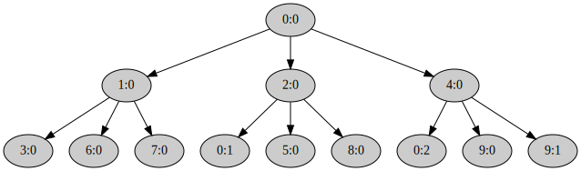

## Copy-on-write fork

Теперь у нас есть всё необходимое для реализации copy-on-write `fork()` в пространстве пользователя.
Программа [`user/cow_fork/src/main.rs`](https://gitlab.com/sergey-v-galtsev/nikka-public/-/blob/master/user/cow_fork/src/main.rs) структурно похожа на [`user/eager_fork/src/main.rs`](https://gitlab.com/sergey-v-galtsev/nikka-public/-/blob/master/user/eager_fork/src/main.rs)
и на `eager_fork` можно ориентироваться при реализации.


#### Ленивое копирование адресного пространства

```rust
fn copy_page_table(
    child: Pid,
    level: u32,
    trap_stack: Block<Page>,
    virt_addr: Virt,
) -> Result<()>
```

Выполняется аналогично [соответствующей процедуре](../../lab/book/5-um-3-eager-fork.html#copy_page_table) `eager_fork`.
Отличается от которой в паре моментов:

- К игнорируемым страницам добавляется `trap_stack`, его копировать не нужно. У потомка изначально будет полностью отдельный стек для обработки исключений.
- Вместо копирования страниц функцией `lib::memory::copy_page()` создаёт в потомке отображение. Оно ссылается на тот же физический фрейм, на который ссылается соответствующая виртуальная страница в родителе. При этом для страниц, которые отображены с одним из флагов `PageTableFlags::WRITABLE` или `PageTableFlags::COPY_ON_WRITE`, в обоих адресных пространствах меняет флаги отображения страницы так, чтобы `PageTableFlags::COPY_ON_WRITE` был включён, а `PageTableFlags::WRITABLE` выключен. Копирование содержимого страницы функцией `lib::memory::copy_page()` таким образом лениво откладывается до возникновения Page Fault.


#### Пользовательский обработчик исключений Page Fault

Когда программа попытается записать в страницу, помеченную в `copy_page_table()` как `COPY_ON_WRITE` и только на чтение,
возникнет Page Fault и ядро передаст управление в
[реализованный вами ранее](../../lab/book/5-um-4-trap-handler.html#%D0%A2%D1%80%D0%B0%D0%BC%D0%BF%D0%BB%D0%B8%D0%BD-%D0%BE%D0%B1%D1%80%D0%B0%D0%B1%D0%BE%D1%82%D1%87%D0%B8%D0%BA%D0%B0-%D0%BF%D1%80%D0%B5%D1%80%D1%8B%D0%B2%D0%B0%D0%BD%D0%B8%D0%B9)
`trap_trampoline()`, который в свою очередь запустит

```rust
fn trap_handler(info: &TrapInfo)
```

Эта функция работает в очень стеснённых условиях.

Возможно, вся память программы, кроме стека `trap_stack`, на котором сейчас работает эта функция, доступна только на чтение.
В том числе `RingBuffer`, который используется для логирования в пространстве пользователя макросами библиотеки [tracing](https://docs.rs/tracing/) --- `info!()`, `debug!()` и т.д.
Так как при этом нужно писать, то такое логирование в `trap_handler()` не доступно.
`panic!()` тоже не доступен, так как он использует логирование.
В других частях `cow_fork` логированием можно пользоваться, потому что `trap_handler()` починит возникающие при этом Page Fault.
Для логирования в `trap_handler()` можно воспользоваться
[одним из первых реализованных системных вызовов](../../lab/book/3-process-4-syscall.html#%D0%97%D0%B0%D0%B4%D0%B0%D1%87%D0%B0-12--%D1%81%D0%B8%D1%81%D1%82%D0%B5%D0%BC%D0%BD%D1%8B%D0%B9-%D0%B2%D1%8B%D0%B7%D0%BE%D0%B2-log_value) ---
`syscall::log_value()`.

Вторая неприятность заключается в том, что в процессе--потомке в `trap_handler()` не доступны
`ku::ProcessInfo` и `ku::SystemInfo` даже на чтение.
Поэтому потомок не может узнать свой идентификатор `Pid`.
Так как не работает, в том числе функция `ku::process::pid()`.
Поэтому в `trap_handler()` идентифицировать процесс для выполняемых системных вызовов нужно как `Pid::Current`.

Также учтите, что эти ограничения распространяются на вспомогательные функции, которые `trap_handler()` использует.
Впрочем, оба эти ограничения --- во многом следствие нашей реализации `cow_fork`,
а не характерная особенность обработки прерываний в пространстве пользователя.

При получении управления, `trap_handler()`:

- Проверяет, что прерывание --- это действительно `PageFault` и он вызван записью. Иначе обработчик прекращает исполнение программы, вызвав `syscall::exit()` с кодом ошибки.
- С помощью [реализованной ранее](../../lab/book/5-um-3-eager-fork.html#temp_page) функции `lib::memory::temp_page()` находит временную страницу.
- Копирует содержимое страницы, обращение к которой привело к Page Fault, во временную, с помощью [реализованной вами ранее](../../lab/book/5-um-3-eager-fork.html#copy_page) функции `lib::memory::copy_page()`.
- С помощью системного вызова `syscall::copy_mapping()` заменяет физический фрейм под скопированной страницей на фрейм временной страницы, одновременно меняя флаг `COPY_ON_WRITE` на `WRITABLE` в её отображении.
- С помощью системного вызова `syscall::unmap()` удаляет из адресного пространства не нужную более временную страницу.


#### `cow_fork()`

```rust
fn cow_fork() -> Result<bool>
```

Эта функции похожа на соответствующую функцию `eager_fork()`, но в ней добавляется работа по инициализации обработчика прерываний.
Функция `cow_fork()`:

- Выделяет себе --- родительскому процессу --- стек для обработки исключений с помощью `syscall::map()` и устанавливает себе функцией `syscall::set_trap_handler()` обработчик исключений `trap_handler()`.
- Создаёт процесс потомка с помощью [реализованного вами ранее](../../lab/book/5-um-3-eager-fork.html#%D0%A1%D0%B8%D1%81%D1%82%D0%B5%D0%BC%D0%BD%D1%8B%D0%B9-%D0%B2%D1%8B%D0%B7%D0%BE%D0%B2-exofork) системного вызова `syscall::exofork()`.
- Далее лениво копирует своё адресное пространство в пространство потомка с помощью функции `fn copy_address_space()`.
- Выделяет потомку отдельный стек для обработки исключений с помощью `syscall::map()` и устанавливает уже ему обработчик исключений `trap_handler()` функцией `syscall::set_trap_handler()`.
- Запускает потомка системным вызовом `syscall::set_state()`, устанавливая его состояние в `State::Runnable`.

В потомке `cow_fork()` ничего не делает.
Возвращает она `true` в процессе потомка и `false` в процессе родителя.


### Проверьте себя

Теперь должны заработать тест `cow_fork()` в файле
[`kernel/tests/5-um-5-cow-fork.rs`](https://gitlab.com/sergey-v-galtsev/nikka-public/-/blob/master/kernel/tests/5-um-5-cow-fork.rs):

```console
$ (cd kernel; cargo test --test 5-um-5-cow-fork)
...
5_um_5_cow_fork::cow_fork-----------------------------------
16:28:55 0 I page allocator init; free_page_count = 33822867456; block = [0v18000000000, 0v7F8000000000), size 126.000 TiB
16:28:55 0 I duplicate; address_space = "process" @ 0p7E09000
16:28:55 0 I switch to; address_space = "process" @ 0p7E09000
16:28:55 0 D extend mapping; block = [0v10000000, 0v1000817C), size 32.371 KiB; page_block = [0v10000000, 0v10009000), size 36.000 KiB; flags =   R; page_flags = PRESENT | WRITABLE | USER_ACCESSIBLE
16:28:55 0 D elf loadable program header; file_block = [0v202177, 0v20A2F3), size 32.371 KiB; memory_block = [0v10000000, 0v1000817C), size 32.371 KiB; flags =   R
16:28:55 0 D extend mapping; block = [0v10009000, 0v1006286D), size 358.106 KiB; page_block = [0v10009000, 0v10063000), size 360.000 KiB; flags = X R; page_flags = PRESENT | WRITABLE | USER_ACCESSIBLE
16:28:55 0 D elf loadable program header; file_block = [0v20A2F7, 0v2649E4), size 361.731 KiB; memory_block = [0v10008180, 0v1006286D), size 361.731 KiB; flags = X R
16:28:55 0 D elf loadable program header; file_block = [0v2649E7, 0v264B07), size 288 B; memory_block = [0v10062870, 0v10062990), size 288 B; flags =  WR
16:28:55 0 D extend mapping; block = [0v10063000, 0v10069BE8), size 26.977 KiB; page_block = [0v10063000, 0v1006A000), size 28.000 KiB; flags =  WR; page_flags = PRESENT | WRITABLE | USER_ACCESSIBLE
16:28:55 0 D elf loadable program header; file_block = [0v264B07, 0v26BD2F), size 28.539 KiB; memory_block = [0v10062990, 0v10069BE8), size 28.586 KiB; flags =  WR
16:28:55 0 I switch to; address_space = "base" @ 0p1000
16:28:55 0 I loaded ELF file; context = { rip: 0v10011650, rsp: 0v7F7FFFFFF000 }; file_size = 5.832 MiB; process = { pid: <current>, address_space: "process" @ 0p7E09000, { rip: 0v10011650, rsp: 0v7F7FFFFFF000 } }
16:28:55 0 I allocate; slot = Process { pid: 0:0, address_space: "0:0" @ 0p7E09000, { rip: 0v10011650, rsp: 0v7F7FFFFFF000 } }; process_count = 1
16:28:55 0 I user process page table entry; entry_point = 0v10011650; frame = Frame(32226 @ 0p7DE2000); flags = PRESENT | WRITABLE | USER_ACCESSIBLE | ACCESSED | DIRTY
16:28:55 0 D process_frames = 164
16:28:57 0 I dequeue; pid = Some(0:0)
16:28:57 0 I switch to; address_space = "0:0" @ 0p7E09000
16:28:57 0 D entering the user mode; pid = 0:0; registers = { rax: 0x0, rdi: 0x7F7FFFFDB000, rsi: 0x0, { mode: user, cs:rip: 0x0023:0v10011650, ss:rsp: 0x001B:0v7F7FFFFFF000, rflags: IF } }
16:28:57 0 I name = "cow_fork *"; pedigree = [0:0]; len = 1; capacity = 3; pid = 0:0
16:28:57 0 I page allocator init; free_page_count = 33688649728; block = [0v18000000000, 0v7F0000000000), size 125.500 TiB
16:28:57 0 I duplicate; address_space = "process" @ 0p7D61000
16:28:57 0 I switch to; address_space = "process" @ 0p7D61000
16:28:57 0 I switch to; address_space = "0:0" @ 0p7E09000
16:28:57 0 I allocate; slot = Process { pid: 1:0, address_space: "1:0" @ 0p7D61000, { rip: 0v1000AAE7, rsp: 0v7F7FFFFFD588 } }; process_count = 2
16:28:57 0 I syscall = "exofork"; process = 0:0; child = 1:0
16:28:57 0 I syscall::exofork() done; child = Ok(1:0); pid = 0:0
16:28:57 0 D trap = "Page Fault"; context = { mode: user, cs:rip: 0x0023:0v1001318E, ss:rsp: 0x001B:0v7F7FFFFFBA78, rflags: IF }; info = { address: 0v7F7FFFFFBB60, code: 0b111 = protection violation | write | user }
16:28:57 0 D trap = "Page Fault"; context = { mode: user, cs:rip: 0x0023:0v10010C2F, ss:rsp: 0x001B:0v7F7FFFFFB9E8, rflags: IF AF }; info = { address: 0v7F7FFFFFC0B8, code: 0b111 = protection violation | write | user }
16:28:57 0 D leaving the user mode; pid = 0:0
16:28:57 0 I the process was preempted; pid = 0:0; user_context = { mode: user, cs:rip: 0x0023:0v10013820, ss:rsp: 0x001B:0v7F7FFFFDAFC8, rflags: IF AF }
16:28:57 0 I returned
16:28:57 0 I dequeue; pid = Some(0:0)
16:28:57 0 I switch to; address_space = "0:0" @ 0p7E09000
16:28:57 0 D entering the user mode; pid = 0:0; registers = { rax: 0x7F7FFFFFC0B8, rdi: 0x0, rsi: 0x0, { mode: user, cs:rip: 0x0023:0v10013820, ss:rsp: 0x001B:0v7F7FFFFDAFC8, rflags: IF AF } }
16:28:57 0 D trap = "Page Fault"; context = { mode: user, cs:rip: 0x0023:0v1000D013, ss:rsp: 0x001B:0v7F7FFFFFC8F8, rflags: IF ZF PF }; info = { address: 0v7F7FFFFFD438, code: 0b111 = protection violation | write | user }
16:28:57 0 D trap = "Page Fault"; context = { mode: user, cs:rip: 0x0023:0v1000B851, ss:rsp: 0x001B:0v7F7FFFFFD598, rflags: IF ZF AF PF CF }; info = { address: 0v7F7FFFFFE348, code: 0b111 = protection violation | write | user }
16:28:57 0 D trap = "Page Fault"; context = { mode: user, cs:rip: 0x0023:0v1002DF08, ss:rsp: 0x001B:0v7F7FFFFFD278, rflags: IF ZF PF }; info = { address: 0v10066ED8, code: 0b111 = protection violation | write | user }
16:28:57 0 D leaving the user mode; pid = 0:0
16:28:57 0 I the process was preempted; pid = 0:0; user_context = { mode: user, cs:rip: 0x0023:0v10013820, ss:rsp: 0x001B:0v7F7FFFFDAFC8, rflags: IF ZF PF }
16:28:57 0 I returned
16:28:57 0 I dequeue; pid = Some(0:0)
16:28:57 0 I switch to; address_space = "0:0" @ 0p7E09000
16:28:57 0 D entering the user mode; pid = 0:0; registers = { rax: 0x0, rdi: 0x10066ED8, rsi: 0x0, { mode: user, cs:rip: 0x0023:0v10013820, ss:rsp: 0x001B:0v7F7FFFFDAFC8, rflags: IF ZF PF } }
16:28:57 0 D trap = "Page Fault"; context = { mode: user, cs:rip: 0x0023:0v1002D9B1, ss:rsp: 0x001B:0v7F7FFFFFD1C8, rflags: IF }; info = { address: 0v10067020, code: 0b111 = protection violation | write | user }
16:28:57 0 D trap = "Page Fault"; context = { mode: user, cs:rip: 0x0023:0v1002E452, ss:rsp: 0x001B:0v7F7FFFFFD138, rflags: IF ZF PF }; info = { address: 0v10069BE0, code: 0b111 = protection violation | write | user }
16:28:57 0 D trap = "Page Fault"; context = { mode: user, cs:rip: 0x0023:0v1002FC77, ss:rsp: 0x001B:0v7F7FFFFFAF78, rflags: IF AF PF }; info = { address: 0v7F7FFFFFAF98, code: 0b111 = protection violation | write | user }
16:28:57 0 D leaving the user mode; pid = 0:0
16:28:57 0 I the process was preempted; pid = 0:0; user_context = { mode: user, cs:rip: 0x0023:0v10013820, ss:rsp: 0x001B:0v7F7FFFFDAFC8, rflags: IF AF PF }
16:28:57 0 I returned
16:28:57 0 I dequeue; pid = Some(0:0)
16:28:57 0 I switch to; address_space = "0:0" @ 0p7E09000
16:28:57 0 D entering the user mode; pid = 0:0; registers = { rax: 0x7F7FFFFFBF00, rdi: 0x7F7FFFFFB940, rsi: 0x7F7FFFFFB540, { mode: user, cs:rip: 0x0023:0v10013820, ss:rsp: 0x001B:0v7F7FFFFDAFC8, rflags: IF AF PF } }
16:28:57 0 D trap = "Page Fault"; context = { mode: user, cs:rip: 0x0023:0v10052E60, ss:rsp: 0x001B:0v7F7FFFFF9FE8, rflags: IF AF }; info = { address: 0v7F7FFFFF9FE0, code: 0b111 = protection violation | write | user }
16:28:57 0 I copy_address_space done; child = 1:0; trap_stack = [0v7F7FFFFD7000, 0v7F7FFFFDB000), size 16.000 KiB, Page[~127.500 TiB, ~127.500 TiB); pid = 0:0
16:28:57 0 I syscall::set_state(); child = 1:0; result = Ok(()); pid = 0:0
16:28:57 0 I page allocator init; free_page_count = 33688649728; block = [0v18000000000, 0v7F0000000000), size 125.500 TiB
16:28:57 0 I duplicate; address_space = "process" @ 0p7D36000
16:28:57 0 I switch to; address_space = "process" @ 0p7D36000
16:28:57 0 I switch to; address_space = "0:0" @ 0p7E09000
16:28:57 0 I allocate; slot = Process { pid: 2:0, address_space: "2:0" @ 0p7D36000, { rip: 0v1000AAE7, rsp: 0v7F7FFFFFD588 } }; process_count = 3
16:28:57 0 I syscall = "exofork"; process = 0:0; child = 2:0
16:28:57 0 I syscall::exofork() done; child = Ok(2:0); pid = 0:0
16:28:57 0 D leaving the user mode; pid = 0:0
16:28:57 0 I the process was preempted; pid = 0:0; user_context = { mode: user, cs:rip: 0x0023:0v1001318C, ss:rsp: 0x001B:0v7F7FFFFFBA68, rflags: IF }
16:28:57 0 I returned
16:28:57 0 I dequeue; pid = Some(1:0)
16:28:57 0 I switch to; address_space = "1:0" @ 0p7D61000
16:28:57 0 D entering the user mode; pid = 1:0; registers = { rax: 0x0, rdi: 0xFFFFFFFFFFFFFFFE, rsi: 0x7EFFFFFFB000, { mode: user, cs:rip: 0x0023:0v1000AAE7, ss:rsp: 0x001B:0v7F7FFFFFD588, rflags: IF } }
16:28:57 0 D trap = "Page Fault"; context = { mode: user, cs:rip: 0x0023:0v1000AAE9, ss:rsp: 0x001B:0v7F7FFFFFD598, rflags: IF }; info = { address: 0v7F7FFFFFE820, code: 0b111 = protection violation | write | user }
16:28:57 0 D trap = "Page Fault"; context = { mode: user, cs:rip: 0x0023:0v10018677, ss:rsp: 0x001B:0v7F7FFFFDAD68, rflags: IF ZF PF }; info = { address: 0v7F7FFFFFD590, code: 0b111 = protection violation | write | user }
16:28:57 0 D trap = "Page Fault"; context = { mode: user, cs:rip: 0x0023:0v10015BD2, ss:rsp: 0x001B:0v7F7FFFFFD478, rflags: IF }; info = { address: 0v10069BC0, code: 0b111 = protection violation | write | user }
16:28:57 0 D trap = "Page Fault"; context = { mode: user, cs:rip: 0x0023:0v10046BD1, ss:rsp: 0x001B:0v7F7FFFFFD290, rflags: IF PF }; info = { address: 0v10067DB8, code: 0b111 = protection violation | write | user }
16:28:57 0 D leaving the user mode; pid = 1:0
16:28:57 0 I the process was preempted; pid = 1:0; user_context = { mode: user, cs:rip: 0x0023:0v10013820, ss:rsp: 0x001B:0v7F7FFFFDAFC8, rflags: IF PF }
16:28:57 0 I returned
16:28:58.005 0 I dequeue; pid = Some(0:0)
16:28:58.009 0 I switch to; address_space = "0:0" @ 0p7E09000
16:28:58.015 0 D entering the user mode; pid = 0:0; registers = { rax: 0x0, rdi: 0x0, rsi: 0x0, { mode: user, cs:rip: 0x0023:0v1001318C, ss:rsp: 0x001B:0v7F7FFFFFBA68, rflags: IF } }
16:28:58.081 0 D trap = "Page Fault"; context = { mode: user, cs:rip: 0x0023:0v1001318E, ss:rsp: 0x001B:0v7F7FFFFFBA78, rflags: IF }; info = { address: 0v7F7FFFFFBB60, code: 0b111 = protection violation | write | user }
16:28:58.099 0 D trap = "Page Fault"; context = { mode: user, cs:rip: 0x0023:0v10010C2F, ss:rsp: 0x001B:0v7F7FFFFFB9E8, rflags: IF AF }; info = { address: 0v7F7FFFFFC0B8, code: 0b111 = protection violation | write | user }
16:28:58.117 0 D trap = "Page Fault"; context = { mode: user, cs:rip: 0x0023:0v1000D013, ss:rsp: 0x001B:0v7F7FFFFFC8F8, rflags: IF ZF PF }; info = { address: 0v7F7FFFFFD438, code: 0b111 = protection violation | write | user }
16:28:58.133 0 D trap = "Page Fault"; context = { mode: user, cs:rip: 0x0023:0v1000B851, ss:rsp: 0x001B:0v7F7FFFFFD598, rflags: IF ZF AF PF CF }; info = { address: 0v7F7FFFFFE348, code: 0b111 = protection violation | write | user }
16:28:58.149 0 D trap = "Page Fault"; context = { mode: user, cs:rip: 0x0023:0v10046BD1, ss:rsp: 0x001B:0v7F7FFFFFD290, rflags: IF PF }; info = { address: 0v10067DB8, code: 0b111 = protection violation | write | user }
16:28:58.165 0 D trap = "Page Fault"; context = { mode: user, cs:rip: 0x0023:0v1002FC77, ss:rsp: 0x001B:0v7F7FFFFFAF78, rflags: IF AF PF }; info = { address: 0v7F7FFFFFAF98, code: 0b111 = protection violation | write | user }
16:28:58.179 0 D leaving the user mode; pid = 0:0
16:28:58.185 0 I the process was preempted; pid = 0:0; user_context = { mode: user, cs:rip: 0x0023:0v10013820, ss:rsp: 0x001B:0v7F7FFFFDAFC8, rflags: IF AF PF }
16:28:58.195 0 I returned
16:28:58.199 0 I dequeue; pid = Some(1:0)
16:28:58.203 0 I switch to; address_space = "1:0" @ 0p7D61000
16:28:58.209 0 D entering the user mode; pid = 1:0; registers = { rax: 0x1, rdi: 0x10067DB8, rsi: 0x1, { mode: user, cs:rip: 0x0023:0v10013820, ss:rsp: 0x001B:0v7F7FFFFDAFC8, rflags: IF PF } }
16:28:58.225 0 D trap = "Page Fault"; context = { mode: user, cs:rip: 0x0023:0v10015AA7, ss:rsp: 0x001B:0v7F7FFFFFCFC8, rflags: IF AF }; info = { address: 0v7F7FFFFFCFC8, code: 0b111 = protection violation | write | user }
16:28:58.241 0 D trap = "Page Fault"; context = { mode: user, cs:rip: 0x0023:0v10025184, ss:rsp: 0x001B:0v7F7FFFFFBFD8, rflags: IF AF PF }; info = { address: 0v7F7FFFFFBFE0, code: 0b111 = protection violation | write | user }
16:28:57.971 0 I syscall::exofork() done; child = Ok(<current>); pid = 1:0
16:28:58.261 0 I just created; child = <current>; pid = 1:0; pid = 1:0
16:28:58.261 0 I name = "cow_fork *0"; pedigree = [0:0, 1:0]; len = 2; capacity = 3; pid = 1:0
16:28:58.363 0 I page allocator init; free_page_count = 33554432000; block = [0v18000000000, 0v7E8000000000), size 125.000 TiB
16:28:58.373 0 I duplicate; address_space = "process" @ 0p7D69000
16:28:58.379 0 I switch to; address_space = "process" @ 0p7D69000
16:28:58.385 0 I switch to; address_space = "1:0" @ 0p7D61000
16:28:58.391 0 I allocate; slot = Process { pid: 3:0, address_space: "3:0" @ 0p7D69000, { rip: 0v1000AAE7, rsp: 0v7F7FFFFFD0A8 } }; process_count = 4
16:28:58.401 0 I syscall = "exofork"; process = 1:0; child = 3:0
16:28:58.405 0 I syscall::exofork() done; child = Ok(3:0); pid = 1:0
16:28:58.545 0 D trap = "Page Fault"; context = { mode: user, cs:rip: 0x0023:0v1001318E, ss:rsp: 0x001B:0v7F7FFFFFB598, rflags: IF }; info = { address: 0v7F7FFFFFB680, code: 0b111 = protection violation | write | user }
16:28:58.563 0 D trap = "Page Fault"; context = { mode: user, cs:rip: 0x0023:0v1000D013, ss:rsp: 0x001B:0v7F7FFFFFB7D8, rflags: IF ZF PF }; info = { address: 0v7F7FFFFFC318, code: 0b111 = protection violation | write | user }
16:28:58.579 0 D leaving the user mode; pid = 1:0
16:28:58.583 0 I the process was preempted; pid = 1:0; user_context = { mode: user, cs:rip: 0x0023:0v10013820, ss:rsp: 0x001B:0v7F7FFFFDAFC8, rflags: IF ZF PF }
16:28:58.593 0 I returned
16:28:58.597 0 I dequeue; pid = Some(0:0)
16:28:58.601 0 I switch to; address_space = "0:0" @ 0p7E09000
16:28:58.607 0 D entering the user mode; pid = 0:0; registers = { rax: 0x7F7FFFFFBF00, rdi: 0x7F7FFFFFB940, rsi: 0x7F7FFFFFB540, { mode: user, cs:rip: 0x0023:0v10013820, ss:rsp: 0x001B:0v7F7FFFFDAFC8, rflags: IF AF PF } }
16:28:58.623 0 D trap = "Page Fault"; context = { mode: user, cs:rip: 0x0023:0v10052E60, ss:rsp: 0x001B:0v7F7FFFFF9FE8, rflags: IF AF }; info = { address: 0v7F7FFFFF9FE0, code: 0b111 = protection violation | write | user }
16:28:58.149 0 I copy_address_space done; child = 2:0; trap_stack = [0v7F7FFFFD7000, 0v7F7FFFFDB000), size 16.000 KiB, Page[~127.500 TiB, ~127.500 TiB); pid = 0:0
16:28:58.655 0 D trap = "Page Fault"; context = { mode: user, cs:rip: 0x0023:0v10013B12, ss:rsp: 0x001B:0v7F7FFFFFD2B8, rflags: IF }; info = { address: 0v10069BB8, code: 0b111 = protection violation | write | user }
16:28:58.673 0 I syscall::set_state(); child = 2:0; result = Ok(()); pid = 0:0
16:28:58.757 0 I page allocator init; free_page_count = 33688649728; block = [0v18000000000, 0v7F0000000000), size 125.500 TiB
16:28:58.767 0 I duplicate; address_space = "process" @ 0p7CE9000
16:28:58.773 0 I switch to; address_space = "process" @ 0p7CE9000
16:28:58.779 0 I switch to; address_space = "0:0" @ 0p7E09000
16:28:58.785 0 I allocate; slot = Process { pid: 4:0, address_space: "4:0" @ 0p7CE9000, { rip: 0v1000AAE7, rsp: 0v7F7FFFFFD588 } }; process_count = 5
16:28:58.795 0 I syscall = "exofork"; process = 0:0; child = 4:0
16:28:58.799 0 I syscall::exofork() done; child = Ok(4:0); pid = 0:0
16:28:58.939 0 D trap = "Page Fault"; context = { mode: user, cs:rip: 0x0023:0v1001318E, ss:rsp: 0x001B:0v7F7FFFFFBA78, rflags: IF }; info = { address: 0v7F7FFFFFBB60, code: 0b111 = protection violation | write | user }
16:28:58.957 0 D trap = "Page Fault"; context = { mode: user, cs:rip: 0x0023:0v10010C2F, ss:rsp: 0x001B:0v7F7FFFFFB9E8, rflags: IF AF }; info = { address: 0v7F7FFFFFC0B8, code: 0b111 = protection violation | write | user }
16:28:58.975 0 D trap = "Page Fault"; context = { mode: user, cs:rip: 0x0023:0v1000D013, ss:rsp: 0x001B:0v7F7FFFFFC8F8, rflags: IF ZF PF }; info = { address: 0v7F7FFFFFD438, code: 0b111 = protection violation | write | user }
16:28:59.001 0 D leaving the user mode; pid = 0:0
16:28:59.005 0 I the process was preempted; pid = 0:0; user_context = { mode: user, cs:rip: 0x0023:0v10013820, ss:rsp: 0x001B:0v7F7FFFFDAFC8, rflags: IF ZF PF }
16:28:59.015 0 I returned
16:28:59.019 0 I dequeue; pid = Some(1:0)
16:28:59.023 0 I switch to; address_space = "1:0" @ 0p7D61000
16:28:59.029 0 D entering the user mode; pid = 1:0; registers = { rax: 0x7F7FFFFFC318, rdi: 0x0, rsi: 0x0, { mode: user, cs:rip: 0x0023:0v10013820, ss:rsp: 0x001B:0v7F7FFFFDAFC8, rflags: IF ZF PF } }
16:28:59.045 0 D trap = "Page Fault"; context = { mode: user, cs:rip: 0x0023:0v1000D043, ss:rsp: 0x001B:0v7F7FFFFFCA38, rflags: IF SF }; info = { address: 0v7F7FFFFFD000, code: 0b111 = protection violation | write | user }
16:28:59.061 0 D trap = "Page Fault"; context = { mode: user, cs:rip: 0x0023:0v1000B86F, ss:rsp: 0x001B:0v7F7FFFFFD0B8, rflags: IF ZF AF PF CF }; info = { address: 0v7F7FFFFFE030, code: 0b111 = protection violation | write | user }
16:28:59.079 0 D trap = "Page Fault"; context = { mode: user, cs:rip: 0x0023:0v1002DF08, ss:rsp: 0x001B:0v7F7FFFFFCD98, rflags: IF ZF PF }; info = { address: 0v10066ED8, code: 0b111 = protection violation | write | user }
16:28:59.093 0 D leaving the user mode; pid = 1:0
16:28:59.099 0 I the process was preempted; pid = 1:0; user_context = { mode: user, cs:rip: 0x0023:0v10013820, ss:rsp: 0x001B:0v7F7FFFFDAFC8, rflags: IF ZF PF }
16:28:59.107 0 I returned
16:28:59.113 0 I dequeue; pid = Some(2:0)
16:28:59.117 0 I switch to; address_space = "2:0" @ 0p7D36000
16:28:59.121 0 D entering the user mode; pid = 2:0; registers = { rax: 0x0, rdi: 0xFFFFFFFFFFFFFFFE, rsi: 0x7EFFFFFFB000, { mode: user, cs:rip: 0x0023:0v1000AAE7, ss:rsp: 0x001B:0v7F7FFFFFD588, rflags: IF AF PF } }
16:28:59.135 0 D trap = "Page Fault"; context = { mode: user, cs:rip: 0x0023:0v1000AAE9, ss:rsp: 0x001B:0v7F7FFFFFD598, rflags: IF AF PF }; info = { address: 0v7F7FFFFFE820, code: 0b111 = protection violation | write | user }
16:28:59.153 0 D trap = "Page Fault"; context = { mode: user, cs:rip: 0x0023:0v10018677, ss:rsp: 0x001B:0v7F7FFFFDAD68, rflags: IF ZF PF }; info = { address: 0v7F7FFFFFD590, code: 0b111 = protection violation | write | user }
16:28:59.169 0 D trap = "Page Fault"; context = { mode: user, cs:rip: 0x0023:0v10015BD2, ss:rsp: 0x001B:0v7F7FFFFFD478, rflags: IF }; info = { address: 0v10069BC0, code: 0b111 = protection violation | write | user }
16:28:59.185 0 D trap = "Page Fault"; context = { mode: user, cs:rip: 0x0023:0v10046BD1, ss:rsp: 0x001B:0v7F7FFFFFD290, rflags: IF PF }; info = { address: 0v10067DB8, code: 0b111 = protection violation | write | user }
16:28:59.199 0 D leaving the user mode; pid = 2:0
16:28:59.205 0 I the process was preempted; pid = 2:0; user_context = { mode: user, cs:rip: 0x0023:0v10013820, ss:rsp: 0x001B:0v7F7FFFFDAFC8, rflags: IF PF }
16:28:59.215 0 I returned
16:28:59.219 0 I dequeue; pid = Some(0:0)
16:28:59.223 0 I switch to; address_space = "0:0" @ 0p7E09000
16:28:59.227 0 D entering the user mode; pid = 0:0; registers = { rax: 0x7F7FFFFFD438, rdi: 0x0, rsi: 0x0, { mode: user, cs:rip: 0x0023:0v10013820, ss:rsp: 0x001B:0v7F7FFFFDAFC8, rflags: IF ZF PF } }
16:28:59.243 0 D trap = "Page Fault"; context = { mode: user, cs:rip: 0x0023:0v1000B851, ss:rsp: 0x001B:0v7F7FFFFFD598, rflags: IF ZF AF PF CF }; info = { address: 0v7F7FFFFFE348, code: 0b111 = protection violation | write | user }
16:28:59.261 0 D trap = "Page Fault"; context = { mode: user, cs:rip: 0x0023:0v10046BD1, ss:rsp: 0x001B:0v7F7FFFFFD290, rflags: IF PF }; info = { address: 0v10067DB8, code: 0b111 = protection violation | write | user }
16:28:59.277 0 D trap = "Page Fault"; context = { mode: user, cs:rip: 0x0023:0v1002FC77, ss:rsp: 0x001B:0v7F7FFFFFAF78, rflags: IF AF PF }; info = { address: 0v7F7FFFFFAF98, code: 0b111 = protection violation | write | user }
16:28:59.293 0 D leaving the user mode; pid = 0:0
16:28:59.297 0 I the process was preempted; pid = 0:0; user_context = { mode: user, cs:rip: 0x0023:0v10013820, ss:rsp: 0x001B:0v7F7FFFFDAFC8, rflags: IF AF PF }
16:28:59.307 0 I returned
16:28:59.311 0 I dequeue; pid = Some(1:0)
16:28:59.317 0 I switch to; address_space = "1:0" @ 0p7D61000
16:28:59.321 0 D entering the user mode; pid = 1:0; registers = { rax: 0x0, rdi: 0x10066ED8, rsi: 0x0, { mode: user, cs:rip: 0x0023:0v10013820, ss:rsp: 0x001B:0v7F7FFFFDAFC8, rflags: IF ZF PF } }
16:28:59.337 0 D trap = "Page Fault"; context = { mode: user, cs:rip: 0x0023:0v1002D9B1, ss:rsp: 0x001B:0v7F7FFFFFCCE8, rflags: IF }; info = { address: 0v10067020, code: 0b111 = protection violation | write | user }
16:28:59.353 0 D trap = "Page Fault"; context = { mode: user, cs:rip: 0x0023:0v1002E452, ss:rsp: 0x001B:0v7F7FFFFFCC58, rflags: IF ZF PF }; info = { address: 0v10069BE0, code: 0b111 = protection violation | write | user }
16:28:59.369 0 D trap = "Page Fault"; context = { mode: user, cs:rip: 0x0023:0v1002545E, ss:rsp: 0x001B:0v7F7FFFFFAFF8, rflags: IF AF }; info = { address: 0v7F7FFFFFAFF0, code: 0b111 = protection violation | write | user }
16:28:59.387 0 D trap = "Page Fault"; context = { mode: user, cs:rip: 0x0023:0v10039862, ss:rsp: 0x001B:0v7F7FFFFF9FF8, rflags: IF ZF PF }; info = { address: 0v7F7FFFFF9FF0, code: 0b111 = protection violation | write | user }
16:28:59.401 0 D leaving the user mode; pid = 1:0
16:28:59.407 0 I the process was preempted; pid = 1:0; user_context = { mode: user, cs:rip: 0x0023:0v10013820, ss:rsp: 0x001B:0v7F7FFFFDAFC8, rflags: IF ZF PF }
16:28:59.417 0 I returned
16:28:59.421 0 I dequeue; pid = Some(2:0)
16:28:59.425 0 I switch to; address_space = "2:0" @ 0p7D36000
16:28:59.431 0 D entering the user mode; pid = 2:0; registers = { rax: 0x1, rdi: 0x10067DB8, rsi: 0x1, { mode: user, cs:rip: 0x0023:0v10013820, ss:rsp: 0x001B:0v7F7FFFFDAFC8, rflags: IF PF } }
16:28:59.447 0 D trap = "Page Fault"; context = { mode: user, cs:rip: 0x0023:0v10015AA7, ss:rsp: 0x001B:0v7F7FFFFFCFC8, rflags: IF AF }; info = { address: 0v7F7FFFFFCFC8, code: 0b111 = protection violation | write | user }
16:28:59.463 0 D trap = "Page Fault"; context = { mode: user, cs:rip: 0x0023:0v10025184, ss:rsp: 0x001B:0v7F7FFFFFBFD8, rflags: IF AF PF }; info = { address: 0v7F7FFFFFBFE0, code: 0b111 = protection violation | write | user }
16:28:59.185 0 I syscall::exofork() done; child = Ok(<current>); pid = 2:0
16:28:59.479 0 I just created; child = <current>; pid = 2:0; pid = 2:0
16:28:59.479 0 I name = "cow_fork *1"; pedigree = [0:0, 2:0]; len = 2; capacity = 3; pid = 2:0
16:28:59.583 0 I page allocator init; free_page_count = 33554432000; block = [0v18000000000, 0v7E8000000000), size 125.000 TiB
16:28:59.593 0 I duplicate; address_space = "process" @ 0p7D42000
16:28:59.597 0 I switch to; address_space = "process" @ 0p7D42000
16:28:59.605 0 I switch to; address_space = "2:0" @ 0p7D36000
16:28:59.609 0 I allocate; slot = Process { pid: 5:0, address_space: "5:0" @ 0p7D42000, { rip: 0v1000AAE7, rsp: 0v7F7FFFFFD0A8 } }; process_count = 6
16:28:59.619 0 I syscall = "exofork"; process = 2:0; child = 5:0
16:28:59.625 0 I syscall::exofork() done; child = Ok(5:0); pid = 2:0
16:28:59.763 0 D trap = "Page Fault"; context = { mode: user, cs:rip: 0x0023:0v1001318E, ss:rsp: 0x001B:0v7F7FFFFFB598, rflags: IF }; info = { address: 0v7F7FFFFFB680, code: 0b111 = protection violation | write | user }
16:28:59.783 0 D trap = "Page Fault"; context = { mode: user, cs:rip: 0x0023:0v1000D013, ss:rsp: 0x001B:0v7F7FFFFFB7D8, rflags: IF ZF PF }; info = { address: 0v7F7FFFFFC318, code: 0b111 = protection violation | write | user }
16:28:59.797 0 D leaving the user mode; pid = 2:0
16:28:59.803 0 I the process was preempted; pid = 2:0; user_context = { mode: user, cs:rip: 0x0023:0v10013820, ss:rsp: 0x001B:0v7F7FFFFDAFC8, rflags: IF ZF PF }
16:28:59.813 0 I returned
16:28:59.817 0 I dequeue; pid = Some(0:0)
16:28:59.821 0 I switch to; address_space = "0:0" @ 0p7E09000
16:28:59.827 0 D entering the user mode; pid = 0:0; registers = { rax: 0x7F7FFFFFBF00, rdi: 0x7F7FFFFFB940, rsi: 0x7F7FFFFFB540, { mode: user, cs:rip: 0x0023:0v10013820, ss:rsp: 0x001B:0v7F7FFFFDAFC8, rflags: IF AF PF } }
16:28:59.843 0 D trap = "Page Fault"; context = { mode: user, cs:rip: 0x0023:0v10052E60, ss:rsp: 0x001B:0v7F7FFFFF9FE8, rflags: IF AF }; info = { address: 0v7F7FFFFF9FE0, code: 0b111 = protection violation | write | user }
16:28:59.261 0 I copy_address_space done; child = 4:0; trap_stack = [0v7F7FFFFD7000, 0v7F7FFFFDB000), size 16.000 KiB, Page[~127.500 TiB, ~127.500 TiB); pid = 0:0
16:28:59.877 0 D trap = "Page Fault"; context = { mode: user, cs:rip: 0x0023:0v10013B12, ss:rsp: 0x001B:0v7F7FFFFFD2B8, rflags: IF }; info = { address: 0v10069BB8, code: 0b111 = protection violation | write | user }
16:28:59.891 0 D leaving the user mode; pid = 0:0
16:28:59.895 0 I the process was preempted; pid = 0:0; user_context = { mode: user, cs:rip: 0x0023:0v10013820, ss:rsp: 0x001B:0v7F7FFFFDAFC8, rflags: IF }
16:28:59.905 0 I returned
16:28:59.909 0 I dequeue; pid = Some(1:0)
16:28:59.915 0 I switch to; address_space = "1:0" @ 0p7D61000
16:28:59.919 0 D entering the user mode; pid = 1:0; registers = { rax: 0x7F7FFFFFA5FE, rdi: 0x7F7FFFFFAB60, rsi: 0x3A, { mode: user, cs:rip: 0x0023:0v10013820, ss:rsp: 0x001B:0v7F7FFFFDAFC8, rflags: IF ZF PF } }
16:28:59.369 0 I copy_address_space done; child = 3:0; trap_stack = [0v7F7FFFFD7000, 0v7F7FFFFDB000), size 16.000 KiB, Page[~127.500 TiB, ~127.500 TiB); pid = 1:0
16:28:59.953 0 I syscall::set_state(); child = 3:0; result = Ok(()); pid = 1:0
16:29:00.039 0 I page allocator init; free_page_count = 33554432000; block = [0v18000000000, 0v7E8000000000), size 125.000 TiB
16:29:00.049 0 I duplicate; address_space = "process" @ 0p7C91000
16:29:00.055 0 I switch to; address_space = "process" @ 0p7C91000
16:29:00.061 0 I switch to; address_space = "1:0" @ 0p7D61000
16:29:00.067 0 I allocate; slot = Process { pid: 6:0, address_space: "6:0" @ 0p7C91000, { rip: 0v1000AAE7, rsp: 0v7F7FFFFFD0A8 } }; process_count = 7
16:29:00.077 0 I syscall = "exofork"; process = 1:0; child = 6:0
16:29:00.081 0 I syscall::exofork() done; child = Ok(6:0); pid = 1:0
16:29:00.221 0 D trap = "Page Fault"; context = { mode: user, cs:rip: 0x0023:0v1001318E, ss:rsp: 0x001B:0v7F7FFFFFB598, rflags: IF }; info = { address: 0v7F7FFFFFB680, code: 0b111 = protection violation | write | user }
16:29:00.241 0 D trap = "Page Fault"; context = { mode: user, cs:rip: 0x0023:0v1000D013, ss:rsp: 0x001B:0v7F7FFFFFB7D8, rflags: IF ZF PF }; info = { address: 0v7F7FFFFFC318, code: 0b111 = protection violation | write | user }
16:29:00.257 0 D trap = "Page Fault"; context = { mode: user, cs:rip: 0x0023:0v1000D043, ss:rsp: 0x001B:0v7F7FFFFFCA38, rflags: IF SF }; info = { address: 0v7F7FFFFFD000, code: 0b111 = protection violation | write | user }
16:29:00.275 0 D trap = "Page Fault"; context = { mode: user, cs:rip: 0x0023:0v1000B86F, ss:rsp: 0x001B:0v7F7FFFFFD0B8, rflags: IF ZF AF PF CF }; info = { address: 0v7F7FFFFFE030, code: 0b111 = protection violation | write | user }
16:29:00.289 0 D leaving the user mode; pid = 1:0
16:29:00.293 0 I the process was preempted; pid = 1:0; user_context = { mode: user, cs:rip: 0x0023:0v10013820, ss:rsp: 0x001B:0v7F7FFFFDAFC8, rflags: IF ZF AF PF CF }
16:29:00.307 0 I returned
16:29:00.311 0 I dequeue; pid = Some(2:0)
16:29:00.315 0 I switch to; address_space = "2:0" @ 0p7D36000
16:29:00.321 0 D entering the user mode; pid = 2:0; registers = { rax: 0x7F7FFFFFC318, rdi: 0x0, rsi: 0x0, { mode: user, cs:rip: 0x0023:0v10013820, ss:rsp: 0x001B:0v7F7FFFFDAFC8, rflags: IF ZF PF } }
16:29:00.337 0 D trap = "Page Fault"; context = { mode: user, cs:rip: 0x0023:0v1000D043, ss:rsp: 0x001B:0v7F7FFFFFCA38, rflags: IF SF }; info = { address: 0v7F7FFFFFD000, code: 0b111 = protection violation | write | user }
16:29:00.353 0 D trap = "Page Fault"; context = { mode: user, cs:rip: 0x0023:0v1000B86F, ss:rsp: 0x001B:0v7F7FFFFFD0B8, rflags: IF ZF AF PF CF }; info = { address: 0v7F7FFFFFE030, code: 0b111 = protection violation | write | user }
16:29:00.371 0 D trap = "Page Fault"; context = { mode: user, cs:rip: 0x0023:0v10046BD1, ss:rsp: 0x001B:0v7F7FFFFFCDB0, rflags: IF }; info = { address: 0v10067DB8, code: 0b111 = protection violation | write | user }
16:29:00.387 0 D trap = "Page Fault"; context = { mode: user, cs:rip: 0x0023:0v1002545E, ss:rsp: 0x001B:0v7F7FFFFFAFF8, rflags: IF AF }; info = { address: 0v7F7FFFFFAFF0, code: 0b111 = protection violation | write | user }
16:29:00.403 0 D leaving the user mode; pid = 2:0
16:29:00.407 0 I the process was preempted; pid = 2:0; user_context = { mode: user, cs:rip: 0x0023:0v10013820, ss:rsp: 0x001B:0v7F7FFFFDAFC8, rflags: IF AF }
16:29:00.417 0 I returned
16:29:00.421 0 I dequeue; pid = Some(0:0)
16:29:00.425 0 I switch to; address_space = "0:0" @ 0p7E09000
16:29:00.431 0 D entering the user mode; pid = 0:0; registers = { rax: 0x10069BB8, rdi: 0x10069BB8, rsi: 0x1000DAE0, { mode: user, cs:rip: 0x0023:0v10013820, ss:rsp: 0x001B:0v7F7FFFFDAFC8, rflags: IF } }
16:29:00.447 0 I syscall::set_state(); child = 4:0; result = Ok(()); pid = 0:0
16:29:00.455 0 I free; slot = Process { pid: 0:0, address_space: "0:0" @ 0p7E09000, { rip: 0v10013820, rsp: 0v7F7FFFFDAFC8 } }; process_count = 6
16:29:00.465 0 I switch to; address_space = "base" @ 0p1000
16:29:00.471 0 I drop the current address space; address_space = "0:0" @ 0p7E09000; switch_to = "base" @ 0p1000
16:29:00.529 0 I syscall = "exit"; pid = 0:0; code = 0; reason = Some(OK)
16:29:00.535 0 D leaving the user mode; pid = 0:0
16:29:00.541 0 I dequeue; pid = Some(3:0)
16:29:00.545 0 I switch to; address_space = "3:0" @ 0p7D69000
16:29:00.549 0 D entering the user mode; pid = 3:0; registers = { rax: 0x0, rdi: 0xFFFFFFFFFFFFFFFE, rsi: 0x7E7FFFFFB000, { mode: user, cs:rip: 0x0023:0v1000AAE7, ss:rsp: 0x001B:0v7F7FFFFFD0A8, rflags: IF PF } }
16:29:00.565 0 D trap = "Page Fault"; context = { mode: user, cs:rip: 0x0023:0v1000AAE9, ss:rsp: 0x001B:0v7F7FFFFFD0B8, rflags: IF PF }; info = { address: 0v7F7FFFFFE340, code: 0b111 = protection violation | write | user }
16:29:00.581 0 D trap = "Page Fault"; context = { mode: user, cs:rip: 0x0023:0v10018677, ss:rsp: 0x001B:0v7F7FFFFDAD68, rflags: IF ZF PF }; info = { address: 0v7F7FFFFFD0B0, code: 0b111 = protection violation | write | user }
16:29:00.595 0 D leaving the user mode; pid = 3:0
16:29:00.601 0 I the process was preempted; pid = 3:0; user_context = { mode: user, cs:rip: 0x0023:0v10013820, ss:rsp: 0x001B:0v7F7FFFFDAD30, rflags: IF ZF PF }
16:29:00.611 0 I returned
16:29:00.615 0 I dequeue; pid = Some(1:0)
16:29:00.621 0 I switch to; address_space = "1:0" @ 0p7D61000
16:29:00.625 0 D entering the user mode; pid = 1:0; registers = { rax: 0x10000C68, rdi: 0x7F7FFFFFD4C0, rsi: 0x7F7FFFFFD4E0, { mode: user, cs:rip: 0x0023:0v10013820, ss:rsp: 0x001B:0v7F7FFFFDAFC8, rflags: IF ZF AF PF CF } }
16:29:00.641 0 D trap = "Page Fault"; context = { mode: user, cs:rip: 0x0023:0v10046BD1, ss:rsp: 0x001B:0v7F7FFFFFCDB0, rflags: IF }; info = { address: 0v10067DB8, code: 0b111 = protection violation | write | user }
16:29:00.657 0 D trap = "Page Fault"; context = { mode: user, cs:rip: 0x0023:0v1002545E, ss:rsp: 0x001B:0v7F7FFFFFAFF8, rflags: IF AF }; info = { address: 0v7F7FFFFFAFF0, code: 0b111 = protection violation | write | user }
16:29:00.675 0 D trap = "Page Fault"; context = { mode: user, cs:rip: 0x0023:0v10039862, ss:rsp: 0x001B:0v7F7FFFFF9FF8, rflags: IF ZF PF }; info = { address: 0v7F7FFFFF9FF0, code: 0b111 = protection violation | write | user }
16:29:00.689 0 D leaving the user mode; pid = 1:0
16:29:00.695 0 I the process was preempted; pid = 1:0; user_context = { mode: user, cs:rip: 0x0023:0v10013820, ss:rsp: 0x001B:0v7F7FFFFDAFC8, rflags: IF ZF PF }
16:29:00.705 0 I returned
16:29:00.709 0 I dequeue; pid = Some(2:0)
16:29:00.713 0 I switch to; address_space = "2:0" @ 0p7D36000
16:29:00.719 0 D entering the user mode; pid = 2:0; registers = { rax: 0x7EFFFFFFB000, rdi: 0x7F7FFFFFB040, rsi: 0x7EFFFFFFD000, { mode: user, cs:rip: 0x0023:0v10013820, ss:rsp: 0x001B:0v7F7FFFFDAFC8, rflags: IF AF } }
16:29:00.735 0 D trap = "Page Fault"; context = { mode: user, cs:rip: 0x0023:0v10039862, ss:rsp: 0x001B:0v7F7FFFFF9FF8, rflags: IF ZF PF }; info = { address: 0v7F7FFFFF9FF0, code: 0b111 = protection violation | write | user }
16:29:00.371 0 I copy_address_space done; child = 5:0; trap_stack = [0v7F7FFFFD7000, 0v7F7FFFFDB000), size 16.000 KiB, Page[~127.500 TiB, ~127.500 TiB); pid = 2:0
16:29:00.767 0 D trap = "Page Fault"; context = { mode: user, cs:rip: 0x0023:0v10013B12, ss:rsp: 0x001B:0v7F7FFFFFCDD8, rflags: IF }; info = { address: 0v10069BB8, code: 0b111 = protection violation | write | user }
16:29:00.785 0 I syscall::set_state(); child = 5:0; result = Ok(()); pid = 2:0
16:29:00.873 0 I page allocator init; free_page_count = 33554432000; block = [0v18000000000, 0v7E8000000000), size 125.000 TiB
16:29:00.883 0 I duplicate; address_space = "process" @ 0p7D88000
16:29:00.887 0 I switch to; address_space = "process" @ 0p7D88000
16:29:00.895 0 I switch to; address_space = "2:0" @ 0p7D36000
16:29:00.901 0 I allocate; slot = Process { pid: 0:1, address_space: "0:1" @ 0p7D88000, { rip: 0v1000AAE7, rsp: 0v7F7FFFFFD0A8 } }; process_count = 7
16:29:00.909 0 I syscall = "exofork"; process = 2:0; child = 0:1
16:29:00.915 0 I syscall::exofork() done; child = Ok(0:1); pid = 2:0
16:29:01.053 0 D trap = "Page Fault"; context = { mode: user, cs:rip: 0x0023:0v1001318E, ss:rsp: 0x001B:0v7F7FFFFFB598, rflags: IF }; info = { address: 0v7F7FFFFFB680, code: 0b111 = protection violation | write | user }
16:29:01.073 0 D trap = "Page Fault"; context = { mode: user, cs:rip: 0x0023:0v1000D013, ss:rsp: 0x001B:0v7F7FFFFFB7D8, rflags: IF ZF PF }; info = { address: 0v7F7FFFFFC318, code: 0b111 = protection violation | write | user }
16:29:01.087 0 D trap = "Page Fault"; context = { mode: user, cs:rip: 0x0023:0v1000D043, ss:rsp: 0x001B:0v7F7FFFFFCA38, rflags: IF SF }; info = { address: 0v7F7FFFFFD000, code: 0b111 = protection violation | write | user }
16:29:01.105 0 D trap = "Page Fault"; context = { mode: user, cs:rip: 0x0023:0v1000B86F, ss:rsp: 0x001B:0v7F7FFFFFD0B8, rflags: IF ZF AF PF CF }; info = { address: 0v7F7FFFFFE030, code: 0b111 = protection violation | write | user }
16:29:01.121 0 D trap = "Page Fault"; context = { mode: user, cs:rip: 0x0023:0v10046BD1, ss:rsp: 0x001B:0v7F7FFFFFCDB0, rflags: IF }; info = { address: 0v10067DB8, code: 0b111 = protection violation | write | user }
16:29:01.137 0 D trap = "Page Fault"; context = { mode: user, cs:rip: 0x0023:0v1002545E, ss:rsp: 0x001B:0v7F7FFFFFAFF8, rflags: IF AF }; info = { address: 0v7F7FFFFFAFF0, code: 0b111 = protection violation | write | user }
16:29:01.155 0 D trap = "Page Fault"; context = { mode: user, cs:rip: 0x0023:0v10039862, ss:rsp: 0x001B:0v7F7FFFFF9FF8, rflags: IF ZF PF }; info = { address: 0v7F7FFFFF9FF0, code: 0b111 = protection violation | write | user }
16:29:01.121 0 I copy_address_space done; child = 0:1; trap_stack = [0v7F7FFFFD7000, 0v7F7FFFFDB000), size 16.000 KiB, Page[~127.500 TiB, ~127.500 TiB); pid = 2:0
16:29:01.187 0 D trap = "Page Fault"; context = { mode: user, cs:rip: 0x0023:0v10013B12, ss:rsp: 0x001B:0v7F7FFFFFCDD8, rflags: IF }; info = { address: 0v10069BB8, code: 0b111 = protection violation | write | user }
16:29:01.201 0 D leaving the user mode; pid = 2:0
16:29:01.207 0 I the process was preempted; pid = 2:0; user_context = { mode: user, cs:rip: 0x0023:0v10013820, ss:rsp: 0x001B:0v7F7FFFFDAFC8, rflags: IF }
16:29:01.217 0 I returned
16:29:01.221 0 I dequeue; pid = Some(4:0)
16:29:01.225 0 I switch to; address_space = "4:0" @ 0p7CE9000
16:29:01.231 0 D entering the user mode; pid = 4:0; registers = { rax: 0x0, rdi: 0xFFFFFFFFFFFFFFFE, rsi: 0x7EFFFFFFB000, { mode: user, cs:rip: 0x0023:0v1000AAE7, ss:rsp: 0x001B:0v7F7FFFFFD588, rflags: IF AF PF } }
16:29:01.245 0 D trap = "Page Fault"; context = { mode: user, cs:rip: 0x0023:0v1000AAE9, ss:rsp: 0x001B:0v7F7FFFFFD598, rflags: IF AF PF }; info = { address: 0v7F7FFFFFE820, code: 0b111 = protection violation | write | user }
16:29:01.261 0 D trap = "Page Fault"; context = { mode: user, cs:rip: 0x0023:0v10018677, ss:rsp: 0x001B:0v7F7FFFFDAD68, rflags: IF ZF PF }; info = { address: 0v7F7FFFFFD590, code: 0b111 = protection violation | write | user }
16:29:01.277 0 D trap = "Page Fault"; context = { mode: user, cs:rip: 0x0023:0v10015BD2, ss:rsp: 0x001B:0v7F7FFFFFD478, rflags: IF }; info = { address: 0v10069BC0, code: 0b111 = protection violation | write | user }
16:29:01.291 0 D leaving the user mode; pid = 4:0
16:29:01.297 0 I the process was preempted; pid = 4:0; user_context = { mode: user, cs:rip: 0x0023:0v10013820, ss:rsp: 0x001B:0v7F7FFFFDAFC8, rflags: IF }
16:29:01.305 0 I returned
16:29:01.311 0 I dequeue; pid = Some(3:0)
16:29:01.315 0 I switch to; address_space = "3:0" @ 0p7D69000
16:29:01.319 0 D entering the user mode; pid = 3:0; registers = { rax: 0x7F7FFFFDAF00, rdi: 0x7F7FFFFDAD90, rsi: 0x7F7FFFFDADB8, { mode: user, cs:rip: 0x0023:0v10013820, ss:rsp: 0x001B:0v7F7FFFFDAD30, rflags: IF ZF PF } }
16:29:01.337 0 D trap = "Page Fault"; context = { mode: user, cs:rip: 0x0023:0v10015517, ss:rsp: 0x001B:0v7F7FFFFFCF18, rflags: IF AF PF }; info = { address: 0v7F7FFFFFCF20, code: 0b111 = protection violation | write | user }
16:29:01.353 0 D trap = "Page Fault"; context = { mode: user, cs:rip: 0x0023:0v10015BD2, ss:rsp: 0x001B:0v7F7FFFFFCF98, rflags: IF }; info = { address: 0v10069BC0, code: 0b111 = protection violation | write | user }
16:29:01.369 0 D trap = "Page Fault"; context = { mode: user, cs:rip: 0x0023:0v10046BD1, ss:rsp: 0x001B:0v7F7FFFFFCDB0, rflags: IF }; info = { address: 0v10067DB8, code: 0b111 = protection violation | write | user }
16:29:01.385 0 D trap = "Page Fault"; context = { mode: user, cs:rip: 0x0023:0v10020A87, ss:rsp: 0x001B:0v7F7FFFFFBF78, rflags: IF AF PF }; info = { address: 0v7F7FFFFFBF90, code: 0b111 = protection violation | write | user }
16:29:01.401 0 D leaving the user mode; pid = 3:0
16:29:01.405 0 I the process was preempted; pid = 3:0; user_context = { mode: user, cs:rip: 0x0023:0v10013820, ss:rsp: 0x001B:0v7F7FFFFDAFC8, rflags: IF AF PF }
16:29:01.415 0 I returned
16:29:01.419 0 I dequeue; pid = Some(1:0)
16:29:01.425 0 I switch to; address_space = "1:0" @ 0p7D61000
16:29:01.429 0 D entering the user mode; pid = 1:0; registers = { rax: 0x7F7FFFFFA5FE, rdi: 0x7F7FFFFFAB60, rsi: 0x3A, { mode: user, cs:rip: 0x0023:0v10013820, ss:rsp: 0x001B:0v7F7FFFFDAFC8, rflags: IF ZF PF } }
16:29:00.639 0 I copy_address_space done; child = 6:0; trap_stack = [0v7F7FFFFD7000, 0v7F7FFFFDB000), size 16.000 KiB, Page[~127.500 TiB, ~127.500 TiB); pid = 1:0
16:29:01.463 0 D trap = "Page Fault"; context = { mode: user, cs:rip: 0x0023:0v10013B12, ss:rsp: 0x001B:0v7F7FFFFFCDD8, rflags: IF }; info = { address: 0v10069BB8, code: 0b111 = protection violation | write | user }
16:29:01.479 0 I syscall::set_state(); child = 6:0; result = Ok(()); pid = 1:0
16:29:01.569 0 I page allocator init; free_page_count = 33554432000; block = [0v18000000000, 0v7E8000000000), size 125.000 TiB
16:29:01.579 0 I duplicate; address_space = "process" @ 0p7C52000
16:29:01.583 0 I switch to; address_space = "process" @ 0p7C52000
16:29:01.591 0 I switch to; address_space = "1:0" @ 0p7D61000
16:29:01.595 0 I allocate; slot = Process { pid: 7:0, address_space: "7:0" @ 0p7C52000, { rip: 0v1000AAE7, rsp: 0v7F7FFFFFD0A8 } }; process_count = 8
16:29:01.605 0 I syscall = "exofork"; process = 1:0; child = 7:0
16:29:01.611 0 I syscall::exofork() done; child = Ok(7:0); pid = 1:0
16:29:01.751 0 D trap = "Page Fault"; context = { mode: user, cs:rip: 0x0023:0v1001318E, ss:rsp: 0x001B:0v7F7FFFFFB598, rflags: IF }; info = { address: 0v7F7FFFFFB680, code: 0b111 = protection violation | write | user }
16:29:01.771 0 D trap = "Page Fault"; context = { mode: user, cs:rip: 0x0023:0v1000D013, ss:rsp: 0x001B:0v7F7FFFFFB7D8, rflags: IF ZF PF }; info = { address: 0v7F7FFFFFC318, code: 0b111 = protection violation | write | user }
16:29:01.787 0 D trap = "Page Fault"; context = { mode: user, cs:rip: 0x0023:0v1000D043, ss:rsp: 0x001B:0v7F7FFFFFCA38, rflags: IF SF }; info = { address: 0v7F7FFFFFD000, code: 0b111 = protection violation | write | user }
16:29:01.801 0 D leaving the user mode; pid = 1:0
16:29:01.807 0 I the process was preempted; pid = 1:0; user_context = { mode: user, cs:rip: 0x0023:0v10013820, ss:rsp: 0x001B:0v7F7FFFFDAFC8, rflags: IF SF }
16:29:01.817 0 I returned
16:29:01.821 0 I dequeue; pid = Some(5:0)
16:29:01.825 0 I switch to; address_space = "5:0" @ 0p7D42000
16:29:01.829 0 D entering the user mode; pid = 5:0; registers = { rax: 0x0, rdi: 0xFFFFFFFFFFFFFFFE, rsi: 0x7E7FFFFFB000, { mode: user, cs:rip: 0x0023:0v1000AAE7, ss:rsp: 0x001B:0v7F7FFFFFD0A8, rflags: IF PF } }
16:29:01.845 0 D trap = "Page Fault"; context = { mode: user, cs:rip: 0x0023:0v1000AAE9, ss:rsp: 0x001B:0v7F7FFFFFD0B8, rflags: IF PF }; info = { address: 0v7F7FFFFFE340, code: 0b111 = protection violation | write | user }
16:29:01.861 0 D trap = "Page Fault"; context = { mode: user, cs:rip: 0x0023:0v10018677, ss:rsp: 0x001B:0v7F7FFFFDAD68, rflags: IF ZF PF }; info = { address: 0v7F7FFFFFD0B0, code: 0b111 = protection violation | write | user }
16:29:01.877 0 D trap = "Page Fault"; context = { mode: user, cs:rip: 0x0023:0v10015517, ss:rsp: 0x001B:0v7F7FFFFFCF18, rflags: IF AF PF }; info = { address: 0v7F7FFFFFCF20, code: 0b111 = protection violation | write | user }
16:29:01.893 0 D leaving the user mode; pid = 5:0
16:29:01.897 0 I the process was preempted; pid = 5:0; user_context = { mode: user, cs:rip: 0x0023:0v10013820, ss:rsp: 0x001B:0v7F7FFFFDAFC8, rflags: IF AF PF }
16:29:01.907 0 I returned
16:29:01.913 0 I dequeue; pid = Some(2:0)
16:29:01.917 0 I switch to; address_space = "2:0" @ 0p7D36000
16:29:01.921 0 D entering the user mode; pid = 2:0; registers = { rax: 0x10069BB8, rdi: 0x10069BB8, rsi: 0x1000DAE0, { mode: user, cs:rip: 0x0023:0v10013820, ss:rsp: 0x001B:0v7F7FFFFDAFC8, rflags: IF } }
16:29:01.937 0 I syscall::set_state(); child = 0:1; result = Ok(()); pid = 2:0
16:29:02.027 0 I page allocator init; free_page_count = 33554432000; block = [0v18000000000, 0v7E8000000000), size 125.000 TiB
16:29:02.037 0 I duplicate; address_space = "process" @ 0p7CC4000
16:29:02.041 0 I switch to; address_space = "process" @ 0p7CC4000
16:29:02.047 0 I switch to; address_space = "2:0" @ 0p7D36000
16:29:02.053 0 I allocate; slot = Process { pid: 8:0, address_space: "8:0" @ 0p7CC4000, { rip: 0v1000AAE7, rsp: 0v7F7FFFFFD0A8 } }; process_count = 9
16:29:02.063 0 I syscall = "exofork"; process = 2:0; child = 8:0
16:29:02.069 0 I syscall::exofork() done; child = Ok(8:0); pid = 2:0
16:29:02.209 0 D trap = "Page Fault"; context = { mode: user, cs:rip: 0x0023:0v1001318E, ss:rsp: 0x001B:0v7F7FFFFFB598, rflags: IF }; info = { address: 0v7F7FFFFFB680, code: 0b111 = protection violation | write | user }
16:29:02.227 0 D trap = "Page Fault"; context = { mode: user, cs:rip: 0x0023:0v1000D013, ss:rsp: 0x001B:0v7F7FFFFFB7D8, rflags: IF ZF PF }; info = { address: 0v7F7FFFFFC318, code: 0b111 = protection violation | write | user }
16:29:02.243 0 D trap = "Page Fault"; context = { mode: user, cs:rip: 0x0023:0v1000D043, ss:rsp: 0x001B:0v7F7FFFFFCA38, rflags: IF SF }; info = { address: 0v7F7FFFFFD000, code: 0b111 = protection violation | write | user }
16:29:02.259 0 D trap = "Page Fault"; context = { mode: user, cs:rip: 0x0023:0v1000B86F, ss:rsp: 0x001B:0v7F7FFFFFD0B8, rflags: IF ZF AF PF CF }; info = { address: 0v7F7FFFFFE030, code: 0b111 = protection violation | write | user }
16:29:02.275 0 D trap = "Page Fault"; context = { mode: user, cs:rip: 0x0023:0v10046BD1, ss:rsp: 0x001B:0v7F7FFFFFCDB0, rflags: IF }; info = { address: 0v10067DB8, code: 0b111 = protection violation | write | user }
16:29:02.289 0 D leaving the user mode; pid = 2:0
16:29:02.295 0 I the process was preempted; pid = 2:0; user_context = { mode: user, cs:rip: 0x0023:0v10013820, ss:rsp: 0x001B:0v7F7FFFFDAFC8, rflags: IF }
16:29:02.305 0 I returned
16:29:02.309 0 I dequeue; pid = Some(4:0)
16:29:02.313 0 I switch to; address_space = "4:0" @ 0p7CE9000
16:29:02.319 0 D entering the user mode; pid = 4:0; registers = { rax: 0x10069BC0, rdi: 0x10069BC0, rsi: 0x7EFFFFFFB000, { mode: user, cs:rip: 0x0023:0v10013820, ss:rsp: 0x001B:0v7F7FFFFDAFC8, rflags: IF } }
16:29:02.335 0 D trap = "Page Fault"; context = { mode: user, cs:rip: 0x0023:0v10046BD1, ss:rsp: 0x001B:0v7F7FFFFFD290, rflags: IF PF }; info = { address: 0v10067DB8, code: 0b111 = protection violation | write | user }
16:29:02.351 0 D trap = "Page Fault"; context = { mode: user, cs:rip: 0x0023:0v10015AA7, ss:rsp: 0x001B:0v7F7FFFFFCFC8, rflags: IF AF }; info = { address: 0v7F7FFFFFCFC8, code: 0b111 = protection violation | write | user }
16:29:02.367 0 D trap = "Page Fault"; context = { mode: user, cs:rip: 0x0023:0v10025184, ss:rsp: 0x001B:0v7F7FFFFFBFD8, rflags: IF AF PF }; info = { address: 0v7F7FFFFFBFE0, code: 0b111 = protection violation | write | user }
16:29:02.335 0 I syscall::exofork() done; child = Ok(<current>); pid = 4:0
16:29:02.383 0 I just created; child = <current>; pid = 4:0; pid = 4:0
16:29:02.385 0 I name = "cow_fork *2"; pedigree = [0:0, 4:0]; len = 2; capacity = 3; pid = 4:0
16:29:02.493 0 I page allocator init; free_page_count = 33554432000; block = [0v18000000000, 0v7E8000000000), size 125.000 TiB
16:29:02.503 0 I duplicate; address_space = "process" @ 0p7D16000
16:29:02.507 0 I switch to; address_space = "process" @ 0p7D16000
16:29:02.515 0 I switch to; address_space = "4:0" @ 0p7CE9000
16:29:02.519 0 I allocate; slot = Process { pid: 9:0, address_space: "9:0" @ 0p7D16000, { rip: 0v1000AAE7, rsp: 0v7F7FFFFFD0A8 } }; process_count = 10
16:29:02.529 0 I syscall = "exofork"; process = 4:0; child = 9:0
16:29:02.535 0 I syscall::exofork() done; child = Ok(9:0); pid = 4:0
16:29:02.589 0 D leaving the user mode; pid = 4:0
16:29:02.593 0 I the process was preempted; pid = 4:0; user_context = { mode: user, cs:rip: 0x0023:0v1002135E, ss:rsp: 0x001B:0v7F7FFFFFB408, rflags: IF AF }
16:29:02.603 0 I returned
16:29:02.607 0 I dequeue; pid = Some(3:0)
16:29:02.611 0 I switch to; address_space = "3:0" @ 0p7D69000
16:29:02.617 0 D entering the user mode; pid = 3:0; registers = { rax: 0x7F7FFFFFCC80, rdi: 0x7E7FFFFFB000, rsi: 0x7F7FFFFFCC80, { mode: user, cs:rip: 0x0023:0v10013820, ss:rsp: 0x001B:0v7F7FFFFDAFC8, rflags: IF AF PF } }
16:29:01.367 0 I syscall::exofork() done; child = Ok(<current>); pid = 3:0
16:29:02.633 0 I just created; child = <current>; pid = 3:0; pid = 3:0
16:29:02.635 0 I name = "cow_fork *00"; pedigree = [0:0, 1:0, 3:0]; len = 3; capacity = 3; pid = 3:0
16:29:02.655 0 I free; slot = Process { pid: 3:0, address_space: "3:0" @ 0p7D69000, { rip: 0v10013820, rsp: 0v7F7FFFFDAFC8 } }; process_count = 9
16:29:02.665 0 I switch to; address_space = "base" @ 0p1000
16:29:02.671 0 I drop the current address space; address_space = "3:0" @ 0p7D69000; switch_to = "base" @ 0p1000
16:29:02.735 0 I syscall = "exit"; pid = 3:0; code = 0; reason = Some(OK)
16:29:02.741 0 D leaving the user mode; pid = 3:0
16:29:02.745 0 I dequeue; pid = Some(6:0)
16:29:02.749 0 I switch to; address_space = "6:0" @ 0p7C91000
16:29:02.755 0 D entering the user mode; pid = 6:0; registers = { rax: 0x0, rdi: 0xFFFFFFFFFFFFFFFE, rsi: 0x7E7FFFFFB000, { mode: user, cs:rip: 0x0023:0v1000AAE7, ss:rsp: 0x001B:0v7F7FFFFFD0A8, rflags: IF ZF PF } }
16:29:02.769 0 D trap = "Page Fault"; context = { mode: user, cs:rip: 0x0023:0v1000AAE9, ss:rsp: 0x001B:0v7F7FFFFFD0B8, rflags: IF ZF PF }; info = { address: 0v7F7FFFFFE340, code: 0b111 = protection violation | write | user }
16:29:02.787 0 D trap = "Page Fault"; context = { mode: user, cs:rip: 0x0023:0v10018677, ss:rsp: 0x001B:0v7F7FFFFDAD68, rflags: IF ZF PF }; info = { address: 0v7F7FFFFFD0B0, code: 0b111 = protection violation | write | user }
16:29:02.801 0 D leaving the user mode; pid = 6:0
16:29:02.805 0 I the process was preempted; pid = 6:0; user_context = { mode: user, cs:rip: 0x0023:0v10013820, ss:rsp: 0x001B:0v7F7FFFFDAD30, rflags: IF ZF PF }
16:29:02.815 0 I returned
16:29:02.819 0 I dequeue; pid = Some(1:0)
16:29:02.825 0 I switch to; address_space = "1:0" @ 0p7D61000
16:29:02.829 0 D entering the user mode; pid = 1:0; registers = { rax: 0xFF, rdi: 0xFFFFFFFFFFFFF7F8, rsi: 0x100, { mode: user, cs:rip: 0x0023:0v10013820, ss:rsp: 0x001B:0v7F7FFFFDAFC8, rflags: IF SF } }
16:29:02.845 0 D trap = "Page Fault"; context = { mode: user, cs:rip: 0x0023:0v1000B86F, ss:rsp: 0x001B:0v7F7FFFFFD0B8, rflags: IF ZF AF PF CF }; info = { address: 0v7F7FFFFFE030, code: 0b111 = protection violation | write | user }
16:29:02.863 0 D trap = "Page Fault"; context = { mode: user, cs:rip: 0x0023:0v10046BD1, ss:rsp: 0x001B:0v7F7FFFFFCDB0, rflags: IF }; info = { address: 0v10067DB8, code: 0b111 = protection violation | write | user }
16:29:02.879 0 D trap = "Page Fault"; context = { mode: user, cs:rip: 0x0023:0v1002545E, ss:rsp: 0x001B:0v7F7FFFFFAFF8, rflags: IF AF }; info = { address: 0v7F7FFFFFAFF0, code: 0b111 = protection violation | write | user }
16:29:02.895 0 D leaving the user mode; pid = 1:0
16:29:02.899 0 I the process was preempted; pid = 1:0; user_context = { mode: user, cs:rip: 0x0023:0v10013820, ss:rsp: 0x001B:0v7F7FFFFDAFC8, rflags: IF AF }
16:29:02.909 0 I returned
16:29:02.913 0 I dequeue; pid = Some(5:0)
16:29:02.917 0 I switch to; address_space = "5:0" @ 0p7D42000
16:29:02.923 0 D entering the user mode; pid = 5:0; registers = { rax: 0x0, rdi: 0x7F7FFFFFE358, rsi: 0x0, { mode: user, cs:rip: 0x0023:0v10013820, ss:rsp: 0x001B:0v7F7FFFFDAFC8, rflags: IF AF PF } }
16:29:02.939 0 D trap = "Page Fault"; context = { mode: user, cs:rip: 0x0023:0v10015BD2, ss:rsp: 0x001B:0v7F7FFFFFCF98, rflags: IF }; info = { address: 0v10069BC0, code: 0b111 = protection violation | write | user }
16:29:02.955 0 D trap = "Page Fault"; context = { mode: user, cs:rip: 0x0023:0v10046BD1, ss:rsp: 0x001B:0v7F7FFFFFCDB0, rflags: IF }; info = { address: 0v10067DB8, code: 0b111 = protection violation | write | user }
16:29:02.971 0 D trap = "Page Fault"; context = { mode: user, cs:rip: 0x0023:0v10020A87, ss:rsp: 0x001B:0v7F7FFFFFBF78, rflags: IF AF PF }; info = { address: 0v7F7FFFFFBF90, code: 0b111 = protection violation | write | user }
16:29:02.989 0 D leaving the user mode; pid = 5:0
16:29:02.995 0 I the process was preempted; pid = 5:0; user_context = { mode: user, cs:rip: 0x0023:0v100537B0, ss:rsp: 0x001B:0v7F7FFFFFC920, rflags: IF AF PF }
16:29:03.003 0 I returned
16:29:03.005 0 I dequeue; pid = Some(0:1)
16:29:03.009 0 I switch to; address_space = "0:1" @ 0p7D88000
16:29:03.013 0 D entering the user mode; pid = 0:1; registers = { rax: 0x0, rdi: 0xFFFFFFFFFFFFFFFE, rsi: 0x7E7FFFFFB000, { mode: user, cs:rip: 0x0023:0v1000AAE7, ss:rsp: 0x001B:0v7F7FFFFFD0A8, rflags: IF AF } }
16:29:03.027 0 D trap = "Page Fault"; context = { mode: user, cs:rip: 0x0023:0v1000AAE9, ss:rsp: 0x001B:0v7F7FFFFFD0B8, rflags: IF AF }; info = { address: 0v7F7FFFFFE340, code: 0b111 = protection violation | write | user }
16:29:03.045 0 D trap = "Page Fault"; context = { mode: user, cs:rip: 0x0023:0v10018677, ss:rsp: 0x001B:0v7F7FFFFDAD68, rflags: IF ZF PF }; info = { address: 0v7F7FFFFFD0B0, code: 0b111 = protection violation | write | user }
16:29:03.061 0 D trap = "Page Fault"; context = { mode: user, cs:rip: 0x0023:0v10015517, ss:rsp: 0x001B:0v7F7FFFFFCF18, rflags: IF AF PF }; info = { address: 0v7F7FFFFFCF20, code: 0b111 = protection violation | write | user }
16:29:03.077 0 D trap = "Page Fault"; context = { mode: user, cs:rip: 0x0023:0v10015BD2, ss:rsp: 0x001B:0v7F7FFFFFCF98, rflags: IF }; info = { address: 0v10069BC0, code: 0b111 = protection violation | write | user }
16:29:03.091 0 D leaving the user mode; pid = 0:1
16:29:03.097 0 I the process was preempted; pid = 0:1; user_context = { mode: user, cs:rip: 0x0023:0v10013820, ss:rsp: 0x001B:0v7F7FFFFDAFC8, rflags: IF }
16:29:03.107 0 I returned
16:29:03.111 0 I dequeue; pid = Some(2:0)
16:29:03.115 0 I switch to; address_space = "2:0" @ 0p7D36000
16:29:03.121 0 D entering the user mode; pid = 2:0; registers = { rax: 0x1, rdi: 0x10067DB8, rsi: 0x1, { mode: user, cs:rip: 0x0023:0v10013820, ss:rsp: 0x001B:0v7F7FFFFDAFC8, rflags: IF } }
16:29:03.137 0 D trap = "Page Fault"; context = { mode: user, cs:rip: 0x0023:0v1002545E, ss:rsp: 0x001B:0v7F7FFFFFAFF8, rflags: IF AF }; info = { address: 0v7F7FFFFFAFF0, code: 0b111 = protection violation | write | user }
16:29:03.153 0 D trap = "Page Fault"; context = { mode: user, cs:rip: 0x0023:0v10039862, ss:rsp: 0x001B:0v7F7FFFFF9FF8, rflags: IF ZF PF }; info = { address: 0v7F7FFFFF9FF0, code: 0b111 = protection violation | write | user }
16:29:02.271 0 I copy_address_space done; child = 8:0; trap_stack = [0v7F7FFFFD7000, 0v7F7FFFFDB000), size 16.000 KiB, Page[~127.500 TiB, ~127.500 TiB); pid = 2:0
16:29:03.187 0 D trap = "Page Fault"; context = { mode: user, cs:rip: 0x0023:0v10013B12, ss:rsp: 0x001B:0v7F7FFFFFCDD8, rflags: IF }; info = { address: 0v10069BB8, code: 0b111 = protection violation | write | user }
16:29:03.203 0 I syscall::set_state(); child = 8:0; result = Ok(()); pid = 2:0
16:29:03.211 0 I free; slot = Process { pid: 2:0, address_space: "2:0" @ 0p7D36000, { rip: 0v10013820, rsp: 0v7F7FFFFDAFC8 } }; process_count = 8
16:29:03.219 0 I switch to; address_space = "base" @ 0p1000
16:29:03.225 0 I drop the current address space; address_space = "2:0" @ 0p7D36000; switch_to = "base" @ 0p1000
16:29:03.287 0 I syscall = "exit"; pid = 2:0; code = 0; reason = Some(OK)
16:29:03.291 0 D leaving the user mode; pid = 2:0
16:29:03.297 0 I dequeue; pid = Some(4:0)
16:29:03.301 0 I switch to; address_space = "4:0" @ 0p7CE9000
16:29:03.305 0 D entering the user mode; pid = 4:0; registers = { rax: 0x7EFFFFFFB000, rdi: 0x7F7FFFFFB438, rsi: 0x7EFFFFFFB000, { mode: user, cs:rip: 0x0023:0v1002135E, ss:rsp: 0x001B:0v7F7FFFFFB408, rflags: IF AF } }
16:29:03.411 0 D trap = "Page Fault"; context = { mode: user, cs:rip: 0x0023:0v1001318E, ss:rsp: 0x001B:0v7F7FFFFFB598, rflags: IF }; info = { address: 0v7F7FFFFFB680, code: 0b111 = protection violation | write | user }
16:29:03.431 0 D trap = "Page Fault"; context = { mode: user, cs:rip: 0x0023:0v1000D013, ss:rsp: 0x001B:0v7F7FFFFFB7D8, rflags: IF ZF PF }; info = { address: 0v7F7FFFFFC318, code: 0b111 = protection violation | write | user }
16:29:03.447 0 D trap = "Page Fault"; context = { mode: user, cs:rip: 0x0023:0v1000D043, ss:rsp: 0x001B:0v7F7FFFFFCA38, rflags: IF SF }; info = { address: 0v7F7FFFFFD000, code: 0b111 = protection violation | write | user }
16:29:03.463 0 D trap = "Page Fault"; context = { mode: user, cs:rip: 0x0023:0v1000B86F, ss:rsp: 0x001B:0v7F7FFFFFD0B8, rflags: IF ZF AF PF CF }; info = { address: 0v7F7FFFFFE030, code: 0b111 = protection violation | write | user }
16:29:03.479 0 D trap = "Page Fault"; context = { mode: user, cs:rip: 0x0023:0v10046BD1, ss:rsp: 0x001B:0v7F7FFFFFCDB0, rflags: IF }; info = { address: 0v10067DB8, code: 0b111 = protection violation | write | user }
16:29:03.493 0 D leaving the user mode; pid = 4:0
16:29:03.499 0 I the process was preempted; pid = 4:0; user_context = { mode: user, cs:rip: 0x0023:0v10013820, ss:rsp: 0x001B:0v7F7FFFFDAFC8, rflags: IF }
16:29:03.509 0 I returned
16:29:03.513 0 I dequeue; pid = Some(6:0)
16:29:03.517 0 I switch to; address_space = "6:0" @ 0p7C91000
16:29:03.523 0 D entering the user mode; pid = 6:0; registers = { rax: 0x7F7FFFFDAF00, rdi: 0x7F7FFFFDAD90, rsi: 0x7F7FFFFDADB8, { mode: user, cs:rip: 0x0023:0v10013820, ss:rsp: 0x001B:0v7F7FFFFDAD30, rflags: IF ZF PF } }
16:29:03.539 0 D trap = "Page Fault"; context = { mode: user, cs:rip: 0x0023:0v10015517, ss:rsp: 0x001B:0v7F7FFFFFCF18, rflags: IF AF PF }; info = { address: 0v7F7FFFFFCF20, code: 0b111 = protection violation | write | user }
16:29:03.555 0 D trap = "Page Fault"; context = { mode: user, cs:rip: 0x0023:0v10015BD2, ss:rsp: 0x001B:0v7F7FFFFFCF98, rflags: IF }; info = { address: 0v10069BC0, code: 0b111 = protection violation | write | user }
16:29:03.569 0 D trap = "Page Fault"; context = { mode: user, cs:rip: 0x0023:0v10046BD1, ss:rsp: 0x001B:0v7F7FFFFFCDB0, rflags: IF }; info = { address: 0v10067DB8, code: 0b111 = protection violation | write | user }
16:29:03.585 0 D trap = "Page Fault"; context = { mode: user, cs:rip: 0x0023:0v10020A87, ss:rsp: 0x001B:0v7F7FFFFFBF78, rflags: IF AF PF }; info = { address: 0v7F7FFFFFBF90, code: 0b111 = protection violation | write | user }
16:29:03.569 0 I syscall::exofork() done; child = Ok(<current>); pid = 6:0
16:29:03.603 0 I just created; child = <current>; pid = 6:0; pid = 6:0
16:29:03.603 0 I name = "cow_fork *01"; pedigree = [0:0, 1:0, 6:0]; len = 3; capacity = 3; pid = 6:0
16:29:03.625 0 I free; slot = Process { pid: 6:0, address_space: "6:0" @ 0p7C91000, { rip: 0v10013820, rsp: 0v7F7FFFFDAD30 } }; process_count = 7
16:29:03.635 0 I switch to; address_space = "base" @ 0p1000
16:29:03.639 0 I drop the current address space; address_space = "6:0" @ 0p7C91000; switch_to = "base" @ 0p1000
16:29:03.705 0 I syscall = "exit"; pid = 6:0; code = 0; reason = Some(OK)
16:29:03.709 0 D leaving the user mode; pid = 6:0
16:29:03.715 0 I dequeue; pid = Some(1:0)
16:29:03.719 0 I switch to; address_space = "1:0" @ 0p7D61000
16:29:03.723 0 D entering the user mode; pid = 1:0; registers = { rax: 0x7EFFFFFFB000, rdi: 0x7F7FFFFFB040, rsi: 0x7EFFFFFFD000, { mode: user, cs:rip: 0x0023:0v10013820, ss:rsp: 0x001B:0v7F7FFFFDAFC8, rflags: IF AF } }
16:29:03.741 0 D trap = "Page Fault"; context = { mode: user, cs:rip: 0x0023:0v10039862, ss:rsp: 0x001B:0v7F7FFFFF9FF8, rflags: IF ZF PF }; info = { address: 0v7F7FFFFF9FF0, code: 0b111 = protection violation | write | user }
16:29:02.859 0 I copy_address_space done; child = 7:0; trap_stack = [0v7F7FFFFD7000, 0v7F7FFFFDB000), size 16.000 KiB, Page[~127.500 TiB, ~127.500 TiB); pid = 1:0
16:29:03.773 0 D trap = "Page Fault"; context = { mode: user, cs:rip: 0x0023:0v10013B12, ss:rsp: 0x001B:0v7F7FFFFFCDD8, rflags: IF }; info = { address: 0v10069BB8, code: 0b111 = protection violation | write | user }
16:29:03.787 0 D leaving the user mode; pid = 1:0
16:29:03.793 0 I the process was preempted; pid = 1:0; user_context = { mode: user, cs:rip: 0x0023:0v10013820, ss:rsp: 0x001B:0v7F7FFFFDAFC8, rflags: IF }
16:29:03.803 0 I returned
16:29:03.807 0 I dequeue; pid = Some(5:0)
16:29:03.811 0 I switch to; address_space = "5:0" @ 0p7D42000
16:29:03.817 0 D entering the user mode; pid = 5:0; registers = { rax: 0x9E, rdi: 0x9D, rsi: 0x9E, { mode: user, cs:rip: 0x0023:0v100537B0, ss:rsp: 0x001B:0v7F7FFFFFC920, rflags: IF AF PF } }
16:29:02.951 0 I syscall::exofork() done; child = Ok(<current>); pid = 5:0
16:29:02.985 0 I just created; child = <current>; pid = 5:0; pid = 5:0
16:29:03.831 0 I name = "cow_fork *10"; pedigree = [0:0, 2:0, 5:0]; len = 3; capacity = 3; pid = 5:0
16:29:03.853 0 I free; slot = Process { pid: 5:0, address_space: "5:0" @ 0p7D42000, { rip: 0v100537B0, rsp: 0v7F7FFFFFC920 } }; process_count = 6
16:29:03.863 0 I switch to; address_space = "base" @ 0p1000
16:29:03.867 0 I drop the current address space; address_space = "5:0" @ 0p7D42000; switch_to = "base" @ 0p1000
16:29:03.931 0 I syscall = "exit"; pid = 5:0; code = 0; reason = Some(OK)
16:29:03.937 0 D leaving the user mode; pid = 5:0
16:29:03.943 0 I dequeue; pid = Some(0:1)
16:29:03.947 0 I switch to; address_space = "0:1" @ 0p7D88000
16:29:03.953 0 D entering the user mode; pid = 0:1; registers = { rax: 0x10069BC0, rdi: 0x10069BC0, rsi: 0x7E7FFFFFB000, { mode: user, cs:rip: 0x0023:0v10013820, ss:rsp: 0x001B:0v7F7FFFFDAFC8, rflags: IF } }
16:29:03.969 0 D trap = "Page Fault"; context = { mode: user, cs:rip: 0x0023:0v10046BD1, ss:rsp: 0x001B:0v7F7FFFFFCDB0, rflags: IF }; info = { address: 0v10067DB8, code: 0b111 = protection violation | write | user }
16:29:03.985 0 D trap = "Page Fault"; context = { mode: user, cs:rip: 0x0023:0v10020A87, ss:rsp: 0x001B:0v7F7FFFFFBF78, rflags: IF AF PF }; info = { address: 0v7F7FFFFFBF90, code: 0b111 = protection violation | write | user }
16:29:04.001 0 D leaving the user mode; pid = 0:1
16:29:04.005 0 I the process was preempted; pid = 0:1; user_context = { mode: user, cs:rip: 0x0023:0v10013820, ss:rsp: 0x001B:0v7F7FFFFDAFC8, rflags: IF AF PF }
16:29:04.015 0 I returned
16:29:04.019 0 I dequeue; pid = Some(8:0)
16:29:04.023 0 I switch to; address_space = "8:0" @ 0p7CC4000
16:29:04.029 0 D entering the user mode; pid = 8:0; registers = { rax: 0x0, rdi: 0xFFFFFFFFFFFFFFFE, rsi: 0x7E7FFFFFB000, { mode: user, cs:rip: 0x0023:0v1000AAE7, ss:rsp: 0x001B:0v7F7FFFFFD0A8, rflags: IF } }
16:29:04.043 0 D trap = "Page Fault"; context = { mode: user, cs:rip: 0x0023:0v1000AAE9, ss:rsp: 0x001B:0v7F7FFFFFD0B8, rflags: IF }; info = { address: 0v7F7FFFFFE340, code: 0b111 = protection violation | write | user }
16:29:04.059 0 D trap = "Page Fault"; context = { mode: user, cs:rip: 0x0023:0v10018677, ss:rsp: 0x001B:0v7F7FFFFDAD68, rflags: IF ZF PF }; info = { address: 0v7F7FFFFFD0B0, code: 0b111 = protection violation | write | user }
16:29:04.077 0 D trap = "Page Fault"; context = { mode: user, cs:rip: 0x0023:0v10015517, ss:rsp: 0x001B:0v7F7FFFFFCF18, rflags: IF AF PF }; info = { address: 0v7F7FFFFFCF20, code: 0b111 = protection violation | write | user }
16:29:04.091 0 D leaving the user mode; pid = 8:0
16:29:04.095 0 I the process was preempted; pid = 8:0; user_context = { mode: user, cs:rip: 0x0023:0v10013820, ss:rsp: 0x001B:0v7F7FFFFDAFC8, rflags: IF AF PF }
16:29:04.105 0 I returned
16:29:04.109 0 I dequeue; pid = Some(4:0)
16:29:04.115 0 I switch to; address_space = "4:0" @ 0p7CE9000
16:29:04.119 0 D entering the user mode; pid = 4:0; registers = { rax: 0x1, rdi: 0x10067DB8, rsi: 0x1, { mode: user, cs:rip: 0x0023:0v10013820, ss:rsp: 0x001B:0v7F7FFFFDAFC8, rflags: IF } }
16:29:04.135 0 D trap = "Page Fault"; context = { mode: user, cs:rip: 0x0023:0v1002545E, ss:rsp: 0x001B:0v7F7FFFFFAFF8, rflags: IF AF }; info = { address: 0v7F7FFFFFAFF0, code: 0b111 = protection violation | write | user }
16:29:04.153 0 D trap = "Page Fault"; context = { mode: user, cs:rip: 0x0023:0v10039862, ss:rsp: 0x001B:0v7F7FFFFF9FF8, rflags: IF ZF PF }; info = { address: 0v7F7FFFFF9FF0, code: 0b111 = protection violation | write | user }
16:29:03.479 0 I copy_address_space done; child = 9:0; trap_stack = [0v7F7FFFFD7000, 0v7F7FFFFDB000), size 16.000 KiB, Page[~127.500 TiB, ~127.500 TiB); pid = 4:0
16:29:04.185 0 D trap = "Page Fault"; context = { mode: user, cs:rip: 0x0023:0v10013B12, ss:rsp: 0x001B:0v7F7FFFFFCDD8, rflags: IF }; info = { address: 0v10069BB8, code: 0b111 = protection violation | write | user }
16:29:04.201 0 D leaving the user mode; pid = 4:0
16:29:04.205 0 I the process was preempted; pid = 4:0; user_context = { mode: user, cs:rip: 0x0023:0v10013820, ss:rsp: 0x001B:0v7F7FFFFDAFC8, rflags: IF }
16:29:04.215 0 I returned
16:29:04.219 0 I dequeue; pid = Some(1:0)
16:29:04.223 0 I switch to; address_space = "1:0" @ 0p7D61000
16:29:04.229 0 D entering the user mode; pid = 1:0; registers = { rax: 0x10069BB8, rdi: 0x10069BB8, rsi: 0x1000DAE0, { mode: user, cs:rip: 0x0023:0v10013820, ss:rsp: 0x001B:0v7F7FFFFDAFC8, rflags: IF } }
16:29:04.245 0 I syscall::set_state(); child = 7:0; result = Ok(()); pid = 1:0
16:29:04.251 0 I free; slot = Process { pid: 1:0, address_space: "1:0" @ 0p7D61000, { rip: 0v10013820, rsp: 0v7F7FFFFDAFC8 } }; process_count = 5
16:29:04.261 0 I switch to; address_space = "base" @ 0p1000
16:29:04.267 0 I drop the current address space; address_space = "1:0" @ 0p7D61000; switch_to = "base" @ 0p1000
16:29:04.327 0 I syscall = "exit"; pid = 1:0; code = 0; reason = Some(OK)
16:29:04.333 0 D leaving the user mode; pid = 1:0
16:29:04.337 0 I dequeue; pid = Some(0:1)
16:29:04.343 0 I switch to; address_space = "0:1" @ 0p7D88000
16:29:04.347 0 D entering the user mode; pid = 0:1; registers = { rax: 0x7F7FFFFFCC80, rdi: 0x7E7FFFFFB000, rsi: 0x7F7FFFFFCC80, { mode: user, cs:rip: 0x0023:0v10013820, ss:rsp: 0x001B:0v7F7FFFFDAFC8, rflags: IF AF PF } }
16:29:03.969 0 I syscall::exofork() done; child = Ok(<current>); pid = 0:1
16:29:04.363 0 I just created; child = <current>; pid = 0:1; pid = 0:1
16:29:04.365 0 I name = "cow_fork *11"; pedigree = [0:0, 2:0, 0:1]; len = 3; capacity = 3; pid = 0:1
16:29:04.387 0 I free; slot = Process { pid: 0:1, address_space: "0:1" @ 0p7D88000, { rip: 0v10013820, rsp: 0v7F7FFFFDAFC8 } }; process_count = 4
16:29:04.397 0 I switch to; address_space = "base" @ 0p1000
16:29:04.401 0 I drop the current address space; address_space = "0:1" @ 0p7D88000; switch_to = "base" @ 0p1000
16:29:04.465 0 I syscall = "exit"; pid = 0:1; code = 0; reason = Some(OK)
16:29:04.471 0 D leaving the user mode; pid = 0:1
16:29:04.475 0 I dequeue; pid = Some(8:0)
16:29:04.481 0 I switch to; address_space = "8:0" @ 0p7CC4000
16:29:04.485 0 D entering the user mode; pid = 8:0; registers = { rax: 0x0, rdi: 0x7F7FFFFFE358, rsi: 0x0, { mode: user, cs:rip: 0x0023:0v10013820, ss:rsp: 0x001B:0v7F7FFFFDAFC8, rflags: IF AF PF } }
16:29:04.499 0 D leaving the user mode; pid = 8:0
16:29:04.505 0 I the process was preempted; pid = 8:0; user_context = { mode: user, cs:rip: 0x0023:0v10013820, ss:rsp: 0x001B:0v7F7FFFFDAFC8, rflags: IF AF PF }
16:29:04.515 0 I returned
16:29:04.519 0 I dequeue; pid = Some(4:0)
16:29:04.523 0 I switch to; address_space = "4:0" @ 0p7CE9000
16:29:04.527 0 D entering the user mode; pid = 4:0; registers = { rax: 0x10069BB8, rdi: 0x10069BB8, rsi: 0x1000DAE0, { mode: user, cs:rip: 0x0023:0v10013820, ss:rsp: 0x001B:0v7F7FFFFDAFC8, rflags: IF } }
16:29:04.543 0 I syscall::set_state(); child = 9:0; result = Ok(()); pid = 4:0
16:29:04.633 0 I page allocator init; free_page_count = 33554432000; block = [0v18000000000, 0v7E8000000000), size 125.000 TiB
16:29:04.643 0 I duplicate; address_space = "process" @ 0p7DF3000
16:29:04.649 0 I switch to; address_space = "process" @ 0p7DF3000
16:29:04.655 0 I switch to; address_space = "4:0" @ 0p7CE9000
16:29:04.661 0 I allocate; slot = Process { pid: 0:2, address_space: "0:2" @ 0p7DF3000, { rip: 0v1000AAE7, rsp: 0v7F7FFFFFD0A8 } }; process_count = 5
16:29:04.669 0 I syscall = "exofork"; process = 4:0; child = 0:2
16:29:04.675 0 I syscall::exofork() done; child = Ok(0:2); pid = 4:0
16:29:04.687 0 D leaving the user mode; pid = 4:0
16:29:04.691 0 I the process was preempted; pid = 4:0; user_context = { mode: user, cs:rip: 0x0023:0v1005EB70, ss:rsp: 0x001B:0v7F7FFFFFB690, rflags: IF AF }
16:29:04.701 0 I returned
16:29:04.707 0 I dequeue; pid = Some(7:0)
16:29:04.711 0 I switch to; address_space = "7:0" @ 0p7C52000
16:29:04.715 0 D entering the user mode; pid = 7:0; registers = { rax: 0x0, rdi: 0xFFFFFFFFFFFFFFFE, rsi: 0x7E7FFFFFB000, { mode: user, cs:rip: 0x0023:0v1000AAE7, ss:rsp: 0x001B:0v7F7FFFFFD0A8, rflags: IF ZF PF } }
16:29:04.731 0 D trap = "Page Fault"; context = { mode: user, cs:rip: 0x0023:0v1000AAE9, ss:rsp: 0x001B:0v7F7FFFFFD0B8, rflags: IF ZF PF }; info = { address: 0v7F7FFFFFE340, code: 0b111 = protection violation | write | user }
16:29:04.747 0 D trap = "Page Fault"; context = { mode: user, cs:rip: 0x0023:0v10018677, ss:rsp: 0x001B:0v7F7FFFFDAD68, rflags: IF ZF PF }; info = { address: 0v7F7FFFFFD0B0, code: 0b111 = protection violation | write | user }
16:29:04.763 0 D trap = "Page Fault"; context = { mode: user, cs:rip: 0x0023:0v10015517, ss:rsp: 0x001B:0v7F7FFFFFCF18, rflags: IF AF PF }; info = { address: 0v7F7FFFFFCF20, code: 0b111 = protection violation | write | user }
16:29:04.779 0 D trap = "Page Fault"; context = { mode: user, cs:rip: 0x0023:0v10015BD2, ss:rsp: 0x001B:0v7F7FFFFFCF98, rflags: IF }; info = { address: 0v10069BC0, code: 0b111 = protection violation | write | user }
16:29:04.793 0 D leaving the user mode; pid = 7:0
16:29:04.799 0 I the process was preempted; pid = 7:0; user_context = { mode: user, cs:rip: 0x0023:0v10013820, ss:rsp: 0x001B:0v7F7FFFFDAFC8, rflags: IF }
16:29:04.809 0 I returned
16:29:04.813 0 I dequeue; pid = Some(8:0)
16:29:04.817 0 I switch to; address_space = "8:0" @ 0p7CC4000
16:29:04.823 0 D entering the user mode; pid = 8:0; registers = { rax: 0x0, rdi: 0x7F7FFFFFE358, rsi: 0x0, { mode: user, cs:rip: 0x0023:0v10013820, ss:rsp: 0x001B:0v7F7FFFFDAFC8, rflags: IF AF PF } }
16:29:04.839 0 D trap = "Page Fault"; context = { mode: user, cs:rip: 0x0023:0v10015BD2, ss:rsp: 0x001B:0v7F7FFFFFCF98, rflags: IF }; info = { address: 0v10069BC0, code: 0b111 = protection violation | write | user }
16:29:04.855 0 D trap = "Page Fault"; context = { mode: user, cs:rip: 0x0023:0v10046BD1, ss:rsp: 0x001B:0v7F7FFFFFCDB0, rflags: IF }; info = { address: 0v10067DB8, code: 0b111 = protection violation | write | user }
16:29:04.871 0 D trap = "Page Fault"; context = { mode: user, cs:rip: 0x0023:0v10020A87, ss:rsp: 0x001B:0v7F7FFFFFBF78, rflags: IF AF PF }; info = { address: 0v7F7FFFFFBF90, code: 0b111 = protection violation | write | user }
16:29:04.887 0 D leaving the user mode; pid = 8:0
16:29:04.893 0 I the process was preempted; pid = 8:0; user_context = { mode: user, cs:rip: 0x0023:0v10016490, ss:rsp: 0x001B:0v7F7FFFFFC760, rflags: IF AF }
16:29:04.903 0 I returned
16:29:04.907 0 I dequeue; pid = Some(9:0)
16:29:04.911 0 I switch to; address_space = "9:0" @ 0p7D16000
16:29:04.917 0 D entering the user mode; pid = 9:0; registers = { rax: 0x0, rdi: 0xFFFFFFFFFFFFFFFE, rsi: 0x7E7FFFFFB000, { mode: user, cs:rip: 0x0023:0v1000AAE7, ss:rsp: 0x001B:0v7F7FFFFFD0A8, rflags: IF } }
16:29:04.931 0 D trap = "Page Fault"; context = { mode: user, cs:rip: 0x0023:0v1000AAE9, ss:rsp: 0x001B:0v7F7FFFFFD0B8, rflags: IF }; info = { address: 0v7F7FFFFFE340, code: 0b111 = protection violation | write | user }
16:29:04.947 0 D trap = "Page Fault"; context = { mode: user, cs:rip: 0x0023:0v10018677, ss:rsp: 0x001B:0v7F7FFFFDAD68, rflags: IF ZF PF }; info = { address: 0v7F7FFFFFD0B0, code: 0b111 = protection violation | write | user }
16:29:04.963 0 D trap = "Page Fault"; context = { mode: user, cs:rip: 0x0023:0v10015517, ss:rsp: 0x001B:0v7F7FFFFFCF18, rflags: IF AF PF }; info = { address: 0v7F7FFFFFCF20, code: 0b111 = protection violation | write | user }
16:29:04.979 0 D trap = "Page Fault"; context = { mode: user, cs:rip: 0x0023:0v10015BD2, ss:rsp: 0x001B:0v7F7FFFFFCF98, rflags: IF }; info = { address: 0v10069BC0, code: 0b111 = protection violation | write | user }
16:29:04.993 0 D leaving the user mode; pid = 9:0
16:29:04.999 0 I the process was preempted; pid = 9:0; user_context = { mode: user, cs:rip: 0x0023:0v10013820, ss:rsp: 0x001B:0v7F7FFFFDAFC8, rflags: IF }
16:29:05.009 0 I returned
16:29:05.005 0 I dequeue; pid = Some(4:0)
16:29:05.009 0 I switch to; address_space = "4:0" @ 0p7CE9000
16:29:05.015 0 D entering the user mode; pid = 4:0; registers = { rax: 0xFFFFFF8000080028, rdi: 0x0, rsi: 0x7F7FFFFFBBD8, { mode: user, cs:rip: 0x0023:0v1005EB70, ss:rsp: 0x001B:0v7F7FFFFFB690, rflags: IF AF } }
16:29:05.159 0 D trap = "Page Fault"; context = { mode: user, cs:rip: 0x0023:0v1001318E, ss:rsp: 0x001B:0v7F7FFFFFB598, rflags: IF }; info = { address: 0v7F7FFFFFB680, code: 0b111 = protection violation | write | user }
16:29:05.177 0 D trap = "Page Fault"; context = { mode: user, cs:rip: 0x0023:0v1000D013, ss:rsp: 0x001B:0v7F7FFFFFB7D8, rflags: IF ZF PF }; info = { address: 0v7F7FFFFFC318, code: 0b111 = protection violation | write | user }
16:29:05.193 0 D leaving the user mode; pid = 4:0
16:29:05.197 0 I the process was preempted; pid = 4:0; user_context = { mode: user, cs:rip: 0x0023:0v10013820, ss:rsp: 0x001B:0v7F7FFFFDAFC8, rflags: IF ZF PF }
16:29:05.207 0 I returned
16:29:05.211 0 I dequeue; pid = Some(7:0)
16:29:05.217 0 I switch to; address_space = "7:0" @ 0p7C52000
16:29:05.221 0 D entering the user mode; pid = 7:0; registers = { rax: 0x10069BC0, rdi: 0x10069BC0, rsi: 0x7E7FFFFFB000, { mode: user, cs:rip: 0x0023:0v10013820, ss:rsp: 0x001B:0v7F7FFFFDAFC8, rflags: IF } }
16:29:05.237 0 D trap = "Page Fault"; context = { mode: user, cs:rip: 0x0023:0v10046BD1, ss:rsp: 0x001B:0v7F7FFFFFCDB0, rflags: IF }; info = { address: 0v10067DB8, code: 0b111 = protection violation | write | user }
16:29:05.255 0 D trap = "Page Fault"; context = { mode: user, cs:rip: 0x0023:0v10020A87, ss:rsp: 0x001B:0v7F7FFFFFBF78, rflags: IF AF PF }; info = { address: 0v7F7FFFFFBF90, code: 0b111 = protection violation | write | user }
16:29:05.237 0 I syscall::exofork() done; child = Ok(<current>); pid = 7:0
16:29:05.271 0 I just created; child = <current>; pid = 7:0; pid = 7:0
16:29:05.271 0 I name = "cow_fork *02"; pedigree = [0:0, 1:0, 7:0]; len = 3; capacity = 3; pid = 7:0
16:29:05.293 0 I free; slot = Process { pid: 7:0, address_space: "7:0" @ 0p7C52000, { rip: 0v10013820, rsp: 0v7F7FFFFDAFC8 } }; process_count = 4
16:29:05.303 0 I switch to; address_space = "base" @ 0p1000
16:29:05.307 0 I drop the current address space; address_space = "7:0" @ 0p7C52000; switch_to = "base" @ 0p1000
16:29:05.373 0 I syscall = "exit"; pid = 7:0; code = 0; reason = Some(OK)
16:29:05.379 0 D leaving the user mode; pid = 7:0
16:29:05.383 0 I dequeue; pid = Some(8:0)
16:29:05.387 0 I switch to; address_space = "8:0" @ 0p7CC4000
16:29:05.393 0 D entering the user mode; pid = 8:0; registers = { rax: 0x0, rdi: 0x1, rsi: 0x1, { mode: user, cs:rip: 0x0023:0v10016490, ss:rsp: 0x001B:0v7F7FFFFFC760, rflags: IF AF } }
16:29:04.845 0 I syscall::exofork() done; child = Ok(<current>); pid = 8:0
16:29:04.877 0 I just created; child = <current>; pid = 8:0; pid = 8:0
16:29:05.407 0 I name = "cow_fork *12"; pedigree = [0:0, 2:0, 8:0]; len = 3; capacity = 3; pid = 8:0
16:29:05.429 0 I free; slot = Process { pid: 8:0, address_space: "8:0" @ 0p7CC4000, { rip: 0v10016490, rsp: 0v7F7FFFFFC760 } }; process_count = 3
16:29:05.439 0 I switch to; address_space = "base" @ 0p1000
16:29:05.443 0 I drop the current address space; address_space = "8:0" @ 0p7CC4000; switch_to = "base" @ 0p1000
16:29:05.509 0 I syscall = "exit"; pid = 8:0; code = 0; reason = Some(OK)
16:29:05.513 0 D leaving the user mode; pid = 8:0
16:29:05.519 0 I dequeue; pid = Some(9:0)
16:29:05.523 0 I switch to; address_space = "9:0" @ 0p7D16000
16:29:05.529 0 D entering the user mode; pid = 9:0; registers = { rax: 0x10069BC0, rdi: 0x10069BC0, rsi: 0x7E7FFFFFB000, { mode: user, cs:rip: 0x0023:0v10013820, ss:rsp: 0x001B:0v7F7FFFFDAFC8, rflags: IF } }
16:29:05.545 0 D trap = "Page Fault"; context = { mode: user, cs:rip: 0x0023:0v10046BD1, ss:rsp: 0x001B:0v7F7FFFFFCDB0, rflags: IF }; info = { address: 0v10067DB8, code: 0b111 = protection violation | write | user }
16:29:05.561 0 D trap = "Page Fault"; context = { mode: user, cs:rip: 0x0023:0v10020A87, ss:rsp: 0x001B:0v7F7FFFFFBF78, rflags: IF AF PF }; info = { address: 0v7F7FFFFFBF90, code: 0b111 = protection violation | write | user }
16:29:05.577 0 D leaving the user mode; pid = 9:0
16:29:05.583 0 I the process was preempted; pid = 9:0; user_context = { mode: user, cs:rip: 0x0023:0v10020AAD, ss:rsp: 0x001B:0v7F7FFFFFBB68, rflags: IF AF PF }
16:29:05.593 0 I returned
16:29:05.597 0 I dequeue; pid = Some(4:0)
16:29:05.601 0 I switch to; address_space = "4:0" @ 0p7CE9000
16:29:05.605 0 D entering the user mode; pid = 4:0; registers = { rax: 0x7F7FFFFFC318, rdi: 0x0, rsi: 0x0, { mode: user, cs:rip: 0x0023:0v10013820, ss:rsp: 0x001B:0v7F7FFFFDAFC8, rflags: IF ZF PF } }
16:29:05.621 0 D trap = "Page Fault"; context = { mode: user, cs:rip: 0x0023:0v1000D043, ss:rsp: 0x001B:0v7F7FFFFFCA38, rflags: IF SF }; info = { address: 0v7F7FFFFFD000, code: 0b111 = protection violation | write | user }
16:29:05.639 0 D trap = "Page Fault"; context = { mode: user, cs:rip: 0x0023:0v1000B86F, ss:rsp: 0x001B:0v7F7FFFFFD0B8, rflags: IF ZF AF PF CF }; info = { address: 0v7F7FFFFFE030, code: 0b111 = protection violation | write | user }
16:29:05.655 0 D trap = "Page Fault"; context = { mode: user, cs:rip: 0x0023:0v10046BD1, ss:rsp: 0x001B:0v7F7FFFFFCDB0, rflags: IF }; info = { address: 0v10067DB8, code: 0b111 = protection violation | write | user }
16:29:05.671 0 D trap = "Page Fault"; context = { mode: user, cs:rip: 0x0023:0v1002545E, ss:rsp: 0x001B:0v7F7FFFFFAFF8, rflags: IF AF }; info = { address: 0v7F7FFFFFAFF0, code: 0b111 = protection violation | write | user }
16:29:05.687 0 D leaving the user mode; pid = 4:0
16:29:05.691 0 I the process was preempted; pid = 4:0; user_context = { mode: user, cs:rip: 0x0023:0v10013820, ss:rsp: 0x001B:0v7F7FFFFDAFC8, rflags: IF AF }
16:29:05.701 0 I returned
16:29:05.705 0 I dequeue; pid = Some(9:0)
16:29:05.709 0 I switch to; address_space = "9:0" @ 0p7D16000
16:29:05.715 0 D entering the user mode; pid = 9:0; registers = { rax: 0x0, rdi: 0x7E7FFFFFB000, rsi: 0x7F7FFFFFBB88, { mode: user, cs:rip: 0x0023:0v10020AAD, ss:rsp: 0x001B:0v7F7FFFFFBB68, rflags: IF AF PF } }
16:29:05.545 0 I syscall::exofork() done; child = Ok(<current>); pid = 9:0
16:29:05.729 0 I just created; child = <current>; pid = 9:0; pid = 9:0
16:29:05.729 0 I name = "cow_fork *20"; pedigree = [0:0, 4:0, 9:0]; len = 3; capacity = 3; pid = 9:0
16:29:05.751 0 I free; slot = Process { pid: 9:0, address_space: "9:0" @ 0p7D16000, { rip: 0v10020AAD, rsp: 0v7F7FFFFFBB68 } }; process_count = 2
16:29:05.761 0 I switch to; address_space = "base" @ 0p1000
16:29:05.765 0 I drop the current address space; address_space = "9:0" @ 0p7D16000; switch_to = "base" @ 0p1000
16:29:05.831 0 I syscall = "exit"; pid = 9:0; code = 0; reason = Some(OK)
16:29:05.837 0 D leaving the user mode; pid = 9:0
16:29:05.841 0 I dequeue; pid = Some(4:0)
16:29:05.845 0 I switch to; address_space = "4:0" @ 0p7CE9000
16:29:05.851 0 D entering the user mode; pid = 4:0; registers = { rax: 0x7EFFFFFFB000, rdi: 0x7F7FFFFFB040, rsi: 0x7EFFFFFFD000, { mode: user, cs:rip: 0x0023:0v10013820, ss:rsp: 0x001B:0v7F7FFFFDAFC8, rflags: IF AF } }
16:29:05.867 0 D trap = "Page Fault"; context = { mode: user, cs:rip: 0x0023:0v10039862, ss:rsp: 0x001B:0v7F7FFFFF9FF8, rflags: IF ZF PF }; info = { address: 0v7F7FFFFF9FF0, code: 0b111 = protection violation | write | user }
16:29:05.883 0 D leaving the user mode; pid = 4:0
16:29:05.887 0 I the process was preempted; pid = 4:0; user_context = { mode: user, cs:rip: 0x0023:0v10013820, ss:rsp: 0x001B:0v7F7FFFFDAFC8, rflags: IF ZF PF }
16:29:05.897 0 I returned
16:29:05.903 0 I dequeue; pid = Some(4:0)
16:29:05.907 0 I switch to; address_space = "4:0" @ 0p7CE9000
16:29:05.911 0 D entering the user mode; pid = 4:0; registers = { rax: 0x7F7FFFFFA5FE, rdi: 0x7F7FFFFFAB60, rsi: 0x3A, { mode: user, cs:rip: 0x0023:0v10013820, ss:rsp: 0x001B:0v7F7FFFFDAFC8, rflags: IF ZF PF } }
16:29:05.655 0 I copy_address_space done; child = 0:2; trap_stack = [0v7F7FFFFD7000, 0v7F7FFFFDB000), size 16.000 KiB, Page[~127.500 TiB, ~127.500 TiB); pid = 4:0
16:29:05.943 0 D trap = "Page Fault"; context = { mode: user, cs:rip: 0x0023:0v10013B12, ss:rsp: 0x001B:0v7F7FFFFFCDD8, rflags: IF }; info = { address: 0v10069BB8, code: 0b111 = protection violation | write | user }
16:29:05.961 0 I syscall::set_state(); child = 0:2; result = Ok(()); pid = 4:0
16:29:06.063 0 I page allocator init; free_page_count = 33554432000; block = [0v18000000000, 0v7E8000000000), size 125.000 TiB
16:29:06.073 0 I duplicate; address_space = "process" @ 0p7BF3000
16:29:06.077 0 I switch to; address_space = "process" @ 0p7BF3000
16:29:06.085 0 I switch to; address_space = "4:0" @ 0p7CE9000
16:29:06.089 0 I allocate; slot = Process { pid: 9:1, address_space: "9:1" @ 0p7BF3000, { rip: 0v1000AAE7, rsp: 0v7F7FFFFFD0A8 } }; process_count = 3
16:29:06.099 0 I syscall = "exofork"; process = 4:0; child = 9:1
16:29:06.105 0 I syscall::exofork() done; child = Ok(9:1); pid = 4:0
16:29:06.247 0 D trap = "Page Fault"; context = { mode: user, cs:rip: 0x0023:0v1001318E, ss:rsp: 0x001B:0v7F7FFFFFB598, rflags: IF }; info = { address: 0v7F7FFFFFB680, code: 0b111 = protection violation | write | user }
16:29:06.265 0 D trap = "Page Fault"; context = { mode: user, cs:rip: 0x0023:0v1000D013, ss:rsp: 0x001B:0v7F7FFFFFB7D8, rflags: IF ZF PF }; info = { address: 0v7F7FFFFFC318, code: 0b111 = protection violation | write | user }
16:29:06.281 0 D trap = "Page Fault"; context = { mode: user, cs:rip: 0x0023:0v1000D043, ss:rsp: 0x001B:0v7F7FFFFFCA38, rflags: IF SF }; info = { address: 0v7F7FFFFFD000, code: 0b111 = protection violation | write | user }
16:29:06.295 0 D leaving the user mode; pid = 4:0
16:29:06.301 0 I the process was preempted; pid = 4:0; user_context = { mode: user, cs:rip: 0x0023:0v10013820, ss:rsp: 0x001B:0v7F7FFFFDAFC8, rflags: IF SF }
16:29:06.311 0 I returned
16:29:06.315 0 I dequeue; pid = Some(0:2)
16:29:06.319 0 I switch to; address_space = "0:2" @ 0p7DF3000
16:29:06.325 0 D entering the user mode; pid = 0:2; registers = { rax: 0x0, rdi: 0xFFFFFFFFFFFFFFFE, rsi: 0x7E7FFFFFB000, { mode: user, cs:rip: 0x0023:0v1000AAE7, ss:rsp: 0x001B:0v7F7FFFFFD0A8, rflags: IF } }
16:29:06.339 0 D trap = "Page Fault"; context = { mode: user, cs:rip: 0x0023:0v1000AAE9, ss:rsp: 0x001B:0v7F7FFFFFD0B8, rflags: IF }; info = { address: 0v7F7FFFFFE340, code: 0b111 = protection violation | write | user }
16:29:06.355 0 D trap = "Page Fault"; context = { mode: user, cs:rip: 0x0023:0v10018677, ss:rsp: 0x001B:0v7F7FFFFDAD68, rflags: IF ZF PF }; info = { address: 0v7F7FFFFFD0B0, code: 0b111 = protection violation | write | user }
16:29:06.371 0 D trap = "Page Fault"; context = { mode: user, cs:rip: 0x0023:0v10015517, ss:rsp: 0x001B:0v7F7FFFFFCF18, rflags: IF AF PF }; info = { address: 0v7F7FFFFFCF20, code: 0b111 = protection violation | write | user }
16:29:06.387 0 D trap = "Page Fault"; context = { mode: user, cs:rip: 0x0023:0v10015BD2, ss:rsp: 0x001B:0v7F7FFFFFCF98, rflags: IF }; info = { address: 0v10069BC0, code: 0b111 = protection violation | write | user }
16:29:06.403 0 D leaving the user mode; pid = 0:2
16:29:06.407 0 I the process was preempted; pid = 0:2; user_context = { mode: user, cs:rip: 0x0023:0v10013820, ss:rsp: 0x001B:0v7F7FFFFDAFC8, rflags: IF }
16:29:06.417 0 I returned
16:29:06.421 0 I dequeue; pid = Some(4:0)
16:29:06.427 0 I switch to; address_space = "4:0" @ 0p7CE9000
16:29:06.431 0 D entering the user mode; pid = 4:0; registers = { rax: 0xFF, rdi: 0xFFFFFFFFFFFFF7F8, rsi: 0x100, { mode: user, cs:rip: 0x0023:0v10013820, ss:rsp: 0x001B:0v7F7FFFFDAFC8, rflags: IF SF } }
16:29:06.447 0 D trap = "Page Fault"; context = { mode: user, cs:rip: 0x0023:0v1000B86F, ss:rsp: 0x001B:0v7F7FFFFFD0B8, rflags: IF ZF AF PF CF }; info = { address: 0v7F7FFFFFE030, code: 0b111 = protection violation | write | user }
16:29:06.465 0 D trap = "Page Fault"; context = { mode: user, cs:rip: 0x0023:0v10046BD1, ss:rsp: 0x001B:0v7F7FFFFFCDB0, rflags: IF }; info = { address: 0v10067DB8, code: 0b111 = protection violation | write | user }
16:29:06.481 0 D trap = "Page Fault"; context = { mode: user, cs:rip: 0x0023:0v1002545E, ss:rsp: 0x001B:0v7F7FFFFFAFF8, rflags: IF AF }; info = { address: 0v7F7FFFFFAFF0, code: 0b111 = protection violation | write | user }
16:29:06.495 0 D leaving the user mode; pid = 4:0
16:29:06.501 0 I the process was preempted; pid = 4:0; user_context = { mode: user, cs:rip: 0x0023:0v10013820, ss:rsp: 0x001B:0v7F7FFFFDAFC8, rflags: IF AF }
16:29:06.511 0 I returned
16:29:06.515 0 I dequeue; pid = Some(0:2)
16:29:06.519 0 I switch to; address_space = "0:2" @ 0p7DF3000
16:29:06.525 0 D entering the user mode; pid = 0:2; registers = { rax: 0x10069BC0, rdi: 0x10069BC0, rsi: 0x7E7FFFFFB000, { mode: user, cs:rip: 0x0023:0v10013820, ss:rsp: 0x001B:0v7F7FFFFDAFC8, rflags: IF } }
16:29:06.541 0 D trap = "Page Fault"; context = { mode: user, cs:rip: 0x0023:0v10046BD1, ss:rsp: 0x001B:0v7F7FFFFFCDB0, rflags: IF }; info = { address: 0v10067DB8, code: 0b111 = protection violation | write | user }
16:29:06.557 0 D trap = "Page Fault"; context = { mode: user, cs:rip: 0x0023:0v10020A87, ss:rsp: 0x001B:0v7F7FFFFFBF78, rflags: IF AF PF }; info = { address: 0v7F7FFFFFBF90, code: 0b111 = protection violation | write | user }
16:29:06.541 0 I syscall::exofork() done; child = Ok(<current>); pid = 0:2
16:29:06.573 0 I just created; child = <current>; pid = 0:2; pid = 0:2
16:29:06.575 0 I name = "cow_fork *21"; pedigree = [0:0, 4:0, 0:2]; len = 3; capacity = 3; pid = 0:2
16:29:06.595 0 I free; slot = Process { pid: 0:2, address_space: "0:2" @ 0p7DF3000, { rip: 0v10013820, rsp: 0v7F7FFFFDAFC8 } }; process_count = 2
16:29:06.605 0 I switch to; address_space = "base" @ 0p1000
16:29:06.609 0 I drop the current address space; address_space = "0:2" @ 0p7DF3000; switch_to = "base" @ 0p1000
16:29:06.677 0 I syscall = "exit"; pid = 0:2; code = 0; reason = Some(OK)
16:29:06.681 0 D leaving the user mode; pid = 0:2
16:29:06.687 0 I dequeue; pid = Some(4:0)
16:29:06.691 0 I switch to; address_space = "4:0" @ 0p7CE9000
16:29:06.695 0 D entering the user mode; pid = 4:0; registers = { rax: 0x7EFFFFFFB000, rdi: 0x7F7FFFFFB040, rsi: 0x7EFFFFFFD000, { mode: user, cs:rip: 0x0023:0v10013820, ss:rsp: 0x001B:0v7F7FFFFDAFC8, rflags: IF AF } }
16:29:06.711 0 D trap = "Page Fault"; context = { mode: user, cs:rip: 0x0023:0v10039862, ss:rsp: 0x001B:0v7F7FFFFF9FF8, rflags: IF ZF PF }; info = { address: 0v7F7FFFFF9FF0, code: 0b111 = protection violation | write | user }
16:29:06.465 0 I copy_address_space done; child = 9:1; trap_stack = [0v7F7FFFFD7000, 0v7F7FFFFDB000), size 16.000 KiB, Page[~127.500 TiB, ~127.500 TiB); pid = 4:0
16:29:06.745 0 D trap = "Page Fault"; context = { mode: user, cs:rip: 0x0023:0v10013B12, ss:rsp: 0x001B:0v7F7FFFFFCDD8, rflags: IF }; info = { address: 0v10069BB8, code: 0b111 = protection violation | write | user }
16:29:06.763 0 I syscall::set_state(); child = 9:1; result = Ok(()); pid = 4:0
16:29:06.769 0 I free; slot = Process { pid: 4:0, address_space: "4:0" @ 0p7CE9000, { rip: 0v10013820, rsp: 0v7F7FFFFDAFC8 } }; process_count = 1
16:29:06.779 0 I switch to; address_space = "base" @ 0p1000
16:29:06.783 0 I drop the current address space; address_space = "4:0" @ 0p7CE9000; switch_to = "base" @ 0p1000
16:29:06.847 0 I syscall = "exit"; pid = 4:0; code = 0; reason = Some(OK)
16:29:06.851 0 D leaving the user mode; pid = 4:0
16:29:06.857 0 I dequeue; pid = Some(9:1)
16:29:06.861 0 I switch to; address_space = "9:1" @ 0p7BF3000
16:29:06.867 0 D entering the user mode; pid = 9:1; registers = { rax: 0x0, rdi: 0xFFFFFFFFFFFFFFFE, rsi: 0x7E7FFFFFB000, { mode: user, cs:rip: 0x0023:0v1000AAE7, ss:rsp: 0x001B:0v7F7FFFFFD0A8, rflags: IF ZF PF } }
16:29:06.881 0 D trap = "Page Fault"; context = { mode: user, cs:rip: 0x0023:0v1000AAE9, ss:rsp: 0x001B:0v7F7FFFFFD0B8, rflags: IF ZF PF }; info = { address: 0v7F7FFFFFE340, code: 0b111 = protection violation | write | user }
16:29:06.895 0 D leaving the user mode; pid = 9:1
16:29:06.901 0 I the process was preempted; pid = 9:1; user_context = { mode: user, cs:rip: 0x0023:0v10013820, ss:rsp: 0x001B:0v7F7FFFFDAFC8, rflags: IF ZF PF }
16:29:06.911 0 I returned
16:29:06.915 0 I dequeue; pid = Some(9:1)
16:29:06.919 0 I switch to; address_space = "9:1" @ 0p7BF3000
16:29:06.923 0 D entering the user mode; pid = 9:1; registers = { rax: 0x0, rdi: 0xFFFFFFFFFFFFFFFE, rsi: 0x7E7FFFFFB000, { mode: user, cs:rip: 0x0023:0v10013820, ss:rsp: 0x001B:0v7F7FFFFDAFC8, rflags: IF ZF PF } }
16:29:06.941 0 D trap = "Page Fault"; context = { mode: user, cs:rip: 0x0023:0v10018677, ss:rsp: 0x001B:0v7F7FFFFDAD68, rflags: IF ZF PF }; info = { address: 0v7F7FFFFFD0B0, code: 0b111 = protection violation | write | user }
16:29:06.957 0 D trap = "Page Fault"; context = { mode: user, cs:rip: 0x0023:0v10015517, ss:rsp: 0x001B:0v7F7FFFFFCF18, rflags: IF AF PF }; info = { address: 0v7F7FFFFFCF20, code: 0b111 = protection violation | write | user }
16:29:06.973 0 D trap = "Page Fault"; context = { mode: user, cs:rip: 0x0023:0v10015BD2, ss:rsp: 0x001B:0v7F7FFFFFCF98, rflags: IF }; info = { address: 0v10069BC0, code: 0b111 = protection violation | write | user }
16:29:06.989 0 D trap = "Page Fault"; context = { mode: user, cs:rip: 0x0023:0v10046BD1, ss:rsp: 0x001B:0v7F7FFFFFCDB0, rflags: IF }; info = { address: 0v10067DB8, code: 0b111 = protection violation | write | user }
16:29:07.001 0 D trap = "Page Fault"; context = { mode: user, cs:rip: 0x0023:0v10020A87, ss:rsp: 0x001B:0v7F7FFFFFBF78, rflags: IF AF PF }; info = { address: 0v7F7FFFFFBF90, code: 0b111 = protection violation | write | user }
16:29:06.985 0 I syscall::exofork() done; child = Ok(<current>); pid = 9:1
16:29:07.017 0 I just created; child = <current>; pid = 9:1; pid = 9:1
16:29:07.019 0 I name = "cow_fork *22"; pedigree = [0:0, 4:0, 9:1]; len = 3; capacity = 3; pid = 9:1
16:29:07.041 0 I free; slot = Process { pid: 9:1, address_space: "9:1" @ 0p7BF3000, { rip: 0v10013820, rsp: 0v7F7FFFFDAFC8 } }; process_count = 0
16:29:07.049 0 I switch to; address_space = "base" @ 0p1000
16:29:07.055 0 I drop the current address space; address_space = "9:1" @ 0p7BF3000; switch_to = "base" @ 0p1000
16:29:07.123 0 I syscall = "exit"; pid = 9:1; code = 0; reason = Some(OK)
16:29:07.127 0 D leaving the user mode; pid = 9:1
16:29:07.133 0 I dequeue; pid = None
16:29:07.141 0 D parent = 0:0; process = 1:0
16:29:07.149 0 D parent = 0:0; process = 2:0
16:29:07.155 0 D parent = 0:0; process = 4:0
16:29:07.159 0 D parent = 1:0; process = 3:0
16:29:07.165 0 D parent = 1:0; process = 6:0
16:29:07.169 0 D parent = 1:0; process = 7:0
16:29:07.175 0 D parent = 2:0; process = 0:1
16:29:07.179 0 D parent = 2:0; process = 5:0
16:29:07.185 0 D parent = 2:0; process = 8:0
16:29:07.189 0 D parent = 4:0; process = 0:2
16:29:07.195 0 D parent = 4:0; process = 9:0
16:29:07.199 0 D parent = 4:0; process = 9:1
16:29:07.205 0 D graphviz = digraph process_tree { node [ style = filled; fillcolor = "#CCCCCC"]; "0:0" -> "1:0"; "0:0" -> "2:0"; "0:0" -> "4:0"; "1:0" -> "3:0"; "1:0" -> "6:0"; "1:0" -> "7:0"; "2:0" -> "0:1"; "2:0" -> "5:0"; "2:0" -> "8:0"; "4:0" -> "0:2"; "4:0" -> "9:0"; "4:0" -> "9:1"; }
5_um_5_cow_fork::cow_fork-------------------------- [passed]
16:29:07.227 0 I exit qemu; exit_code = SUCCESS
```

```console
$ grep 'pedigree' log
16:28:57 0 I name = "cow_fork *"; pedigree = [0:0]; len = 1; capacity = 3; pid = 0:0
16:28:58.261 0 I name = "cow_fork *0"; pedigree = [0:0, 1:0]; len = 2; capacity = 3; pid = 1:0
16:28:59.479 0 I name = "cow_fork *1"; pedigree = [0:0, 2:0]; len = 2; capacity = 3; pid = 2:0
16:29:02.385 0 I name = "cow_fork *2"; pedigree = [0:0, 4:0]; len = 2; capacity = 3; pid = 4:0
16:29:02.635 0 I name = "cow_fork *00"; pedigree = [0:0, 1:0, 3:0]; len = 3; capacity = 3; pid = 3:0
16:29:03.603 0 I name = "cow_fork *01"; pedigree = [0:0, 1:0, 6:0]; len = 3; capacity = 3; pid = 6:0
16:29:03.831 0 I name = "cow_fork *10"; pedigree = [0:0, 2:0, 5:0]; len = 3; capacity = 3; pid = 5:0
16:29:04.365 0 I name = "cow_fork *11"; pedigree = [0:0, 2:0, 0:1]; len = 3; capacity = 3; pid = 0:1
16:29:05.271 0 I name = "cow_fork *02"; pedigree = [0:0, 1:0, 7:0]; len = 3; capacity = 3; pid = 7:0
16:29:05.407 0 I name = "cow_fork *12"; pedigree = [0:0, 2:0, 8:0]; len = 3; capacity = 3; pid = 8:0
16:29:05.729 0 I name = "cow_fork *20"; pedigree = [0:0, 4:0, 9:0]; len = 3; capacity = 3; pid = 9:0
16:29:06.575 0 I name = "cow_fork *21"; pedigree = [0:0, 4:0, 0:2]; len = 3; capacity = 3; pid = 0:2
16:29:07.019 0 I name = "cow_fork *22"; pedigree = [0:0, 4:0, 9:1]; len = 3; capacity = 3; pid = 9:1
```

Получилось такое дерево процессов:



### Ориентировочный объём работ этой части лабораторки

```console
 main.rs |   74 ++++++++++++++++++++++++++++++++++++++++++++++++++++++++++++++++++++------
 1 file changed, 68 insertions(+), 6 deletions(-)
```
