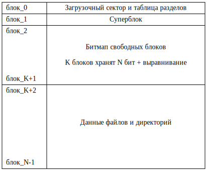

## Файловая система

В этой лабораторной работе мы реализуем файловую систему.
Она очень упрощена, и не поддерживает права доступа к файлам, линки и многое другое.
В частности, директории хранятся как файлы с массивом записей, а не как хеш-таблицы или B-деревья.
Что ведёт к неэффективному линейному поиску по ним.
Также для простоты, формат хранения структур файловой системы на диске и в памяти будет одинаковый.
Поэтому можно будет работать с отображённым в память диском.


### Структура файловой системы на диске




### Суперблок

Хранит основную информацию о файловой системе.
Она нужна, например, при монтировании.
У нас он очень простой:

```rust
struct Superblock {
    magic: [u8; MAGIC.len()],
    endian: u64,
    block_count: usize,
    root: Inode,
}
```


### Дамп диска в шестнадцатеричном виде

При выполнении лабораторки вам может пригодиться команда

```console
$ make fs-dump
...
00001000: 4e69 6b6b 6127 7320 7369 6d70 6c65 2066  Nikka's simple f
00001010: 696c 6520 7379 7374 656d 0000 0000 0000  ile system......
00001020: 0807 0605 0403 0201 0020 0000 0000 0000  ......... ......
00001030: 0200 0000 0000 0000 0000 0000 0000 0000  ................
...
00002000: ff3f 0000 0000 0000 0000 0000 0000 0000  .?..............
...
00003000: 0100 0000 0000 0000 3cd5 fc00 aa80 0000  ........<.......
00003010: 0000 0000 0000 0000 2e16 0000 0000 0000  ................
00003020: 0400 0000 0000 0000 0500 0000 0000 0000  ................
...
00003040: 6669 6c65 2d31 0000 0000 0000 0000 0000  file-1..........
...
00003080: 0000 0000 0000 0000 3cd5 fc00 aa80 0000  ........<.......
...
000030c0: 6669 6c65 2d74 6f2d 6265 2d65 7261 7365  file-to-be-erase
000030d0: 6400 0000 0000 0000 0000 0000 0000 0000  d...............
...
00003100: 0100 0000 0000 0000 3cd5 fc00 aa80 0000  ........<.......
00003110: 0000 0000 0000 0000 9426 0000 0000 0000  .........&......
00003120: 0700 0000 0000 0000 0800 0000 0000 0000  ................
...
00003140: 6669 6c65 2d32 0000 0000 0000 0000 0000  file-2..........
...
00003180: 0200 0000 0000 0000 3cd5 fc00 aa80 0000  ........<.......
00003190: 0000 0000 0000 0000 0010 0000 0000 0000  ................
000031a0: 0a00 0000 0000 0000 0000 0000 0000 0000  ................
...
000031c0: 6469 722d 3100 0000 0000 0000 0000 0000  dir-1...........
...
00005000: 0600 0000 0000 0000 0000 0000 0000 0000  ................
...
00007f50: 0000 0000 0000 002a 2a2a 2a2a 2a2a 2a2a  .......*********
00007f60: 2a2a 2a2a 2a2a 2a2a 2a2a 2a2a 2a2a 2a2a  ****************
00007f70: 2a2a 2a2a 2a2a 2a2a 2a2a 2a2a 2a2a 2a2a  ****************
00007f80: 2a2a 2a2a 2a2a 2a2a 2a2a 2a2a 2a2a 2a2a  ****************
00007f90: 2a2a 2a2a 2a2a 2a2a 2a2a 2a2a 2a2a 2a2a  ****************
00007fa0: 2a2a 2a2a 2a2a 2a2a 2a2a 2a2a 2a2a 2a2a  ****************
00007fb0: 2a2a 2a2a 2a2a 2a2a 2a2a 2a2a 2a2a 2a2a  ****************
00007fc0: 2a2a 2a2a 2a2a 2a2a 2a2a 2a2a 2a2a 2a2a  ****************
00007fd0: 2a2a 2a2a 2a2a 2a2a 2a2a 2a2a 2a2a 2a2a  ****************
00007fe0: 2a2a 2a2a 2a2a 2a2a 2a2a 2a2a 2a2a 2a2a  ****************
00007ff0: 2a2a 2a2a 2a2a 2a2a 2a2a 2a2a 2a2a 2a2a  ****************
00008000: 0900 0000 0000 0000 0d00 0000 0000 0000  ................
...
0000a000: 0100 0000 0000 0000 3cd5 fc00 aa80 0000  ........<.......
...
0000a040: 6669 6c65 2d34 0000 0000 0000 0000 0000  file-4..........
...
0000a080: 0100 0000 0000 0000 3cd5 fc00 aa80 0000  ........<.......
...
0000a0c0: 6669 6c65 2d35 0000 0000 0000 0000 0000  file-5..........
...
0000a100: 0200 0000 0000 0000 3cd5 fc00 aa80 0000  ........<.......
0000a110: 0000 0000 0000 0000 0010 0000 0000 0000  ................
0000a120: 0b00 0000 0000 0000 0000 0000 0000 0000  ................
...
0000a140: 6469 722d 3200 0000 0000 0000 0000 0000  dir-2...........
...
0000b000: 0200 0000 0000 0000 3cd5 fc00 aa80 0000  ........<.......
0000b010: 0000 0000 0000 0000 0010 0000 0000 0000  ................
0000b020: 0c00 0000 0000 0000 0000 0000 0000 0000  ................
...
0000b040: 6469 722d 3300 0000 0000 0000 0000 0000  dir-3...........
...
0000c000: 0100 0000 0000 0000 3cd5 fc00 aa80 0000  ........<.......
...
0000c040: 6669 6c65 2d33 0000 0000 0000 0000 0000  file-3..........
...
```
