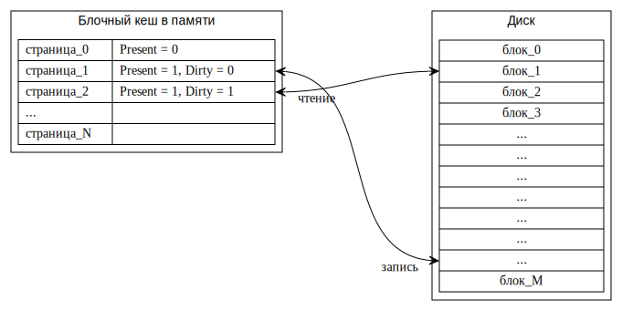
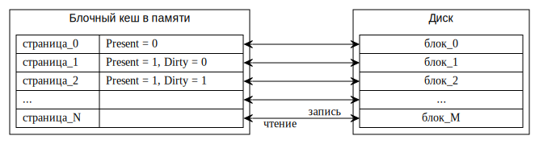

## [Блочный кеш](https://en.wikipedia.org/wiki/Page_cache)

В Nikka диск отображается в память, чтобы удобнее было с ним работать.
Для отслеживания с какого диска, куда именно и сколько памяти отображено, служит структура
[блочного кеша](https://en.wikipedia.org/wiki/Page_cache)
[`kernel::fs::block_cache::BlockCache`](../../doc/kernel/fs/block_cache/struct.BlockCache.html):

```rust
struct BlockCache {
    cache: Block<Page>,
    disk: Disk,
}
```

Она является [синглтоном](https://en.wikipedia.org/wiki/Singleton_pattern)
[`static ref BLOCK_CACHE: Mutex<Option<BlockCache>>`](../../doc/kernel/fs/block_cache/struct.BLOCK_CACHE.html).

В память блоки зачитываются по необходимости.
Для этого, изначально все страницы помечаются недоступными.
А при возникновении ошибки обращения к памяти, страницы нужного блока считывается с диска обработчиком
[`BlockCache::trap_handler()`](../../doc/kernel/fs/block_cache/struct.BlockCache.html#method.trap_handler).
Запись блока выполняется при необходимости вызовом
[`BlockCache::flush_block()`](../../doc/kernel/fs/block_cache/struct.BlockCache.html#method.flush_block).
Все блоки можно записать вызовом
[`BlockCache::flush()`](../../doc/kernel/fs/block_cache/struct.BlockCache.html#method.flush).
Для простоты, размер блока
[`kernel::fs::BLOCK_SIZE`](../../doc/kernel/fs/constant.BLOCK_SIZE.html)
берётся равным размеру страницы
[`Page::SIZE`](../../doc/ku/memory/frage/struct.Frage.html#associatedconstant.SIZE).


### Блочный кеш в общем случае

Обычно размер кеша в памяти гораздо меньше, чем размер кешируемого диска:




### Блочный кеш в Nikka

В Nikka сделано значительное упрощение.
Размер кеша в памяти равен размер кешируемого диска.
Поэтому размер диска ограничен размером доступной в машине памяти.




### Задача 1 --- блочный кеш


#### Инициализация

Реализуйте
[метод](../../doc/kernel/fs/block_cache/struct.BlockCache.html#method.init)
инициализации блочного кеша

```rust
fn BlockCache::init(
    disk: Disk,
    block_count: usize,
) -> Result<()>
```

в файле
[`kernel/src/fs/block_cache.rs`](https://gitlab.com/sergey-v-galtsev/nikka-public/-/blob/master/kernel/src/fs/block_cache.rs).

Он должен зарезервировать в
[`kernel::memory::BASE_ADDRESS_SPACE`](../../doc/kernel/memory/struct.BASE_ADDRESS_SPACE.html)
блок виртуальных страниц, достаточный для хранения `block_count` блоков файловой системы.
И записать соответствующее значение в
[`BLOCK_CACHE`](../../doc/kernel/fs/block_cache/struct.BLOCK_CACHE.html).


#### Обращение к блоку в блочном кеше

Реализуйте [метод](../../doc/kernel/fs/block_cache/struct.BlockCache.html#method.block)

```rust
fn block(
    block_number: usize,
) -> Result<Block<Virt>>
```

Он возвращает блок памяти блочного кеша
[`BLOCK_CACHE`](../../doc/kernel/fs/block_cache/struct.BLOCK_CACHE.html),
который отвечает блоку `block_number` диска.


#### Считывание блока с диска

Реализуйте [метод](../../doc/kernel/fs/block_cache/struct.BlockCache.html#method.trap_handler)

```rust
fn BlockCache::trap_handler(
    info: &Info,
) -> Result<bool>
```

в файле
[`kernel/src/fs/block_cache.rs`](https://gitlab.com/sergey-v-galtsev/nikka-public/-/blob/master/kernel/src/fs/block_cache.rs).

Он должен обработать Page Fault, если адрес, который его вызвал, относится к блочному кешу.
Если это так и Page Fault успешно обработан, верните `true`.
Если адрес, вызвавший Page Fault, не относится к блочному кешу, верните `false`.
Для чтения с диска используйте метод
[`kernel::fs::disk::Disk::pio_read()`](../../doc/kernel/fs/disk/struct.Disk.html#method.pio_read).


#### Запись блока на диск

Запись блока выполняется при необходимости вызовом
[`BlockCache::flush_block()`](../../doc/kernel/fs/block_cache/struct.BlockCache.html#method.flush_block).

Реализуйте [метод](../../doc/kernel/fs/block_cache/struct.BlockCache.html#method.flush_block)

```rust
fn BlockCache::flush_block(
    block_number: usize,
) -> Result<()>
```

в файле
[`kernel/src/fs/block_cache.rs`](https://gitlab.com/sergey-v-galtsev/nikka-public/-/blob/master/kernel/src/fs/block_cache.rs).

Он записывает заданный блок на диск методом
[`kernel::fs::disk::Disk::pio_write()`](../../doc/kernel/fs/disk/struct.Disk.html#method.pio_write).
Запись нужно делать только если:

- Блок отображён в память. Это означает что нему были обращения.
- И помечен как [`PageTableFlags::DIRTY`](../../doc/ku/memory/mmu/struct.PageTableFlags.html#associatedconstant.DIRTY). То есть, в память были записи, а значит блок на диске потенциально содержит устаревшие данные. Если обращения к блоку были только на чтение, то данные в памяти такие же как на диске, и можно их не записывать. А процессор в этом случае не установит бит [`PageTableFlags::DIRTY`](../../doc/ku/memory/mmu/struct.PageTableFlags.html#associatedconstant.DIRTY).
- После записи блока, сбросьте бит [`PageTableFlags::DIRTY`](../../doc/ku/memory/mmu/struct.PageTableFlags.html#associatedconstant.DIRTY). Он фактически означает одинаковость данных на диске и в памяти блочного кеша. Которая только что восстановлена. При этом нужно сбросить и соответствующую запись в [TLB](https://en.wikipedia.org/wiki/Translation_lookaside_buffer) с помощью функции [`kernel::memory::mmu::flush()`](../../doc/kernel/memory/mmu/fn.flush.html). Иначе процессор не узнает, что вы сбросили [`PageTableFlags::DIRTY`](../../doc/ku/memory/mmu/struct.PageTableFlags.html#associatedconstant.DIRTY) и не проставит его в таблице страниц при следующей записи. И обновлённый блок на диск записан не будет.


### Проверьте себя

Теперь должны заработать тесты в файлах
[`kernel/tests/6-fs-1-block-cache-1-write.rs`](https://gitlab.com/sergey-v-galtsev/nikka-public/-/blob/master/kernel/tests/6-fs-1-block-cache-1-write.rs) и
[`kernel/tests/6-fs-1-block-cache-2-read.rs`](https://gitlab.com/sergey-v-galtsev/nikka-public/-/blob/master/kernel/tests/6-fs-1-block-cache-2-read.rs):

```console
$ (cd kernel; cargo test --test 6-fs-1-block-cache-1-write --test 6-fs-1-block-cache-2-read)
...
6_fs_1_block_cache_1_write::write---------------------------
18:59:56 0 D block_count = 8192
18:59:56 0 D flush; block = 0
18:59:56 0 D flush; block = 2
18:59:56 0 D flush; block = 4
18:59:56 0 D flush; block = 6
18:59:56 0 D flush; block = 8
18:59:56 0 D flush; block = 10
18:59:56 0 D flush; block = 12
18:59:56 0 D flush; block = 14
18:59:56 0 D flush; block = 16
18:59:56 0 D flush; block = 18
18:59:56 0 D flush; block = 20
18:59:56 0 D flush; block = 22
18:59:56 0 D flush; block = 24
18:59:56 0 D flush; block = 26
18:59:56 0 D flush; block = 28
18:59:56 0 D flush; block = 30
6_fs_1_block_cache_1_write::write------------------ [passed]
18:59:56 0 I exit qemu; exit_code = SUCCESS
...
6_fs_1_block_cache_2_read::read_what_was_written------------
18:59:58 0 D block_count = 8192
18:59:58 0 D i = 0; block = 0; actual = 0; expected = 0
18:59:58 0 D i = 777; block = 1; actual = 0; expected = 0
18:59:58 0 D i = 1554; block = 3; actual = 0; expected = 0
18:59:58 0 D i = 2331; block = 4; actual = 2331; expected = 2331
18:59:58 0 D i = 3108; block = 6; actual = 3108; expected = 3108
18:59:58 0 D i = 3885; block = 7; actual = 0; expected = 0
18:59:58 0 D i = 4662; block = 9; actual = 0; expected = 0
18:59:58 0 D i = 5439; block = 10; actual = 5439; expected = 5439
18:59:58 0 D i = 6216; block = 12; actual = 6216; expected = 6216
18:59:58 0 D i = 6993; block = 13; actual = 0; expected = 0
18:59:58 0 D i = 7770; block = 15; actual = 0; expected = 0
18:59:58 0 D i = 8547; block = 16; actual = 8547; expected = 8547
18:59:58 0 D i = 9324; block = 18; actual = 9324; expected = 9324
18:59:58 0 D i = 10101; block = 19; actual = 0; expected = 0
18:59:58 0 D i = 10878; block = 21; actual = 0; expected = 0
18:59:58 0 D i = 11655; block = 22; actual = 11655; expected = 11655
18:59:58 0 D i = 12432; block = 24; actual = 12432; expected = 12432
18:59:58 0 D i = 13209; block = 25; actual = 0; expected = 0
18:59:58 0 D i = 13986; block = 27; actual = 0; expected = 0
18:59:58 0 D i = 14763; block = 28; actual = 14763; expected = 14763
18:59:58 0 D i = 15540; block = 30; actual = 15540; expected = 15540
18:59:58 0 D i = 16317; block = 31; actual = 0; expected = 0
6_fs_1_block_cache_2_read::read_what_was_written--- [passed]
18:59:58 0 I exit qemu; exit_code = SUCCESS
```


### Ориентировочный объём работ этой части лабораторки

```console
 kernel/src/fs/block_cache.rs |   64 ++++++++++++++++++++++++++++++++++++++++++++++++++++++++--------
 1 file changed, 56 insertions(+), 8 deletions(-)
```
