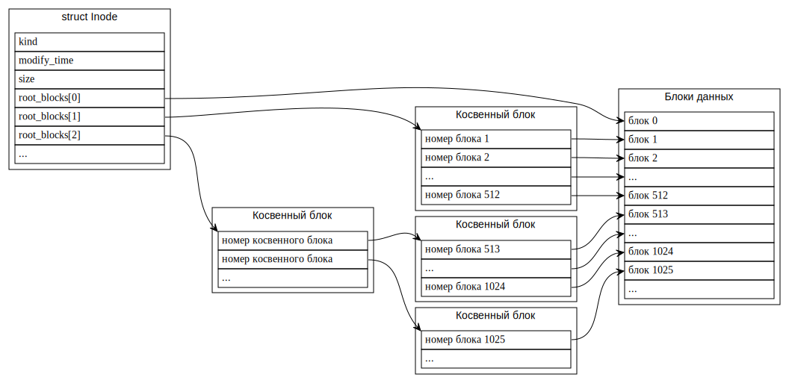

## Index node (inode)

В [inode](https://en.wikipedia.org/wiki/Inode) хранится метаинформация об объекте с данными.
Имя объекта не хранится, оно хранится в директории.
Объектом может быть как файл, так и директория.
В случае директорий, их содержимое --- массив из имен объектов и их [inode](https://en.wikipedia.org/wiki/Inode).
[Inode](https://en.wikipedia.org/wiki/Inode) корневой директории файловой системы хранится в суперблоке.

В файловых системах семейства System V, упрощённую реализацию которой пишем мы,
в директории хранится не сам
[inode](https://en.wikipedia.org/wiki/Inode),
а его номер.
Это позволяет иметь для одного
[inode](https://en.wikipedia.org/wiki/Inode)
несколько имён в одной и той же или в разных директориях ---
[жёстких ссылок](https://en.wikipedia.org/wiki/Hard_link).
В этом случае сами
[inode](https://en.wikipedia.org/wiki/Inode)
хранятся в отдельном массиве в файловой системе (на диске).
И для ускорения их аллокации заводят отдельный битмап, как для блоков.

Структура `Inode` выглядит так:

```rust
enum Kind {
    Unused = 0,
    File = 1,
    Directory = 2,
}

struct Inode {
    kind: Kind,
    modify_time: DateTime<Utc>,
    size: usize,
    root_blocks: [usize; MAX_HEIGHT],
}

const MAX_HEIGHT: usize = 4;
```


### Блоки данных inode

Блоки данных
[inode](https://en.wikipedia.org/wiki/Inode)
адресуются через массив `root_blocks` структуры `struct Inode`.




### Задача 3 --- index node (inode)

Реализуйте недостающие методы структуры
[`kernel::fs::inode::Inode`](../../doc/kernel/fs/inode/struct.Inode.html)
в файле
[`kernel/src/fs/inode.rs`](https://gitlab.com/sergey-v-galtsev/nikka-public/-/blob/master/kernel/src/fs/inode.rs).

Вам могут пригодиться методы `size::div_ceil()` и `size::next_multiple_of()`.


#### [`kernel::fs::inode::Inode::block_entry()`](../../doc/kernel/fs/inode/struct.Inode.html#method.block_entry)

- Если при обходе леса встречается не выделенный косвенный блок, то его нужно выделить из `block_bitmap`. Не выделенные блоки имеют зарезервированный номер `NO_BLOCK`.
- А вот выделять блок для данных, на который указывает результирующая запись, не нужно.

Этот метод похож на
[`kernel::memory::mapping::Mapping::translate()`](../../doc/kernel/memory/mapping/struct.Mapping.html#method.translate),
[который вы уже реализовали](../../lab/book/2-mm-6-address-space-2-translate.html#%D0%9E%D1%82%D0%BE%D0%B1%D1%80%D0%B0%D0%B6%D0%B5%D0%BD%D0%B8%D0%B5-%D0%B2%D0%B8%D1%80%D1%82%D1%83%D0%B0%D0%BB%D1%8C%D0%BD%D1%8B%D1%85-%D1%81%D1%82%D1%80%D0%B0%D0%BD%D0%B8%D1%86-%D0%BD%D0%B0-%D1%84%D0%B8%D0%B7%D0%B8%D1%87%D0%B5%D1%81%D0%BA%D0%B8%D0%B5-%D1%84%D1%80%D0%B5%D0%B9%D0%BC%D1%8B).
Только в `Inode` для блоков не одно дерево фиксированной высоты,
а последовательность деревьев возрастающей высоты.


#### [`kernel::fs::inode::Inode::set_size()`](../../doc/kernel/fs/inode/struct.Inode.html#method.set_size)


#### [`kernel::fs::inode::Inode::read()`](../../doc/kernel/fs/inode/struct.Inode.html#method.read)


#### [`kernel::fs::inode::Inode::write()`](../../doc/kernel/fs/inode/struct.Inode.html#method.write)
